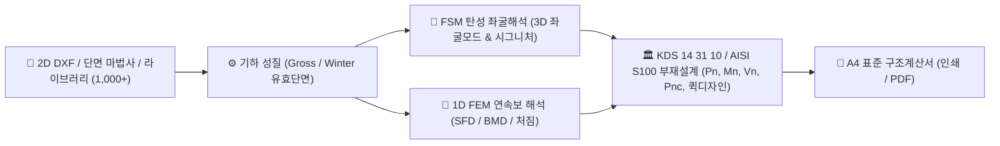

# CFDesigner (Cold-Formed Section Analyzer & Designer)

<p align="center">
  <strong>AutoCAD DXF 기반 냉간성형강 비정형 단면 CAD 연동 구조해석 및 KDS 14 31 10 / AISI S100 직접강도법(DSM) 클라우드 설계 시스템</strong>
</p>

<p align="center">
  
  
  
  
  
</p>

---

## 1. 프로젝트 개요 (Overview)

**CFDesigner**는 기존 북미 중심의 상용 냉간성형강 프로그램(`CFS.exe`)의 모든 공학 해석·설계 알고리즘과 라이브러리를 **순수 Python 기반의 모던 AltDP 웹 애플리케이션으로 100% 완전 포팅(Full Web Migration)**한 차세대 오픈소스 엔지니어링 패키지입니다.

AutoCAD 2D Polyline(DXF) 입력 기반의 **비정형 단면 기하 모델링 $\rightarrow$ FSM(유한대판법) 탄성 좌굴해석 $\rightarrow$ 1D FEM 보/연속보 구조해석 $\rightarrow$ KDS 14 31 10 / AISI S100 직접강도법(DSM) 부재설계 $\rightarrow$ A4 표준 구조계산서**까지의 전 과정을 현대적인 웹 브라우저 상에서 원클릭으로 완결합니다.



---

## 2. 주요 기능 및 특징 (Key Features)

### 📐 1. 기하 모델링 & 단면 미세 편집기 (Phase 1)
* **AutoCAD 2D DXF 가져오기**: 2D LWPOLYLINE 중심선 및 코너 아크(Fillet R) 자동 파싱 및 유한 스트립 자동 메싱.
* **6대 표준 단면 파라메트릭 마법사**: C형, Z형, 모자형(Hat), 각형관(Tube), L형강(Angle), 데크(Deck) 파라메트릭 생성.
* **단면 요소 테이블 직접 편집 (Spreadsheet)**: 절점 좌표, 요소 길이($L$), 경사각($\theta$), 두께($t$) 스프레드시트 모달 편집 및 2D 캔버스 실시간 동기화.
* **기하 변환 & 보강 리브**: 90°/임의각 회전, X/Y 대칭 미러링, 도심 원점 정렬, 플랜지/웨브 중간 V형·U형 보강 리브(Ribs) 자동 삽입.

### 📚 2. 표준 단면 라이브러리 & 재료 DB (Phase 2)
* **1,000+개 표준 단면 라이브러리 브라우저**: 북미 SSMA, SFIA, LGSI 등 `*.cfsl` 바이너리 단면 DB 실시간 검색, 필터링 및 원클릭 로드.
* **강재 재료 DB**: KS 규격(SSC275, SSC355, SSC400 등) 및 ASTM(A653, A1008 등) 강종 프리셋과 사용자 정의 물성치($F_y, F_u, E, \nu$).
* **코너 성형 가공경화($F_{ya}$) 계산기**: AISI S100 Appendix 1 및 KDS 기준 코너 절곡에 따른 유효항복강도 자동 산정.

### 🔬 3. 단면 해석 & FSM 탄성 좌굴해석 (Phase 3)
* **기하학적 단면 성질**: 총단면적($A_g$), 도심($C_G$), 생브낭 비틀림($J$), 섹터모멘트 기반 뒴상수($C_w$), 전단중심($S_C$), 주축($I_1, I_2, \theta_p$) 정밀 선적분.
* **Winter 식 기반 유효단면 해석**: 압축/휨 하중 시 유효폭 반복 계산 및 2D 캔버스 유효단면 점선 실시간 렌더링.
* **FSM 탄성 좌굴해석**: $[K_e], [K_g]$ 스트립 강성행렬 조립 및 일반화 고유치 해석을 통한 국부($P_{crl}$), 왜곡($P_{crd}$), 전체($P_{cre}$) 좌굴하중 산정.
* **시그니처 커브 & 3D 좌굴모드 뷰어**: 반파장($L$) 스펙트럼 곡선(Chart.js) 및 Three.js 기반 인터랙티브 3D 좌굴 변형 형상 실시간 렌더링.
* **퀵 디자인 (Quick Design)**: 소요 설계 하중($P_u, M_u$) 또는 등분포하중 입력 시 표준 단면 DB를 자동 전수 탐색하여 안전율을 만족하는 최경량 단면 자동 추천.
* **웨브 크리플링 (Web Crippling)**: EOF, IOF, ETF, ITF 4대 지지조건별 공칭 웨브 크리플링 강도($P_{nc}$) 산정.

### 🌉 4. 1D 뼈대 구조해석 엔진 (Phase 4)
* **1D FEM 구조해석 마법사**: 단순보, 2~3경간 연속보, 캔틸레버 모델 마법사 및 등분포하중, 집중하중, 외력 모멘트 입력 지원.
* **SFD / BMD / 처짐 다이어그램**: 전단력도(SFD), 휨모멘트도(BMD), 처짐 곡선 인터랙티브 렌더링 및 허용 처짐 자동 검토.
* **부재설계 원클릭 연동**: 최대 단면력($M_{max}, V_{max}$)을 KDS 부재설계 모듈로 원클릭 전송하여 단면 안전성 자동 평가.

### 🌐 5. 다국어 온라인 도움말 & 도해·용어사전 시스템 (Phase 5)
* **7개 카테고리 27개 토픽 완비**: 시작하기, 라이브러리, 단면성질, FSM 좌굴이론, KDS 부재설계, 1D 구조해석, 부록(전문 용어사전 & 기호집).
* **고해상도 도해 16종 & 라이트박스 줌**: 레거시 vs 모던 웹 2열 대조 카드, FSM 좌굴 4종 및 비틀림 좌표계 4종 고해상도 그래픽 도해 수록.
* **3-Way Bilingual Edition**: 한글 웹 UI/UX 가이드 + KDS 수식(`content_html`)과 CFS 14.0 오리지널 영문 원문(`content_en_html`, `decompiled_src/cfs_help_manual/` 1:1 대조) 수록.
* **1.8만자 전문 용어사전 & 114종 기호집**: AISI S100/KDS 공식 공학 용어 정의 및 라틴/그리스 문자 총람, 키워드 가중치 검색 지원.

### 📄 6. A4 표준 구조계산서 출력
* 단면 형상도, Gross/Effective 성질표, FSM 시그니처 커브, DSM 강도 산정식 및 종합 판정 요약표를 A4 포맷 브라우저 인쇄 및 PDF 저장.

---

## 3. 시작하기 (Quick Start)

### 3.1. 요구 사양
* Python 3.10 이상
* 최신 웹 브라우저 (Chrome, Edge, Safari, Firefox)

### 3.2. 설치 및 실행

```bash
# 1. 저장소 복제
git clone https://github.com/zlkiki/CFDesigner.git
cd CFDesigner

# 2. 의존성 패키지 설치
pip install -r requirements.txt

# 3. 로컬 웹 서버 구동
python -m uvicorn src.api.server:app --reload --host 127.0.0.1 --port 8000
# 또는 PowerShell 스크립트 실행: .\run.ps1
```

* 브라우저에서 `http://127.0.0.1:8000` 접속 시 **CFDesigner 메인 워크스페이스** 실행
* `http://127.0.0.1:8000/manual` 접속 시 **온라인 도움말 매뉴얼(Bilingual Edition)** 실행

---

## 4. 테스트 및 검증 (Tests)

CFDesigner는 CFS.exe 원본 계산치 및 KDS 기준과의 **0.1% 오차 미만 교차 검증**을 포함한 **55개 단위/통합 자동화 테스트 스위트**를 제공합니다.

```bash
# 전체 테스트 실행
python -m pytest tests/ -v
```

```plaintext
============================= test session starts =============================
collected 55 items

tests/test_c_section.py (2 tests) ............................. PASSED [  3%]
tests/test_dxf_integration.py (1 test) ........................ PASSED [  5%]
tests/test_manual_api.py (29 tests) ........................... PASSED [ 58%]
tests/test_phase1_geometry_edit.py (4 tests) .................. PASSED [ 65%]
tests/test_phase2_library_material.py (4 tests) ............... PASSED [ 72%]
tests/test_phase3_advanced_design.py (4 tests) ................ PASSED [ 80%]
tests/test_phase4_frame1d_analysis.py (5 tests) ............... PASSED [ 89%]
tests/test_web_api.py (5 tests) ............................... PASSED [ 98%]
tests/test_z_section.py (1 test) .............................. PASSED [100%]

======================= 55 passed in 17.98s (100% Pass) =======================
```

---

## 5. 프로젝트 디렉토리 구조 (Directory Structure)

```plaintext
CFDesigner/
├── .agents/                          # 🤖 [에이전트 지침] AI 마스터 가이드(AGENTS.md) 및 스킬
├── docs/                             # 📑 [기술 문서 SSOT] 공학 수식집, 시스템 아키텍처, 파일 인벤토리
├── 요구사항/                         # 📋 [요구사항 관리] 완료 아카이브(@@OLD/) 및 비긴급 백로그(보류/)
├── original_source/                  # 🏛️ [원본 바이너리] CFS 14.0 원본 실행 파일 및 표준 단면 DB (*.cfsl, *.mtl)
├── decompiled_src/                   # 💻 [추출 C# 소스] CFS.exe에서 복원한 108개 C# 소스코드 (Ground Truth)
├── src/                              # 🚀 [독립 패키지] Python 기반 핵심 해석/설계 엔진 및 AltDP 웹 UI
│   ├── api/                          # - FastAPI REST 라우터 (server.py, routes.py, manual_routes.py)
│   ├── cad/                          # - DXF 2D Polyline 파서 및 메셔 (dxf_reader.py, part_mesher.py)
│   ├── geometry/                     # - 단면 기하(gross_properties), 편집기, 라이브러리, Winter 유효폭
│   ├── solver/                       # - FSM 탄성좌굴 솔버(strip_assembler) & 1D FEM 구조해석(frame1d)
│   ├── design/                       # - KDS/AISI DSM 부재설계(dsm_compression), 전단/크리플링, 퀵디자인
│   ├── report/                       # - A4 표준 구조계산서 렌더러 (html_report.py)
│   └── web/                          # - 프론트엔드 (index.html, manual.html, static/js, static/css)
├── tests/                            # 🧪 [테스트] 55개 pytest 단위 및 통합 테스트 스위트
├── scripts/                          # 🛠️ [빌드 & 유틸리티] 토픽 데이터셋 생성 및 관리 도구
├── requirements.txt                  # 📦 Python 의존성 명세
└── run.ps1                           # ⚡ 원클릭 서버 실행 스크립트
```

---

## 6. 라이선스 및 참조 기준 (License & References)

* **설계 기준**: KDS 14 31 10 (국내 냉간성형강구조설계기준), AISI S100 (North American Specification for Cold-Formed Steel Structural Members)
* **핵심 참조 자산**: CFS (Cold-Formed Steel Design Software, RSG Software, Inc.) v14.0
