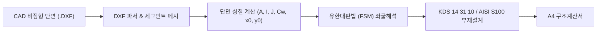

# CFDesigner (Cold-Formed Section Analyzer & Designer)

**CFDesigner**는 AutoCAD 2D 단면(DXF) 입력 기반의 **비정형 냉간성형강 단면 기하 모델링 $\rightarrow$ FSM(유한대판법) 탄성 좌굴해석 $\rightarrow$ KDS 14 31 10 / AISI S100 직접강도법(DSM) 구조설계 파이프라인**을 제공하는 차세대 오픈소스 엔지니어링 패키지입니다.

---

## 1. 주요 기능 (Features)

* 📐 **CAD 비정형 단면 자동 로딩 & 메싱**: AutoCAD 등에서 작도된 2D Polyline 중심선 및 두께(Width), 코너 Fillet R을 자동 분할.
* ⚙️ **기하학적 단면 성질 계산**: 총단면(Gross) 및 유효단면(Effective) 특성치($A, I_x, I_y, J, C_w, x_o, y_o$) 정밀 산정.
* 🔬 **유한대판법(FSM) 탄성 좌굴해석**: 국부(Local, $P_{crl}$), 왜곡(Distortional, $P_{crd}$), 전체(Global, $P_{cre}$) 좌굴모드 및 좌굴곡선(Signature Curve) 자동 해석.
* 🏛️ **KDS 14 31 10 & AISI S100 부재설계**: 직접강도법(DSM) 기반 압축/휨 공칭강도($P_n, M_n$), 복부판 전단($V_n$), 웨브 크리플링($P_{nc}$) 및 P-M 조합응력 검토.

---

## 2. 핵심 문서 안내 (Documentation)

* 📌 **[TODO 및 로드맵](docs/00_todo_and_roadmap.md)**: AISI S100 복원 및 KDS 14 31 10 비교 로드맵
* 📐 **[전체 시스템 아키텍처](docs/01_system_architecture.md)**: 전체 시스템 구조 및 복원 C# 모듈 역할도
* 📏 **[CAD(DXF) 파싱 명세](docs/02_cad_dxf_specification.md)**: 2D Polyline 정의 규칙 및 DXFPart 메싱 알고리즘
* ⚙️ **[단면 기하학적 성질 계산서](docs/03_section_properties.md)**: 기하학적 특성치($A, I, J, C_w, x_o, y_o$) 공식집
* 🔬 **[유한대판법(FSM) 해석 명세](docs/04_finite_strip_method.md)**: $[K_e], [K_g]$ 강성행렬 및 좌굴 판별 이론
* 🏛️ **[KDS / AISI 부재설계 기준서](docs/05_kds_aisi_design_rules.md)**: 직접강도법(DSM) 공칭강도 수식집
* 🚀 **[Python 독립 엔진 개발 로드맵](docs/06_python_engine_migration_plan.md)**: Python 포팅 전략 및 아키텍처 명세
* 📖 **[CFS 공식 매뉴얼 아카이브](docs/cfs_help_manual/overview.htm)**: CFS 14.0 공식 도움말 및 이론 매뉴얼 (95개)

---

## 3. 소스 코드 현황

* `decompiled_src/`: CFS.exe로부터 100% 복원된 C# 솔루션 (`CFS.sln`, `CFS.csproj`)
* `src/`: 향후 개발되는 Python 기반 독립 해석/설계 엔진
