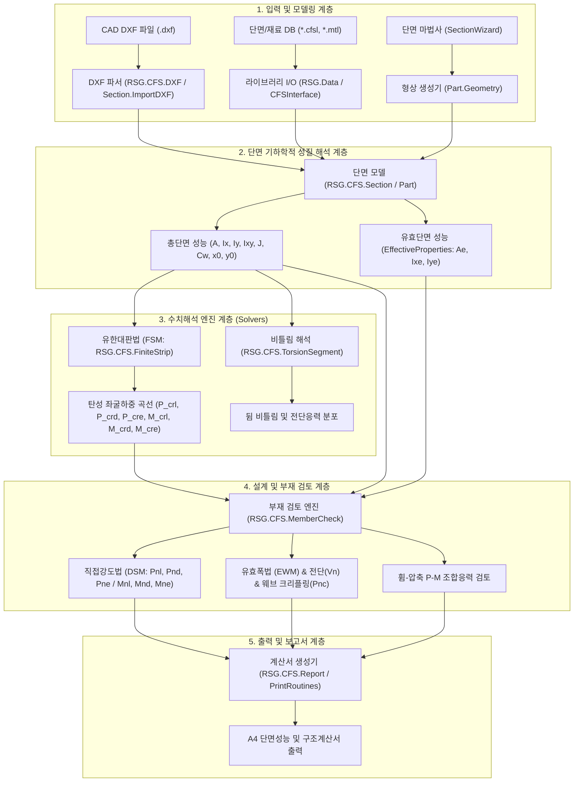

# [기술 문서 01] 전체 시스템 아키텍처 및 역공학 분석 명세 (01_system_architecture.md)

---

## 1. 개요 및 복원 시스템 개요

본 프로젝트는 상용 냉간성형강(Cold-Formed Steel) 해석·설계 프로그램인 **CFS.exe (Version 14.0)**의 전체 바이너리를 역공학하여 **108개 전체 C# 소스 파일 및 솔루션(.sln, .csproj)**으로 100% 복원하고, 독자적인 Python 기반의 CAD 연동 구조해석 및 KDS/AISI 부재설계 엔진으로 전환하기 위한 기반을 제공합니다.

---

## 2. 전체 시스템 아키텍처 및 데이터 흐름도

---

## 3. 핵심 네임스페이스 및 파일 인벤토리

| 네임스페이스 | 주요 클래스 | 파일 위치 | 핵심 역할 및 알고리즘 |
|---|---|---|---|
| **`RSG.CFS`** | `DXF` | [`RSG/CFS/DXF.cs`](file:///f:/PyProject/CFT/decompiled_src/RSG/CFS/DXF.cs) | AutoCAD DXF 파일 I/O, 좌표 스케일링, 원점 정렬 |
| | `Section` | [`RSG/CFS/Section.cs`](file:///f:/PyProject/CFT/decompiled_src/RSG/CFS/Section.cs) | 단면 형상 정의, Gross/Effective 특성치 계산, MemberCheck |
| | `Part` | [`RSG/CFS/Part.cs`](file:///f:/PyProject/CFT/decompiled_src/RSG/CFS/Part.cs) | 개별 파트 형상, 코너 Fillet R 분할, 두께 오프셋 |
| | `FiniteStrip` | [`RSG/CFS/FiniteStrip.cs`](file:///f:/PyProject/CFT/decompiled_src/RSG/CFS/FiniteStrip.cs) | **유한대판법(FSM)** $[K_e], [K_g]$ 조립, 고유치 해석, 좌굴하중 곡선 산정 |
| | `MemberCheck` | [`RSG/CFS/MemberCheck.cs`](file:///f:/PyProject/CFT/decompiled_src/RSG/CFS/MemberCheck.cs) | 부재 설계 결과 데이터 구조체 |
| | `EffectiveProperties` | [`RSG/CFS/EffectiveProperties.cs`](file:///f:/PyProject/CFT/decompiled_src/RSG/CFS/EffectiveProperties.cs) | 유효폭법(Winter 식) 기반 응력 반복 수치해석 |
| | `Analysis` | [`RSG/CFS/Analysis.cs`](file:///f:/PyProject/CFT/decompiled_src/RSG/CFS/Analysis.cs) | 기둥/보 1D 유한요소 뼈대 해석 및 하중조합 |
| | `Report` | [`RSG/CFS/Report.cs`](file:///f:/PyProject/CFT/decompiled_src/RSG/CFS/Report.cs) | 구조계산서 RTF 포맷 생성 및 결과 테이블 빌더 |
| **`RSG.Math`** | `Sturm` | [`RSG/Math/Sturm.cs`](file:///f:/PyProject/CFT/decompiled_src/RSG/Math/Sturm.cs) | 스텀 시퀀스(Sturm sequence) 기반 다항식/고유치 수치해석 솔버 |
| **`RSG.Data`** | `DataAnalysis` | [`RSG/Data/DataAnalysis.cs`](file:///f:/PyProject/CFT/decompiled_src/RSG/Data/DataAnalysis.cs) | 단면 DB 파일 데이터 처리 |
| **`_Global`** | `frm*` (43개) | [`_Global/`](file:///f:/PyProject/CFT/decompiled_src/_Global/) | Windows Forms UI 대화상자 및 뷰어 |

---

## 4. 빌드 환경 및 프로젝트 복원 상태

* **솔루션 파일**: [`decompiled_src/CFS.sln`](file:///f:/PyProject/CFT/decompiled_src/CFS.sln)
* **프로젝트 파일**: [`decompiled_src/CFS.csproj`](file:///f:/PyProject/CFT/decompiled_src/CFS.csproj) (.NET Framework 4.8 / Windows Forms, x86 타겟)
* **외부 종속 DLL**:
  - `FlexCell.dll` (UI 그리드 컨트롤)
  - `PLUSManaged.dll` (소프트웨어 보호 라이브러리)
