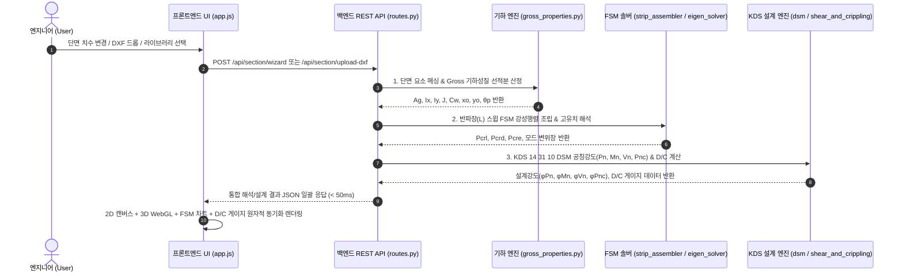
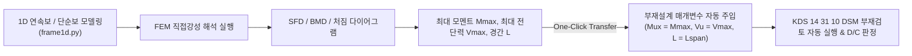

# [시스템 아키텍처] CFDesigner 전체 시스템 구조 및 5대 계층 설계서 (01_system_architecture.md)

> **문서 상태**: 🌟 Single Source of Truth (SSOT)  
> **문서 버전**: v3.0 (Phase 1~8 전체 완료, 3열 퀵디자인, FSM 응력구배, 코너 Fillet 및 테마/로딩 반응형 UX 완전 통합판)  
> **기술 스택**: Python 3.10+, FastAPI, NumPy, SciPy, ezdxf, Shapely, Vanilla JS/CSS (AltDP), Chart.js, Three.js WebGL, Jinja2

---

## 1. 전체 시스템 5대 계층 아키텍처

CFDesigner는 **프론트엔드 UI**, **비동기 REST API**, **CAD/기하 모델링**, **FSM/1D 수치해석**, **KDS 부재설계 & A4 리포트**의 5대 계층으로 완벽히 분리된 단방향 고속 리액티브 파이프라인을 구성합니다.

```mermaid
graph TD
    subgraph L1 ["1. 프론트엔드 웹 UI 계층 (src/web/)"]
        UI_Main["메인 대시보드 (index.html, app.js)<br>• 4분할 레이아웃 & 실시간 상태바<br>• 10대 전문 모달 다이얼로그"]
        UI_2D["2D CAD 캔버스 (canvas_2d.js)<br>• 줌/팬, 코너 Fillet, 도심/주축, Winter 유효단면"]
        UI_3D["3D WebGL 뷰어 (viewer_3d.js)<br>• Three.js 로컬/디스토셔널/글로벌 모드 애니메이션"]
        UI_Charts["차트 엔진 (chart_fsm.js, chart_diagrams.js)<br>• FSM 시그니처 커브 / SFD / BMD / 처짐"]
        UI_Manual["온라인 도움말 SPA (manual.html, manual.js)<br>• 3-Way Bilingual / 8대 카테고리 27개 토픽 / 실시간 검색"]
    end

    subgraph L2 ["2. 백엔드 REST API 계층 (src/api/)"]
        API_Server["FastAPI 서버 (server.py)<br>• 정적 파일 서빙 & CORS / 비동기 라우터"]
        API_Main["메인 라우터 (routes.py)<br>• /api/section/*, /api/fsm/*, /api/design/*<br>• /api/library/*, /api/frame/*, /api/report/*"]
        API_Manual["도움말 라우터 (manual_routes.py)<br>• /api/manual/categories, /topic/{id}, /search"]
    end

    subgraph L3 ["3. CAD 파싱 & 기하 모델링 계층 (src/cad/, src/geometry/)"]
        M_CAD["CAD 메싱 엔진 (dxf_reader.py, part_mesher.py)<br>• Polyline/Arc 파싱 & Fillet R 메싱"]
        M_Wiz["단면 마법사 (section_wizard.py)<br>• C, Z, Hat, Tube, Angle, Deck 파라메트릭 빌더"]
        M_Geom["기하 성질 & 편집기 (gross_properties.py, geometry_editor.py)<br>• 선적분 Ag, Ix, Iy, J, Cw, xo, yo / 회전/대칭/리브"]
        M_Lib["라이브러리 & 가공경화 (library_parser.py)<br>• *.cfsl 바이너리 DB & 코너 Fya 강도 산정"]
        M_Eff["Winter 유효단면 엔진 (effective_width.py)<br>• 압축/휨 유효폭 반복 계산 & Ae, Ixe 산정"]
    end

    subgraph L4 ["4. FSM 및 1D FEM 수치해석 계층 (src/solver/)"]
        M_FSM["FSM 탄성좌굴 솔버 (strip_assembler.py, eigen_solver.py)<br>• 8x8 [Ke], [Kg] 강성행렬 조립 & 고유치 해석"]
        M_Sig["좌굴 모드 분류기 (signature_curve.py)<br>• 반파장 L 스윕 & Pcrl, Pcrd, Pcre 자동 추출"]
        M_1D["1D FEM 구조해석기 (frame1d.py)<br>• 다경간 보/연속보 FEM, 자중 반영, SFD/BMD/처짐"]
    end

    subgraph L5 ["5. KDS 설계 & 리포팅 계층 (src/design/, src/report/)"]
        M_DSM["KDS 14 31 10 직접강도법 (dsm_compression.py, dsm_flexure.py)<br>• Pn = min(Pne, Pnl, Pnd), Mn = min(Mne, Mnl, Mnd)"]
        M_Crip["전단 & 웨브 크리플링 (shear_and_crippling.py, beam_column.py)<br>• Vn, 4대 조건 Pnc, P-M 2축 조합응력 상관비"]
        M_QD["퀵 디자인 최적화 (quick_design.py)<br>• 소요 하중 만족 최경량 단면 자동 탐색"]
        M_Rept["A4 구조계산서 엔진 (html_report.py, summary_table.py)<br>• KDS 표준 A4 Jinja2 HTML 템플릿 렌더러"]
    end

    UI_Main <-->|비동기 REST API (< 50ms)| API_Main
    UI_Manual <-->|비동기 REST API| API_Manual
    API_Main --> M_CAD & M_Wiz & M_Geom & M_Lib & M_Eff
    API_Main --> M_FSM & M_Sig & M_1D
    API_Main --> M_DSM & M_Crip & M_QD & M_Rept
    API_Manual --> M_Lib
```

---

## 2. 모듈 간 실시간 데이터 파이프라인 (Real-Time Data Flow)



---

## 3. 계층별 핵심 책임 및 데이터 모델

### 3.1 프론트엔드 웹 UI 계층 (`src/web/`)
* **[`index.html`](file:///f:/PyProject/CFDesigner/src/web/index.html)**: 4분할 레이아웃(헤더/사이드바/워크스페이스/대시보드) 및 10대 전문 모달 마크업.
* **[`app.js`](file:///f:/PyProject/CFDesigner/src/web/static/js/app.js)**: 전역 상태 관리기, REST API 호출기, 모달 라이프사이클 제어.
* **[`canvas_2d.js`](file:///f:/PyProject/CFDesigner/src/web/static/js/canvas_2d.js)**: 2D CAD 인터랙션(줌/팬/도심/주축/Winter 유효단면 점선 오버레이).
* **[`viewer_3d.js`](file:///f:/PyProject/CFDesigner/src/web/static/js/viewer_3d.js)**: Three.js WebGL 기반 3D 부재 좌굴 모드 실시간 진동 애니메이션.
* **[`chart_fsm.js`](file:///f:/PyProject/CFDesigner/src/web/static/js/chart_fsm.js)**: 로그 스케일 FSM 시그니처 커브 및 극소점 동기화.
* **[`chart_diagrams.js`](file:///f:/PyProject/CFDesigner/src/web/static/js/chart_diagrams.js)**: 1D FEM 해석 결과 SFD/BMD/처짐 4단 스택 다이어그램.
* **[`manual.html`](file:///f:/PyProject/CFDesigner/src/web/manual.html)** / **[`manual.js`](file:///f:/PyProject/CFDesigner/src/web/static/js/manual.js)**: 3-Way Bilingual 온라인 매뉴얼 SPA.

### 3.2 백엔드 REST API 계층 (`src/api/`)
* **[`server.py`](file:///f:/PyProject/CFDesigner/src/api/server.py)**: FastAPI 어플리케이션 인스턴스, 정적 파일 마운트, CORS 미들웨어 구성.
* **[`routes.py`](file:///f:/PyProject/CFDesigner/src/api/routes.py)**: 단면 모델링, 기하 변환, 유효폭, FSM, KDS 설계, 1D 구조해석, A4 리포트 등 16개 핵심 엔드포인트 구현.
* **[`manual_routes.py`](file:///f:/PyProject/CFDesigner/src/api/manual_routes.py)**: 6대 카테고리 25개 토픽 TOC, 개별 본문, 다국어 가중치 검색 API.

### 3.3 CAD & 기하 모델링 계층 (`src/cad/`, `src/geometry/`)
* **[`dxf_reader.py`](file:///f:/PyProject/CFDesigner/src/cad/dxf_reader.py)** & **[`part_mesher.py`](file:///f:/PyProject/CFDesigner/src/cad/part_mesher.py)**: 2D DXF 파싱 및 코너 모서리($R$) 호 분할 메싱.
* **[`gross_properties.py`](file:///f:/PyProject/CFDesigner/src/geometry/gross_properties.py)**: 선적분 기반 Gross 기하성질($A_g, I_x, I_y, J, C_w, x_0, y_0, \theta_p$) 공식 계산.
* **[`geometry_editor.py`](file:///f:/PyProject/CFDesigner/src/geometry/geometry_editor.py)**: 요소 스프레드시트 편집, 직교/각도 회전, 대칭 미러링, 도심 원점 정렬, V/사다리꼴 리브 생성.
* **[`library_parser.py`](file:///f:/PyProject/CFDesigner/src/geometry/library_parser.py)**: `*.cfsl` 바이너리 단면 파싱 및 코너 가공경화 유효항복강도($F_{ya}$) 계산.
* **[`effective_width.py`](file:///f:/PyProject/CFDesigner/src/geometry/effective_width.py)**: Winter 유효폭 반복 해석($A_e, I_{xe}, \Delta y$).

### 3.4 FSM 및 1D FEM 수치해석 솔버 계층 (`src/solver/`)
* **[`strip_assembler.py`](file:///f:/PyProject/CFDesigner/src/solver/strip_assembler.py)**: 8x8 대판 요소 탄성 강성행렬 $[k_e]$ 및 기하 강성행렬 $[k_g]$ 조립.
* **[`eigen_solver.py`](file:///f:/PyProject/CFDesigner/src/solver/eigen_solver.py)**: SciPy `eigh` 기반 일반화 고유치 해석기 ($[K_e] - \lambda [K_g] = 0$).
* **[`signature_curve.py`](file:///f:/PyProject/CFDesigner/src/solver/signature_curve.py)**: 반파장 스윕 및 국부($P_{crl}$), 왜곡($P_{crd}$), 전체($P_{cre}$) 3대 좌굴하중 자동 판별.
* **[`frame1d.py`](file:///f:/PyProject/CFDesigner/src/solver/frame1d.py)**: 1D 보/연속보/캔틸레버 FEM 직접강성법 해석 및 SFD/BMD/처짐 연산.

### 3.5 KDS 14 31 10 설계 및 리포팅 계층 (`src/design/`, `src/report/`)
* **[`dsm_compression.py`](file:///f:/PyProject/CFDesigner/src/design/dsm_compression.py)** / **[`dsm_flexure.py`](file:///f:/PyProject/CFDesigner/src/design/dsm_flexure.py)**: 직접강도법 공칭압축강도 $P_n$ 및 공칭휨강도 $M_n$ 산정.
* **[`shear_and_crippling.py`](file:///f:/PyProject/CFDesigner/src/design/shear_and_crippling.py)**: 웨브 전단강도 $V_n$ 및 4대 조건(IOF/EOF/ITF/ETF) 웨브 크리플링 지압강도 $P_{nc}$ 산정.
* **[`beam_column.py`](file:///f:/PyProject/CFDesigner/src/design/beam_column.py)**: KDS 4.5 P-M 휨-압축 2축 상관식 검토.
* **[`quick_design.py`](file:///f:/PyProject/CFDesigner/src/design/quick_design.py)**: 목표 하중 조건에 부합하는 최경량 단면 자동 탐색.
* **[`html_report.py`](file:///f:/PyProject/CFDesigner/src/report/html_report.py)**: KDS 14 31 10 표준 A4 구조계산서 Jinja2 HTML 템플릿 렌더러.

---

## 4. 1D 구조해석 $\rightarrow$ 단면 부재설계 원클릭 연동 파이프라인


