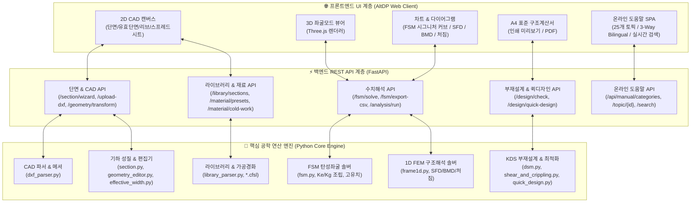

# [시스템 아키텍처] CFDesigner 전체 시스템 구조 및 계층도

> **문서 상태**: 🌟 Single Source of Truth (SSOT)  
> **최종 갱신일**: 2026-09-01 (Phase 1~5 통합 완료)  
> **기술 스택**: Python 3.10+, FastAPI, NumPy, SciPy, ezdxf, HTML5, Vanilla CSS (AltDP), Chart.js, Three.js

---

## 1. 전체 시스템 5대 계층 구조도

---

## 2. 데이터 흐름 및 파이프라인 (Data Pipeline)

1. **단면 생성 & 기하 조작**:
   - 2D DXF 업로드, 6대 표준 단면 마법사, 1,000+개 표준 라이브러리 로드, 스프레드시트 요소 직접 편집.
   - 단면 기하 변환(회전, 대칭, 원점 정렬) 및 중간 보강 리브(V형, U형) 자동 생성.
2. **단면 성질 해석 (Gross & Effective)**:
   - 총단면($A_g, I_x, I_y, J, C_w, x_o, y_o$) 선적분 계산.
   - Winter 유효폭 반복 계산을 통한 유효단면($A_{eff}, I_{eff}$) 및 2D 캔버스 점선 시각화.
3. **FSM 탄성 좌굴해석**:
   - 부재 반파장 $L$에 따른 $[K_e], [K_g]$ 강성행렬 조립 및 일반화 고유치 수치해석.
   - 국부($P_{crl}$), 왜곡($P_{crd}$), 전체($P_{cre}$) 좌굴하중 판별 및 Three.js 3D 실시간 형상 렌더링.
4. **1D 뼈대 구조해석 & 단면력 산정**:
   - 단순보, 다경간 연속보, 캔틸레버 FEM 해석을 통한 SFD, BMD, 처짐 다이어그램 생성.
   - 최대 소요 모멘트($M_u$), 전단력($V_u$) 추출 후 부재설계 모듈로 자동 연동.
5. **KDS 14 31 10 / AISI S100 부재설계 & A4 계산서**:
   - 직접강도법(DSM) 기반 압축($P_n$), 휨($M_n$), 전단($V_n$), 웨브 크리플링($P_{nc}$) 및 P-M 조합응력 판정.
   - 퀵 디자인(Quick Design) 목표 하중 최적 단면 자동 추천.
   - A4 규격 인쇄/PDF 저장용 구조계산서 원클릭 생성.
