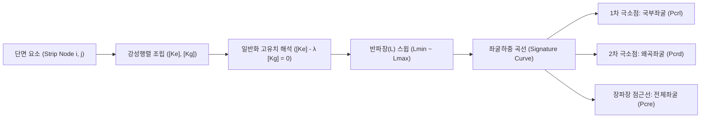

# [기술 문서 04] 유한대판법(FSM) 수치해석 엔진 이론 및 알고리즘 (04_finite_strip_method.md)

---

## 1. 유한대판법 (Finite Strip Method, FSM) 개요

유한대판법(FSM)은 길이 방향($Z$축)으로 단면이 일정한 박판 기둥 및 보 부재에 대해, 길이 방향 변위는 조화함수(Sine/Cosine 급수)로 가정하고 단면 평면($X-Y$)은 1차원 판 요소로 이산화하여 **탄성 좌굴하중($P_{cr}$) 및 좌굴 모드를 매우 적은 자유도로 초고속 정밀 해석하는 수치해석 기법**입니다.

---

## 2. 대판 요소(Strip Element)의 자유도 및 변위 함수

각 대판(Strip) 요소는 두 노드 $i, j$로 구성되며, 노드당 4개의 자유도(총 8자유도)를 갖습니다:
$$\mathbf{d}_e = [u_i, w_i, v_i, \theta_i, u_j, w_j, v_j, \theta_j]^T$$
- **면내(Membrane) 변위**: $u$ (횡방향 변위), $v$ (축방향 변위)
- **면외(Bending) 변위**: $w$ (수직 처짐), $\theta = \frac{\partial w}{\partial x}$ (회전각)

반파장 $L$에 대해 단순지지 경계조건 하에서의 길이방향 형상함수 ($k_m = \frac{\pi}{L}$):
$$u(x, z) = u(x) \sin(k_m z), \quad v(x, z) = v(x) \cos(k_m z), \quad w(x, z) = w(x) \sin(k_m z)$$

---

## 3. 요소 강성행렬 ($[k_e]$) 및 기하 강성행렬 ($[k_g]$) 공식

CFS.exe `RSG.CFS.FiniteStrip.cs`에 구현된 8x8 강성행렬 성분입니다:

### 3.1. 면내 멤브레인 탄성 강성행렬 ($[k_m]$: 4x4)
두께 $t$, 폭 $b$, 종탄성계수 $E_x, E_y$, 전단탄성계수 $G$, 푸아송비 $\nu_x, \nu_y$:
- $D_x = \frac{E_x t}{1 - \nu_x \nu_y}, \quad D_y = \frac{E_y t}{1 - \nu_x \nu_y}, \quad D_1 = \nu_y D_x, \quad D_{xy} = G t$

주요 행렬 성분 ($k_m = \pi / L$):
- $k_{11} = t \left( \frac{L D_x}{2 b} + \frac{L b k_m^2 G}{6} \right)$
- $k_{22} = t \left( \frac{L b k_m^2 D_y}{6} + \frac{L G}{2 b} \right)$
- $k_{21} = t \left( \frac{L k_m D_1}{4} - \frac{L k_m G}{4} \right)$
- $k_{31} = t \left( -\frac{L D_x}{2 b} + \frac{L b k_m^2 G}{12} \right)$
- $k_{41} = t \left( \frac{L k_m D_1}{4} + \frac{L k_m G}{4} \right)$

### 3.2. 면외 휨 탄성 강성행렬 ($[k_b]$: 4x4)
휨강성 $D_{bx} = \frac{E_x t^3}{12(1-\nu_x \nu_y)}, \quad D_{by} = \frac{E_y t^3}{12(1-\nu_x \nu_y)}, \quad D_{b1} = \nu_y D_{bx}, \quad D_{bxy} = \frac{G t^3}{12}$:
- $k_{55} = \frac{13 L b k_m^4}{70} D_{by} + \frac{12 L k_m^2}{5 b} D_{bxy} + \frac{6 L k_m^2}{5 b} D_{b1} + \frac{6 L}{b^3} D_{bx}$
- $k_{66} = \frac{L b^3 k_m^4}{210} D_{by} + \frac{4 L b k_m^2}{15} D_{bxy} + \frac{2 L b k_m^2}{15} D_{b1} + \frac{2 L}{b} D_{bx}$
- $k_{65} = \frac{11 L b^2 k_m^4}{420} D_{by} + \frac{L k_m^2}{5} D_{bxy} + \frac{3 L k_m^2}{5} D_{b1} + \frac{3 L}{b^2} D_{bx}$

### 3.3. 기하 강성행렬 ($[k_g]$: 응력 $\sigma_i, \sigma_j$ 작용 시)
단위 하중에 대한 요소 응력 분포 $f_1 = \sigma_i \cdot t \cdot \frac{b \pi^2}{1680 L}, \quad f_2 = \sigma_j \cdot t \cdot \frac{b \pi^2}{1680 L}$:
- $k_{g,11} = 70 (3 f_1 + f_2)$
- $k_{g,33} = 70 (f_1 + 3 f_2)$
- $k_{g,31} = 70 (f_1 + f_2)$
- $k_{g,55} = 24 (10 f_1 + 3 f_2)$
- $k_{g,66} = b^2 (5 f_1 + 3 f_2)$
- $k_{g,77} = 24 (3 f_1 + 10 f_2)$
- $k_{g,88} = b^2 (3 f_1 + 5 f_2)$

---

## 4. 전체 강성행렬 조립 및 고유치 해석

1. **좌표변환 (각도 $\alpha$)**:
   $$\mathbf{T} = \begin{bmatrix} \cos\alpha & 0 & 0 & 0 & \sin\alpha & 0 & 0 & 0 \\ 0 & 1 & 0 & 0 & 0 & 0 & 0 & 0 \\ 0 & 0 & \cos\alpha & 0 & 0 & 0 & \sin\alpha & 0 \\ 0 & 0 & 0 & 1 & 0 & 0 & 0 & 0 \\ -\sin\alpha & 0 & 0 & 0 & \cos\alpha & 0 & 0 & 0 \\ 0 & 0 & 0 & 0 & 0 & 1 & 0 & 0 \\ 0 & 0 & -\sin\alpha & 0 & 0 & 0 & \cos\alpha & 0 \\ 0 & 0 & 0 & 0 & 0 & 0 & 0 & 1 \end{bmatrix}$$
   $$\mathbf{k}_e^{global} = \mathbf{T}^T \mathbf{k}_e \mathbf{T}, \quad \mathbf{k}_g^{global} = \mathbf{T}^T \mathbf{k}_g \mathbf{T}$$

2. **일반화 고유치 문제 해결**:
   $$[\mathbf{K}_e] \mathbf{\Phi} = \lambda [\mathbf{K}_g] \mathbf{\Phi}$$
   최소 고유치 $\lambda_{min}$이 해당 반파장 $L$에서의 **탄성 좌굴 하중계수(Load Factor, $LF$)**가 됩니다.

---

## 5. 좌굴 모드 자동 판별 기준 (Signature Curve Interpretation)

- **국부좌굴 ($P_{crl}, M_{crl}$)**: 반파장 $L$이 판 요소 폭 수준(보통 $20\text{mm} \sim 150\text{mm}$)에서 나타나는 1차 극소점(Valley). 단면 코너 절점의 변위는 거의 없고 평판 내부만 파단.
- **왜곡좌굴 ($P_{crd}, M_{crd}$)**: 반파장 $L$이 단면 높이의 2~5배(보통 $200\text{mm} \sim 800\text{mm}$)에서 나타나는 2차 극소점. 립(Lip) 및 플랜지가 복부판과 함께 회전/변형.
- **전체좌굴 ($P_{cre}, M_{cre}$)**: 반파장 $L$이 부재 지간 길이($1000\text{mm} \sim 10000\text{mm}$)로 갈수록 Euler 휨/비틀림 좌굴 곡선에 수렴.
