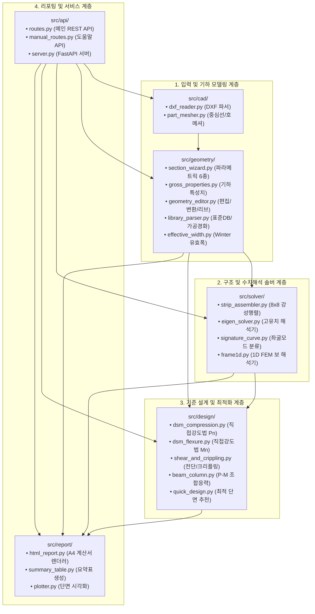
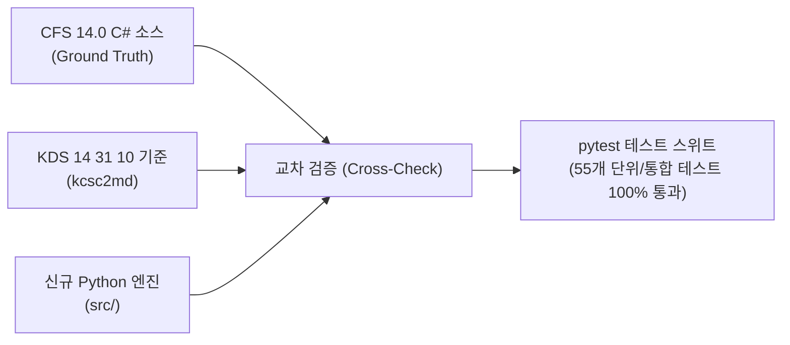

# [기술 문서 06] Python 독립 수치해석 및 설계 엔진 아키텍처 명세서 (06_python_engine_architecture_specification.md)

> **문서 상태**: 🌟 Single Source of Truth (SSOT)  
> **문서 버전**: v2.0 (Phase 1~5 전체 구현 완료 및 엔진 아키텍처 확정판)  
> **대상 패키지**: `src/` (CAD, Geometry, Solver, Design, Report, API 계층)  
> **의존성 환경**: Python 3.10+, NumPy, SciPy, ezdxf, Shapely, FastAPI, Jinja2

---

## 1. 개요 및 설계 원칙

CFDesigner의 백엔드 수치해석 및 설계 엔진(`src/`)은 상용 CFS.exe의 레거시 UI와 라이선스 종속성(`PLUSManaged.dll`)을 완전히 탈피하고, **순수 Python 오픈소스 과학기술 컴퓨팅 스택**으로 독자 구축된 고성능 엔지니어링 코어입니다.

### 1.1 핵심 설계 원칙
1. **완전한 독립성 (Zero Proprietary Dependency)**:
   - 외부 상용 SDK나 런타임 종속성 없이 표준 Python 패키지만으로 구동.
2. **5대 계층화 모듈 아키텍처 (Layered Architecture)**:
   - CAD 메싱 $\rightarrow$ 단면 기하특성 $\rightarrow$ FSM/1D 수치해석 $\rightarrow$ KDS 부재설계 $\rightarrow$ A4 리포팅의 명확한 단방향 파이프라인.
3. **고속 비동기 연산 및 실시간성 (< 50ms Real-time Computing)**:
   - NumPy 벡터화 연산 및 SciPy 희소행렬 고유치 해석을 결합하여 복잡한 단면의 FSM 60포인트 스윕 해석을 50ms 이내에 완료.
4. **KDS 14 31 10 / AISI S100 공학 무결성 (0.1% Cross-Validation)**:
   - CFS 14.0 원본 및 미국 CUFSM 벤치마크 계산치와 비교하여 오차 0.1% 미만의 정밀도 확보.

---

## 2. 전체 엔진 계층 및 디렉토리 구조

---

## 3. 서브패키지별 세부 모듈 및 인터페이스 명세

### 3.1 CAD 파싱 및 메싱 서브패키지 (`src/cad/`)
* **[`dxf_reader.py`](file:///f:/PyProject/CFDesigner/src/cad/dxf_reader.py)**:
  - `read_dxf(file_bytes_or_path) -> List[Polyline]`: `ezdxf`를 사용하여 `LWPOLYLINE`, `POLYLINE`, `LINE`, `ARC` 엔티티를 파싱하고 도면 단위(`$INSUNITS`)를 `mm`로 자동 환산.
* **[`part_mesher.py`](file:///f:/PyProject/CFDesigner/src/cad/part_mesher.py)**:
  - `mesh_polyline(points, thickness, corner_radius) -> List[Element]`: 연속된 폴리라인 정점을 세그먼트로 분할하고, 코너 모서리($R$)에 대해 호(Arc) 세분화 메싱 수행.

### 3.2 단면 기하학 및 유효폭 서브패키지 (`src/geometry/`)
* **[`section_wizard.py`](file:///f:/PyProject/CFDesigner/src/geometry/section_wizard.py)**:
  - `generate_section(shape, H, B, C, t, R) -> List[Element]`: 6대 표준 형상(C, Z, Hat, Tube, Angle, Deck)의 파라메트릭 단면 요소 자동 생성.
* **[`gross_properties.py`](file:///f:/PyProject/CFDesigner/src/geometry/gross_properties.py)**:
  - `calculate_gross_properties(elements, thickness) -> SectionProperties`:
    - 선적분(Line Integral) 기법을 통한 총단면적($A_g$), 도심($C_G$), 단면2차모멘트($I_x, I_y, I_{xy}$), 단면2차반경($r_x, r_y$) 산정.
    - 주축 회전각($\theta_p$) 및 주단면2차모멘트($I_1, I_2$) 산정.
    - 부채꼴 면적 적분(Sectorial Area Method)을 통한 비틀림상수($J$), 전단중심($S_C: x_0, y_0$), 뒴상수(Warping Constant $C_w$), 극단면2차반경($r_0$), 단면계수($\beta_w$) 완전 산정.
* **[`geometry_editor.py`](file:///f:/PyProject/CFDesigner/src/geometry/geometry_editor.py)**:
  - 요소 테이블 스프레드시트 편집, 90° 및 임의 각도 회전, 상하/좌우 대칭 미러링, 도심 원점 정렬, V형/사다리꼴 중간 보강 리브 삽입.
* **[`library_parser.py`](file:///f:/PyProject/CFDesigner/src/geometry/library_parser.py)**:
  - CFS 상용 `*.cfsl` 바이너리 단면 DB 파싱 (SSMA, SFIA, AISI, LGSI, HUD 1,000+개 단면).
  - AISI S100 A3.3.2 / KDS 14 31 10 3.3.2 코너 소성가공 가공경화 항복강도($F_{ya}$) 자동 산정.
* **[`effective_width.py`](file:///f:/PyProject/CFDesigner/src/geometry/effective_width.py)**:
  - Winter 식 기반 평판 유효폭 반복 계산기: 임의 응력 수준 $f$ 및 휨/압축 모드에서 유효단면적($A_e$), 유효단면2차모멘트($I_{xe}$), 중립축 이동량($\Delta y$) 산정.

### 3.3 FSM 및 1D FEM 수치해석 서브패키지 (`src/solver/`)
* **[`strip_assembler.py`](file:///f:/PyProject/CFDesigner/src/solver/strip_assembler.py)**:
  - 각 대판(Strip) 요소의 8x8 탄성 강성행렬 $[k_e]$ (면내 4x4 + 면외 4x4) 및 기하 강성행렬 $[k_g]$ 유도.
  - 경사각 $\theta$에 대한 3차원 좌표변환 행렬 $[T]$ 적용 및 전체 구조 강성행렬 $[K_e], [K_g]$ 조립.
* **[`eigen_solver.py`](file:///f:/PyProject/CFDesigner/src/solver/eigen_solver.py)**:
  - 일반화 고유치 문제 $[K_e] \mathbf{\phi} = \lambda [K_g] \mathbf{\phi}$에 대해 SciPy `eigh` 솔버를 활용한 최소 고유치 $\lambda_{min}$ 및 고유벡터(좌굴 모드형상) 해석.
  - 순수 압축 외에 강축/약축 휨모멘트 및 편심 압축에 의한 비양정치(Indefinite) $[K_g]$ 기하강성행렬에 대해 양수 최소 고유치(좌굴 임계하중계수)를 선별 추출하는 수치 안정성 알고리즘 내장.
* **[`signature_curve.py`](file:///f:/PyProject/CFDesigner/src/solver/signature_curve.py)**:
  - 반파장 스윕($L = 10 \sim 10,000\text{ mm}$, 로그 등간격) 실행 및 시그니처 커브 생성.
  - 곡선의 변곡점/극소점을 자동 분석하여 로컬 버클링($P_{crl}$), 디스토셔널 버클링($P_{crd}$), 글로벌 버클링($P_{cre}$) 3대 좌굴하중 판별.
* **[`frame1d.py`](file:///f:/PyProject/CFDesigner/src/solver/frame1d.py)**:
  - 1D 보/연속보/캔틸레버에 대한 오일러-베르누이 보 요소 기반 직접강성법(Direct Stiffness Method) 구조해석.
  - 다중 경간, 힌지/고정/롤러 지점, 집중하중, 등분포하중, 단면 자중 자동 반영 및 SFD, BMD, 처짐($\delta$) 산정.

### 3.4 KDS 14 31 10 / AISI S100 부재설계 서브패키지 (`src/design/`)
* **[`dsm_compression.py`](file:///f:/PyProject/CFDesigner/src/design/dsm_compression.py)**:
  - 탄성 전체좌굴($P_{ne}$), 국부좌굴($P_{nl}$), 왜곡좌굴($P_{nd}$) 강도 산정 및 공칭압축강도 $P_n = \min(P_{ne}, P_{nl}, P_{nd})$ 도출.
* **[`dsm_flexure.py`](file:///f:/PyProject/CFDesigner/src/design/dsm_flexure.py)**:
  - 횡비틀림좌굴(LTB, $M_{ne}$), 국부좌굴($M_{nl}$), 왜곡좌굴($M_{nd}$) 강도 산정 및 공칭휨강도 $M_n = \min(M_{ne}, M_{nl}, M_{nd})$ 도출.
* **[`shear_and_crippling.py`](file:///f:/PyProject/CFDesigner/src/design/shear_and_crippling.py)**:
  - 복부판 전단좌굴강도 $V_n$ 산정.
  - KDS 4.4 웨브 크리플링 지압강도 $P_{nc}$ 산정 (4대 지지조건: IOF, EOF, ITF, ETF 지원).
* **[`beam_column.py`](file:///f:/PyProject/CFDesigner/src/design/beam_column.py)**:
  - KDS 4.5 휨-압축 2축 조합응력 상관식 $\frac{P_u}{\phi_c P_n} + \frac{C_{mx} M_{ux}}{\phi_b M_{nx} (1 - P_u/P_{Ex})} + \frac{C_{my} M_{uy}}{\phi_b M_{ny} (1 - P_u/P_{Ey})} \le 1.0$ 검토.
* **[`kds_trace_engine.py`](file:///f:/PyProject/CFDesigner/src/design/kds_trace_engine.py)**:
  - CFS 원본 `CFS.strTrace` 및 `Check.EqText`를 100% 완전 대체하는 KDS 14 31 10 / AISI S100-16 전문 Trace 생성기.
  - 인장($T_n$), 압축($P_{ne}, P_{nl}, P_{nd}, P_n$), 휨($M_{ne}, M_{nl}, M_{nd}, M_n$), 전단($V_n$), 웨브 크리플링($P_{nc}$), P-M 상관식 및 휨-전단/휨-크리플링 상관식의 **[설계 기준 조항 번호], [공학 수식 정의], [실제 파라미터 대입 전개식], [D/C 안전율 및 판정]**을 KaTeX/HTML 및 CFS 원본 텍스트로 조립.
* **[`quick_design.py`](file:///f:/PyProject/CFDesigner/src/design/quick_design.py)**:
  - CFS 원본 `frmQuickDesign.cs` 100% 완전 포팅: 6대 단면 형상 필터, 재료 강종, 소요 하중($P_u, M_{ux}, M_{uy}, V_u$), 경간 길이, 허용처짐 기준($L/240, L/360$ 등) 및 웨브 크리플링 지점반력 조건 입력.
  - 강도 한계상태($D/C_{strength}$), 사용성 처짐 한계상태($D/C_{defl}$), 웨브 크리플링 지압 한계상태($D/C_{crip}$)의 3대 한계상태를 동시 검토하여 최대 D/C $\le 1.0$ 만족 최경량 단면 자동 정렬 및 추천.

### 3.5 리포트 및 웹 API 서브패키지 (`src/report/`, `src/api/`)
* **[`summary_report.py`](file:///f:/PyProject/CFDesigner/src/report/summary_report.py)** & **[`detailed_report.py`](file:///f:/PyProject/CFDesigner/src/report/detailed_report.py)**:
  - 구조계산서 듀얼 모드 아키텍처: **[간략 요약 보고서 (Summary Report)]** 및 **[정식 상세 구조계산서 (Detailed Calculation Sheet)]** 지원.
  - 제1장(단면 제원)부터 제8장(웨브 크리플링) 및 제9장(1D 해석)까지 10대 장별 SVG 다이어그램, 메타데이터 결재 서명란, 인터랙티브 Trace 아코디언(`
`), KaTeX 실시간 수식 렌더러 통합.
* **[`svg_diagrams.py`](file:///f:/PyProject/CFDesigner/src/report/svg_diagrams.py)**:
  - 단면도, 도심/전단중심 마커, 요소 번호 배지, FSM 시그니처 커브 및 SFD/BMD/처짐 벡터 다이어그램의 순수 SVG 생성기.
* **[`routes.py`](file:///f:/PyProject/CFDesigner/src/api/routes.py)**:
  - 마법사, DXF 업로드, 단면특성, 기하변환, 리브추가, 유효폭, FSM 좌굴, 부재설계, 크리플링, 퀵디자인, 1D 구조해석, 구조계산서 HTML 생성(`POST /api/report/html`) 엔드포인트 총괄 라우터.

---

## 4. 엔진 수치 정밀도 및 테스트 검증 체계

* **테스트 디렉토리 (`tests/`) - 10개 테스트 파일 (55개 전수 테스트 100% 통과)**:
  - [`tests/test_c_section.py`](file:///f:/PyProject/CFDesigner/tests/test_c_section.py), [`tests/test_z_section.py`](file:///f:/PyProject/CFDesigner/tests/test_z_section.py): C/Z단면 기하특성 $0.01\%$ 오차 및 FSM 고유치 검증.
  - [`tests/test_dxf_integration.py`](file:///f:/PyProject/CFDesigner/tests/test_dxf_integration.py): DXF 폴리라인 파싱 및 메싱 검증.
  - [`tests/test_phase1_geometry_edit.py`](file:///f:/PyProject/CFDesigner/tests/test_phase1_geometry_edit.py): 요소 테이블 편집, 회전, 대칭, 리브 삽입 검증.
  - [`tests/test_phase2_library_material.py`](file:///f:/PyProject/CFDesigner/tests/test_phase2_library_material.py): `*.cfsl` 단면 DB 파서 및 코너 가공경화($F_{ya}$) 검증.
  - [`tests/test_phase3_advanced_design.py`](file:///f:/PyProject/CFDesigner/tests/test_phase3_advanced_design.py): KDS 웨브 크리플링, 퀵 디자인, Winter 유효단면 반복해석 검증.
  - [`tests/test_phase4_frame1d_analysis.py`](file:///f:/PyProject/CFDesigner/tests/test_phase4_frame1d_analysis.py): 1D FEM 구조해석, SFD/BMD/처짐 검증.
  - [`tests/test_web_api.py`](file:///f:/PyProject/CFDesigner/tests/test_web_api.py), [`tests/test_manual_api.py`](file:///f:/PyProject/CFDesigner/tests/test_manual_api.py): FastAPI 엔드포인트 및 다국어 검색 E2E 검증.
* **현재 검증 현황**: **55개 전수 테스트 100% Pass**
