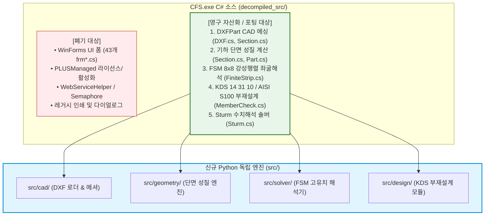

# [기술 문서 06] Python 독립 엔진 개발 전략 및 포팅 로드맵 (06_python_engine_migration_plan.md)

---

## 1. 추진 배경 및 C# 소스 컴파일 진단 결과

### 1.1. C# 재컴파일의 기술적 한계
`decompiled_src/`에 복원된 C# 소스를 기반으로 단독 실행 가능한 C# 바이너리를 재컴파일하는 것은 다음과 같은 구조적 제약으로 인해 불가능하며 실익이 없습니다:

1. **`PLUSManaged.dll` (Concept Software 라이선스 SDK) 강결합**:
   - 프로그램 기동, 단면 계산, 부재 검토 등 코드 전반에 걸쳐 `CFSLicense` 및 `com.softwarekey.Client` 라이선스 검증 루틴이 침투해 있어, 라이브러리 참조 제거 시 수백 개의 컴파일 에러가 발생함.
2. **WinForms UI 바이너리 리소스(`.resx`) 결락**:
   - 43개 UI 폼 클래스가 `resources.GetObject(...)` 형태의 바이너리 리소스에 의존하고 있어, 실행 시 `MissingManifestResourceException`으로 런타임 크래시가 발생함.
3. **디컴파일 코드의 제어 흐름 왜곡**:
   - 예외 처리 블록(`try0000_dispatch`, `goto IL_...`) 및 VB 런타임(`Microsoft.VisualBasic.CompilerServices`) 의존성.

### 1.2. 결론 및 전략적 전환
> **"불필요한 레거시 UI와 라이선스 모듈은 폐기하고, 완벽히 복원된 4대 핵심 공학 알고리즘만을 순수 Python 모듈(`src/`)로 포팅하여 100% 독립적이고 현대적인 CAD 연동 해석 엔진을 구축한다."**

---

## 2. 모듈 분류: 폐기 대상 vs 자산화 대상



---

## 3. 신규 Python 엔진(`src/`) 아키텍처 명세

외부 상용 라이브러리 종속성 없이, 순수 오픈소스 표준 스택(`numpy`, `scipy`, `ezdxf`, `shapely`, `matplotlib`)을 기반으로 구성합니다.

```
src/
├── cad/                        # 1. CAD 파싱 및 단면 메싱
│   ├── __init__.py
│   ├── dxf_reader.py          # ezdxf 기반 LWPOLYLINE/POLYLINE 읽기 & $INSUNITS 환산
│   └── part_mesher.py         # C# DXFPart 대응: 코너 Fillet R, 두께 오프셋, 요소 분할
├── geometry/                   # 2. 기하학적 단면 성질 계산
│   ├── __init__.py
│   ├── gross_properties.py    # A, Ix, Iy, Ixy, rx, ry, Zx, Zy, J, Cw, x0, y0
│   └── effective_properties.py# Winter 유효폭 반복 수치해석 (Ae, Ixe, Iye)
├── solver/                     # 3. 유한대판법(FSM) 탄성 좌굴해석
│   ├── __init__.py
│   ├── strip_assembler.py     # 8x8 [Ke], [Kg] 요소 강성행렬 조립 및 좌표변환
│   ├── eigen_solver.py        # 일반화 고유치 해석 ([Ke] - λ [Kg] = 0)
│   └── signature_curve.py     # 반파장 스윕 및 국부(Pcrl)/왜곡(Pcrd)/전체(Pcre) 모드 판별
├── design/                     # 4. KDS 14 31 10 / AISI S100 부재설계
│   ├── __init__.py
│   ├── dsm_compression.py     # 직접강도법 압축재 공칭강도 Pn (Pne, Pnl, Pnd)
│   ├── dsm_flexure.py         # 직접강도법 휨재 공칭강도 Mn (Mne, Mnl, Mnd)
│   ├── shear_and_crippling.py # 복부판 전단(Vn) 및 웨브 크리플링(Pnc)
│   └── beam_column.py         # 휨-압축 P-M 조합응력 상관식 검토
└── report/                     # 5. 계산서 및 시각화
    ├── __init__.py
    ├── plotter.py             # 2D 단면도 및 FSM 좌굴 형상/곡선 Matplotlib 시각화
    └── summary_table.py       # A4 구조계산서 텍스트/마크다운 요약 리포트
```

---

## 4. 단계별 개발 및 검증 로드맵 (4-Phase Roadmap)

### Phase 1: CAD 로더 & 단면 기하 성질 엔진 구축 (`src/cad/`, `src/geometry/`)
* **구현 목표**: DXF 파일 읽기 $\rightarrow$ 단면 메싱 $\rightarrow$ 단면적($A$), 단면이차모멘트($I$), 전단중심($x_o, y_o$), 비틀림/와핑 상수($J, C_w$) 산정.
* **검증 방법**: CFS 표준 단면 라이브러리(C형강, Z형강) 및 DXF 샘플 단면과 소수점 4자리까지 교차 검증.

### Phase 2: FSM 유한대판법 탄성 좌굴 솔버 구축 (`src/solver/`)
* **구현 목표**: 8x8 요소 강성행렬 조립, 반파장 스윕(0.1 ~ 1000 inch) 고유치 해석, Signature Curve 자동 생성 및 $P_{crl}, P_{crd}, P_{cre}$ 자동 추출.
* **검증 방법**: `CFS.exe`의 FiniteStrip 해석 결과 및 `CUFSM` 벤치마크 데이터와 좌굴하중 0.1% 오차 검증.

### Phase 3: KDS 14 31 10 / AISI S100 부재설계 모듈 구축 (`src/design/`)
* **구현 목표**: 직접강도법(DSM) 공칭 압축/휨 강도 계산, 복부판 전단, 웨브 크리플링, P-M 상호작용 검토.
* **검증 방법**: 상위 `kcsc2md`의 KDS 14 31 10 공인 예제집 및 CFS MemberCheck 결과와 1:1 대조.

### Phase 4: A4 계산서 출력 및 시각화 파이프라인 완성 (`src/report/`)
* **구현 목표**: 2D 단면 형상, FSM 좌굴모드 다이어그램, P-M 상관도 및 A4 표준 구조계산서 자동 생성.
