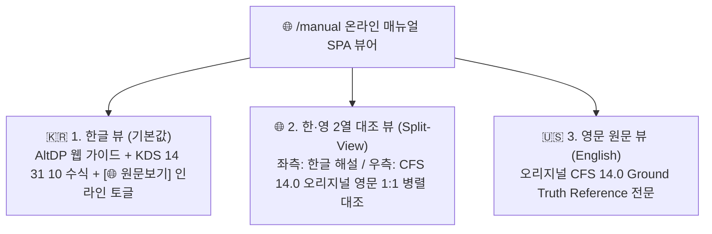

# [온라인 도움말 시스템 통합 명세서] CFDesigner Online Help & Bilingual Documentation SSOT

> **문서 상태**: 🌟 Single Source of Truth (SSOT)  
> **문서 버전**: v2.0 (Phase 1~5 25개 전수 토픽 및 한·영 3-Way Bilingual 통합판)  
> **관련 엔드포인트**: `/manual` (SPA 웹 뷰어) & `/api/manual/*` (REST API)  
> **원본 레퍼런스**: CFS 14.0 공식 매뉴얼 ([`decompiled_src/cfs_help_manual/`](file:///f:/PyProject/CFDesigner/decompiled_src/cfs_help_manual/overview.htm)) & KDS 14 31 10 기준

---

## 1. 시스템 개요 및 뷰 패러다임

CFDesigner 온라인 도움말 시스템은 국내 실무 엔지니어를 위한 **KDS 14 31 10 표준 한글 공학 해설 및 모던 웹 UI/UX 가이드**와, 원본 상용 CFS 14.0의 기준 수식 및 공학 이론을 교차 검증할 수 있는 **AISI S100 영문 원문(Ground Truth Reference)**을 동시에 제공하는 통합 다국어 도움말 플랫폼입니다.



### 1.1 3-Way 다국어 뷰 모드 사양
1. **한글 뷰 (Korean Mode, 기본값)**:
   - 모던 AltDP 인터페이스 조작법과 국내 KDS 14 31 10 설계기준에 맞춘 완결성 높은 한글 테크니컬 가이드.
   - 각 주요 단락/수식 우측에 `[🌐 원문보기]` 아코디언 토글을 제공하여 문맥을 벗어나지 않고 영문 원문 대조 가능.
2. **한·영 2열 대조 뷰 (Side-by-Side Split View)**:
   - 5:5 2열 분할 그리드로 좌측 한글, 우측 영문 원문을 동시 배치.
   - 양방향 스크롤 연동(Synchronized Scrolling)을 지원하여 논문/보고서 작성 및 기준 대조 시 생산성 극대화.
3. **영문 원문 뷰 (English Ground Truth Mode)**:
   - CFS 14.0 오리지널 기술문헌 및 AISI S100 설계 매뉴얼의 원문 서술과 공학 기호 체계를 100% 보존하여 표시.

### 1.2 전문 공학 용어 툴팁 & 정의 피킹 (Glossary Peek)
- 본문 내 주요 공학 용어(예: *Warping Constant*, *Distortional Buckling*, *Web Crippling*, *Direct Strength Method*)에 호버 시 영문 명칭, 약어, 원문 정의를 담은 팝오버 툴팁 실시간 표출.
- KaTeX 수식 엔진을 통해 모든 LaTeX 수식이 다크/라이트 테마에 맞추어 선명하게 렌더링.

---

## 2. 6대 카테고리 및 25개 전수 토픽 인덱스 명세

| 카테고리 | 토픽 ID | 한글 제목 (Web UI) | 영문 제목 (CFS 14.0 Reference) | 주요 수록 내용 및 공학 이론 | 구현 Phase |
|---|---|---|---|---|:---:|
| **1. 시작하기 & 웹 UI** | `intro` | 시스템 소개 및 특징 | System Overview & Features | CFS SaaS 웹 구조, 클라우드 수치해석 아키텍처 개요 | 기반 |
| | `ui_layout` | 웹 UI 4분할 레이아웃 가이드 | Web UI 4-Quadrant Layout Guide | 좌측 제어패널, 2D/3D 캔버스, FSM 차트, D/C 패널 | 기반 |
| | `wizard` | 단면 마법사 파라메트릭 생성 | Parametric Section Wizard | 6대 기본 단면(C, Z, Hat, Deck, Tube, Angle) 파라메트릭 빌드 | 기반 |
| | `dxf_import` | AutoCAD DXF 가져오기 & 메싱 | AutoCAD DXF Import & Auto-Meshing | 2D Polyline 중심선 작도, 곡선 분할, 드래그&드롭 로드 | 기반 |
| | `element_grid` | 단면 요소 테이블 직접 편집 | Element Table Spreadsheet Editor | 노드, 길이, 각도, 두께 스프레드시트 편집 모달 | Phase 1 |
| | `geom_transform` | 단면 기하 변환 및 중간 리브 | Geometric Transforms & Intermediate Ribs | 90° 회전, 대칭 미러링, 원점 정렬, V/U형 보강 리브 추가 | Phase 1 |
| **2. 라이브러리 & 재료** | `section_lib` | 표준 단면 라이브러리 브라우저 | Section Library Browser (AISI/SSMA) | 1,000+개 표준 단면(SSMA/SFIA/LGSI) 검색, 필터 및 로드 | Phase 2 |
| | `material_db` | 강재 재료 DB 및 물성치 설정 | Material Properties & Custom Steel | KS(SSC275, SGC 등) 및 ASTM 프리셋, $F_y, F_u, E$ 파라미터 | Phase 2 |
| | `cold_work` | 코너 성형 가공경화 강도 증가 | Cold-Work Forming Strength Calculation | 코너 절곡에 따른 가공경화 유효항복강도($F_{ya}$) 자동 산정식 | Phase 2 |
| **3. 단면 성질 & 유효단면** | `gross_props` | 총단면 기하학적 성질 (Gross) | Gross Section Properties | $A_g, I_x, I_y, r_x, r_y$, 도심($C_G$) 선적분 메싱 적분 공식 | 기반 |
| | `torsion_props` | 비틀림 및 뒴 성질 (Torsion) | Torsional & Warping Properties | 생브낭 $J$, 뒴상수 $C_w$, 전단중심 $S_C(x_0, y_0)$, 극반경 $r_0$ | 기반 |
| | `principal_axes` | 주축 및 주단면 2차모멘트 | Principal Axes & Principal Moments | 주축 회전각($\theta_p$), 주단면 2차모멘트($I_1, I_2$), 단면 계수 | 기반 |
| | `effective_props` | Winter 식 기반 유효단면 해석 | Effective Section Properties (Winter Method) | 압축/휨 하중 하의 유효폭 반복 계산 및 2D 점선 표시 | Phase 3 |
| **4. FSM 좌굴해석** | `fsm_theory` | FSM 탄성 좌굴 해석 이론 | FSM Elastic Buckling Theory | $[K_e], [K_g]$ 대판 강성행렬 유도 및 일반화 고유치 수치해석 | 기반 |
| | `buckling_modes` | 좌굴 모드 판별 (국부/왜곡/전체) | Buckling Mode Classification | $P_{crl}, P_{crd}, P_{cre}$ 판독법 및 모드 변형 형상 판별 | 기반 |
| | `signature_curve` | 시그니처 커브 및 3D 시각화 | Signature Curve & 3D Visualization | 반파장 $L$ 스펙트럼 곡선, Three.js 3D 모드 형상 조작 | 기반 |
| | `fsm_params` | FSM 해석 구간 및 하중조건 설정 | Buckling Analysis Parameters & Results Grid | 스윕 범위($L_{min} \sim L_{max}$), 편심응력, CSV 데이터 내보내기 | Phase 3 |
| **5. KDS 설계 & 계산서** | `kds_dsm_comp` | KDS 압축부재 설계 (DSM Pn) | KDS Compression Member Design (DSM Pn) | $P_{ne}, P_{nl}, P_{nd}$ 및 공칭압축강도 $P_n$ 산정식 | 기반 |
| | `kds_dsm_flex` | KDS 휨부재 설계 (DSM Mn) | KDS Flexural Member Design (DSM Mn) | $M_{ne}, M_{nl}, M_{nd}$ 및 공칭휨강도 $M_n$ 산정식 | 기반 |
| | `kds_shear_crip` | KDS 전단강도 & 웨브 크리플링 | KDS Shear & Web Crippling Strength | 전단강도 $V_n$ 및 4대 지지조건(EOF/IOF/ETF/ITF) $P_{nc}$ 산정식 | Phase 3 |
| | `quick_design` | 퀵 디자인 (최적 단면 자동 추천) | Quick Design Optimization Tool | 소요 하중($P_u, M_u$) 입력 시 경량 최적 단면 자동 탐색 알고리즘 | Phase 3 |
| | `kds_interaction` | P-M 조합응력 & D/C 검토 | P-M Interaction & Biaxial Bending | 휨-압축 상관식, 모멘트 증대계수($B_1, B_2$), D/C 판정 기준 | 기반 |
| | `report_guide` | A4 구조계산서 출력 & 인쇄 | A4 Calculation Report Guide | 인쇄 미리보기, 수식 근거표, 브라우저 PDF/인쇄 표준 서식 | 기반 |
| **6. 1D 구조해석** | `analysis_wizard` | 1D 구조해석 마법사 & 하중입력 | 1D Frame Analysis Wizard & Loadings | 단순보, 연속보, 캔틸레버 경간/지점/하중(점/분포/모멘트) 입력법 | Phase 4 |
| | `diagrams_viewer` | SFD / BMD / 처짐 다이어그램 | Shear, Moment & Deflection Diagrams | SFD/BMD/처짐 차트 인터랙션 및 부재설계 원클릭 연동 흐름 | Phase 4 |

---

## 3. 프론트엔드 UI/UX 아키텍처 및 스타일 명세

### 3.1 파일 구성 및 컴포넌트 책임
* **[`src/web/manual.html`](file:///f:/PyProject/CFDesigner/src/web/manual.html)**:
  - SPA 뷰어 마크업 구조
  - 상단 툴바: 로고, 3-Way 뷰 세그먼트 컨트롤, 실시간 다국어 검색창, 테마 토글 버튼
  - 좌측 사이드바: 6대 카테고리 트리 TOC 및 25개 토픽 뱃지
  - 중앙 메인 뷰포트: Single / Split 뷰 컨테이너, 인라인 토글 박스, 용어 툴팁 팝오버
* **[`src/web/static/css/manual.css`](file:///f:/PyProject/CFDesigner/src/web/static/css/manual.css)**:
  - AltDP 모던 다크/라이트 디자인 토큰 연동
  - 3-Way 뷰 세그먼트 컨트롤 UI (`.view-mode-btn`, `.active`)
  - 2열 스플릿 뷰 그리드 레이아웃 (`.split-container`, `.split-col-ko`, `.split-col-en`)
  - 인라인 원문 아코디언 카드 (`.inline-en-box`, `.inline-toggle-btn`)
  - 공학 용어 툴팁 스타일 (`.glossary-term`, `.term-popover`)
* **[`src/web/static/js/manual.js`](file:///f:/PyProject/CFDesigner/src/web/static/js/manual.js)**:
  - 클라이언트 라우팅 및 토픽 로딩 (`loadTopic(id)`)
  - 3-Way 뷰 모드 상태 관리 (`ko`, `split`, `en`) 및 `localStorage` 영속화
  - 인라인 원문 토글 이벤트 핸들링
  - 스플릿 모드 좌/우 동기화 스크롤
  - 실시간 다국어 검색 디바운싱 및 하이라이트
  - KaTeX 수식 동적 렌더링 파이프라인

---

## 4. 백엔드 REST API 및 데이터 스키마

### 4.1 데이터 모델 (`src/web/manual/topics.py`)
각 토픽은 완전한 한·영 병기 데이터셋 구조를 갖습니다:

```python
class TopicDict(TypedDict):
    id: str                 # 토픽 고유 식별자 (예: 'gross_props')
    category: str           # 6대 카테고리 ID (예: 'section_props')
    title_ko: str           # 한글 제목
    title_en: str           # 영문 제목 (CFS 14.0 매뉴얼 표제)
    summary_ko: str         # 한글 요약 설명
    summary_en: str         # 영문 요약 설명
    content_ko_html: str    # 한글 본문 HTML (KaTeX 수식 + 인라인 토글 태그 포함)
    content_en_html: str    # 영문 원문 HTML (AISI S100 / CFS 레거시 텍스트)
    order: int              # 목차 표시 순서
```

### 4.2 REST API 엔드포인트 명세 (`src/api/manual_routes.py`)

| 메서드 | 엔드포인트 | 파라미터 | 반환 내용 및 설명 |
|---|---|---|---|
| `GET` | `/manual` | - | 온라인 도움말 SPA 웹 페이지 HTML 서빙 |
| `GET` | `/api/manual/categories` | - | 6대 카테고리 및 25개 토픽 메타데이터 목록 (TOC 트리 구조) |
| `GET` | `/api/manual/topic/{id}` | `id` (경로) | 지정한 토픽의 한/영 전체 본문, 요약 및 메타데이터 반환 |
| `GET` | `/api/manual/search` | `q` (쿼리스트링) | 다국어(한글/영문) 가중치 기반 실시간 통합 검색 결과 반환 |

### 4.3 다국어 검색 알고리즘 및 스코어링 규칙
* **가중치 매칭 스코어**:
  - `title_ko` / `title_en` 일치: **10점**
  - `summary_ko` / `summary_en` 일치: **5점**
  - `content_ko_html` / `content_en_html` 일치: **1점**
* 한글 검색어(예: `유효폭`, `좌굴모드`)뿐 아니라 영문 공학 키워드(예: `Winter`, `Distortional`, `Warping`, `Web Crippling`)로도 양방향 검색 가능.

---

## 5. KDS 14 31 10 & CFS 14.0 원본 무결성 대조 체계

1. **CFS 14.0 오리지널 도움말 아카이브 ([`decompiled_src/cfs_help_manual/`](file:///f:/PyProject/CFDesigner/decompiled_src/cfs_help_manual/overview.htm))**:
   - 95개 오리지널 도움말 HTML 파일 보존.
   - 영문 원문 뷰 및 인라인 대조 시 원본 문구와 수식 변수 표기법을 그대로 준용.
2. **KDS 14 31 10 국가건설기준 Ground Truth**:
   - 상위 `kcsc2md` 자산과 교차 검증하여 국내 설계식 기호($P_n, M_n, \phi$) 및 한글 용어 표준 준수.
