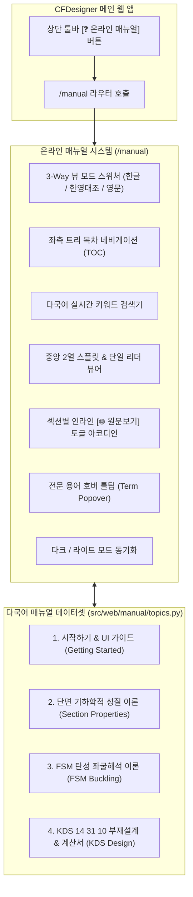

# [기술 문서 08] 온라인 도움말 시스템 사양서 (08_online_help_manual_specification.md)

---

## 1. 개요 및 목적

본 문서는 **CFDesigner (냉간성형강 비정형 단면 CAD 연동 구조해석 및 KDS/AISI 부재설계 시스템)**의 내장 온라인 도움말 시스템(Online Help Manual System)의 아키텍처, KDS 14 31 10 기준 기반의 공학 이론 한글화 표준, 영문 원문(AISI S100 / CFS Ground Truth) 대조 뷰어, 그리고 AltDP 스타일의 웹 문서 뷰어(`/manual`) 사양을 정의합니다.

기존 상용 CFS 14.0의 95개 HTML 도움말 자산을 기반으로, **레거시 WinForms UI 설명을 최신 AltDP 웹 인터페이스로 전면 개편**하고, **국내 건설기준 KDS 14 31 10과 영문 원문을 완벽하게 병기 대조할 수 있는 다국어 뷰어 엔진**을 구축하였습니다.

---

## 2. 온라인 도움말 시스템 아키텍처 (Bilingual Edition)

---

## 3. 다국어 뷰 모드 및 UI 컴포넌트 명세

### 3.1 3-Way 글로벌 뷰 모드
1. **🇰🇷 한글 뷰 모드 (`ko`)**: KDS 14 31 10 기준에 맞추어 현대화된 한국어 설명. 각 섹션/블록 우측에 인라인 `[🌐 원문보기]` 버튼 배치.
2. **🌐 한·영 2열 대조 뷰 모드 (`split`)**: 데스크톱 화면에서 좌측(한글)과 우측(영문 원문)을 5:5 비율로 분할하여 나란히 표시. 스크롤 위치 동기화(Synchronized Scroll) 지원.
3. **🇺🇸 영문 원문 뷰 모드 (`en`)**: AISI S100 및 오리지널 CFS 기술 문서 기반의 영문 원문 문서 단독 뷰.

### 3.2 단락별 인라인 원문 토글 (Inline Toggle Accordion)
- 한글 모드 열람 중 특정 단락이나 수식의 번역 정합성을 확인하고자 할 때, `[🌐 원문 보기 (View Original)]` 클릭 시 해당 위치 바로 아래에 `ORIGINAL REFERENCE` 배지가 달린 세련된 원문 인라인 카드가 부드럽게 펼쳐짐.

### 3.3 전문 공학 용어 호버 툴팁 (Term Tooltip)
- 본문 내 `` 태그가 적용된 전문 용어에 마우스를 올리면, 해당 용어의 영문 표준 명칭 및 공학적 정의를 팝오버로 실시간 표시.

---

## 4. 도움말 4대 카테고리 및 세부 토픽 구성 명세

### 📂 1. 시작하기 및 웹 인터페이스 가이드 (Getting Started & UI Guide)
| 토픽 ID | 한글 제목 | 영문 제목 | 핵심 내용 |
|---|---|---|---|
| `intro` | 시스템 소개 및 특징 | System Overview & Features | CFDesigner 시스템 개요, FSM 수치해석의 특징 및 SaaS 웹 구조 |
| `ui_layout` | 웹 UI 4분할 레이아웃 가이드 | Web UI 4-Quadrant Layout Guide | 4분할 레이아웃(단면입력, 2D/3D 캔버스, 시그니처커브, D/C 패널) 설명 |
| `wizard` | 단면 마법사 파라메트릭 생성 | Parametric Section Wizard | C, Z, 모자형, 각형강관, L형강, 데크 6대 표준 단면 생성 및 모서리($R$) 메싱 |
| `dxf_import` | AutoCAD DXF 가져오기 및 메싱 | AutoCAD DXF Import & Auto-Meshing | 2D Polyline 작도 규칙, 중심선(Centerline) 추출 및 유한대판 노드 자동 생성 |

### 📂 2. 단면 기하학적 성질 이론 (Section Properties Theory)
| 토픽 ID | 한글 제목 | 영문 제목 | 핵심 내용 |
|---|---|---|---|
| `gross_props` | 총단면 기하학적 성질 (Gross Properties) | Gross Section Properties | $A_g, I_x, I_y, r_x, r_y$, 도심($C_G$) 계산 선적분 수식 |
| `torsion_props` | 비틀림 및 뒴 성질 (Torsion & Warping) | Torsional & Warping Properties | 생브낭 비틀림($J$), 섹터좌표계 기반 뒴상수($C_w$), 전단중심($S_C$), 극단면반경($r_0$) |
| `principal_axes` | 주축 및 주단면 2차모멘트 (Principal Axes) | Principal Axes & Principal Moments | 주축 회전각($\theta_p$), 주단면 2차모멘트($I_1, I_2$) 및 Mohr 관성원 수식 유도 |

### 📂 3. FSM 탄성 좌굴해석 이론 (Finite Strip Method Buckling)
| 토픽 ID | 한글 제목 | 영문 제목 | 핵심 내용 |
|---|---|---|---|
| `fsm_theory` | 유한대판법(FSM) 탄성 좌굴 해석 이론 | FSM Elastic Buckling Theory | 길이방향 사인함수 전개, $[K_e], [K_g]$ 대판 강성행렬 유도 및 일반화 고유치 문제 |
| `buckling_modes` | 좌굴 모드 판별: 국부, 왜곡, 전체 좌굴 | Buckling Mode Classification | 국부($P_{crl}$), 왜곡($P_{crd}$), 전체($P_{cre}$) 좌굴 특성 및 자동 판별 알고리즘 |
| `signature_curve` | 시그니처 커브 및 3D 좌굴모드 시각화 | Signature Curve & 3D Visualization | 반파장 $L$에 따른 좌굴 스펙트럼 판독법 및 Three.js 3D 모드 형상 렌더링 |

### 📂 4. KDS 14 31 10 부재설계 & 계산서 (Member Design & Reports)
| 토픽 ID | 한글 제목 | 영문 제목 | 핵심 내용 |
|---|---|---|---|
| `kds_dsm_comp` | KDS 14 31 10 압축부재 설계 (DSM Pn) | KDS Compression Member Design (DSM Pn) | 전체좌굴($P_{ne}$), 국부좌굴($P_{nl}$), 왜곡좌굴($P_{nd}$) 및 공칭압축강도 $P_n$ 산정식 |
| `kds_dsm_flex` | KDS 14 31 10 휨부재 설계 (DSM Mn) | KDS Flexural Member Design (DSM Mn) | 횡비틀림좌굴($M_{ne}$), 국부($M_{nl}$), 왜곡($M_{nd}$) 및 공칭휨강도 $M_n$ 산정식 |
| `kds_shear_crip` | KDS 전단강도(Vn) 및 웨브 크리플링(Pnc) | KDS Shear Strength (Vn) & Web Crippling | KDS 전단좌굴강도($V_n$) 및 4대 지지조건별 웨브 크리플링($P_{nc}$) 수식 |
| `kds_interaction` | P-M 조합응력 및 2축 휨-압축 검토 | P-M Interaction & Biaxial Bending | 휨-압축 부재 상관식, 모멘트 증대계수($B_1, B_2$) 및 D/C Ratio 판정 |
| `report_guide` | A4 구조계산서 출력 및 인쇄 가이드 | A4 Calculation Report Guide | A4 계산서 서식 구조, 수식 근거표, 브라우저 PDF 인쇄 최적화 |

---

## 5. KDS 14 31 10 표준 한국어-영어 공학 용어 매핑 테이블

| 영문 용어 (CFS / AISI) | KDS 14 31 10 표준 용어 | 비고 및 수식 심볼 |
|---|---|---|
| Gross Properties | 총단면 성질 | $A_g, I_x, I_y, r_x, r_y$ |
| Effective Properties | 유효단면 성질 | $A_e, I_{xe}, I_{ye}$ (Winter 유효폭) |
| Centroid (CG) | 도심 (도심축) | $(x_{cg}, y_{cg})$ |
| Shear Center (SC) | 전단중심 | $(x_o, y_o)$ |
| Saint-Venant Torsion Constant | 생브낭 비틀림상수 | $J$ |
| Warping Constant | 뒴(워핑) 상수 | $C_w$ |
| Principal Axes | 주축 (주단면 2차모멘트) | $I_1, I_2, \theta_p$ |
| Finite Strip Method (FSM) | 유한대판법 | $[K_e]\{\delta\} = \lambda [K_g]\{\delta\}$ |
| Signature Curve | 좌굴하중곡선 (시그니처 커브) | $L$ vs $\sigma_{cr}$ 곡선 |
| Local Buckling | 국부 좌굴 | $P_{crl}, M_{crl}$ (판요소 휨 변형) |
| Distortional Buckling | 왜곡 좌굴 | $P_{crd}, M_{crd}$ (플랜지/립 회전 변형) |
| Global / Lateral-Torsional Buckling | 전체 좌굴 / 횡비틀림 좌굴 | $P_{cre}, M_{cre}$ |
| Direct Strength Method (DSM) | 직접강도법 | KDS 14 31 10 제4장 |
| Web Crippling | 웨브 크리플링 (복부판 국부압궤) | $P_{nc}$ |
| Demand-Capacity Ratio (D/C Ratio) | 소요강도 대비 설계내력비 (D/C 비) | $P_u / (\phi P_n) \le 1.0$ |
