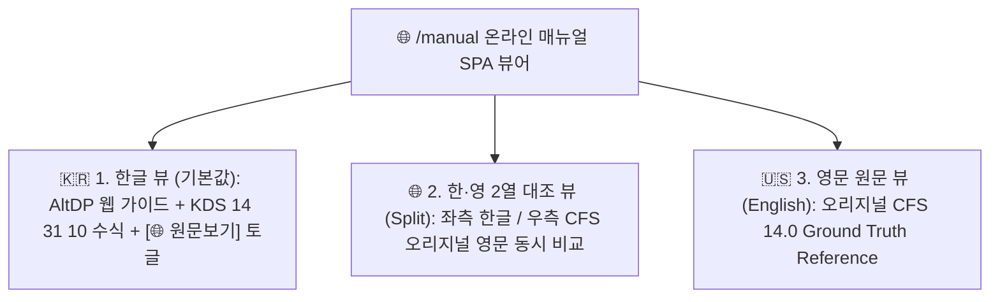

# [온라인 도움말 시스템 명세서] CFDesigner Online Help Manual Specification (Bilingual Edition)

> **문서 상태**: 🌟 Single Source of Truth (SSOT)  
> **최종 갱신일**: 2026-09-01 (Phase 5 25개 토픽 확장 완료)  
> **적용 URL**: `/manual` (AltDP SPA 뷰어) & `/api/manual/*` (REST API)

---

## 1. 시스템 개요 및 뷰 모드 사양

CFDesigner 온라인 도움말 매뉴얼은 국내 실무 엔지니어를 위한 **KDS 14 31 10 표준 한글 공학 해설 및 모던 웹 UI/UX 가이드**와, 상용 CFS 14.0의 기준 수식 및 원본을 대조할 수 있는 **AISI S100 영문 원문(Ground Truth Reference)**을 동시에 제공하는 3-Way Bilingual 뷰어입니다.

---

## 2. 6대 카테고리 및 25개 토픽 인덱스 명세

| 카테고리 | 토픽 ID | 한글 제목 (Web UI) | 영문 제목 (CFS 14.0 Reference) | 주요 수록 내용 | Phase |
|---|---|---|---|---|:---:|
| **1. 시작하기 & 웹 UI** | `intro` | 시스템 소개 및 특징 | System Overview & Features | CFS SaaS 웹 구조, 클라우드 수치해석 개요 | 기반 |
| | `ui_layout` | 웹 UI 4분할 레이아웃 가이드 | Web UI 4-Quadrant Layout Guide | 좌측 제어패널, 2D/3D 캔버스, FSM 차트, D/C 패널 | 기반 |
| | `wizard` | 단면 마법사 파라메트릭 생성 | Parametric Section Wizard | 6대 기본 단면(C, Z, Hat, Deck, Tube, Angle) | 기반 |
| | `dxf_import` | AutoCAD DXF 가져오기 & 메싱 | AutoCAD DXF Import & Auto-Meshing | 2D Polyline 중심선 작도 및 드래그&드롭 로드 | 기반 |
| | **`element_grid`** | **단면 요소 테이블 직접 편집** | **Element Table Spreadsheet Editor** | 노드, 길이, 각도, 두께 스프레드시트 편집 모달 | **P1** |
| | **`geom_transform`** | **단면 기하 변환 및 중간 리브** | **Geometric Transforms & Intermediate Ribs** | 90° 회전, 대칭 미러링, 원점 정렬, V/U형 보강 리브 | **P1** |
| **2. 라이브러리 & 재료** | **`section_lib`** | **표준 단면 라이브러리 브라우저** | **Section Library Browser (AISI/SSMA)** | 1,000+개 표준 단면(SSMA/SFIA/LGSI) 검색 & 로드 | **P2** |
| | **`material_db`** | **강재 재료 DB 및 물성치 설정** | **Material Properties & Custom Steel** | KS(SSC275 등) 및 ASTM 프리셋, $F_y, F_u, E$ 설정 | **P2** |
| | **`cold_work`** | **코너 성형 가공경화 강도 증가** | **Cold-Work Forming Strength Calculation** | 코너 절곡에 따른 유효항복강도($F_{ya}$) 자동 산정 | **P2** |
| **3. 단면 성질 & 유효단면** | `gross_props` | 총단면 기하학적 성질 (Gross) | Gross Section Properties | $A_g, I_x, I_y, r_x, r_y$, 도심($C_G$) 선적분 수식 | 기반 |
| | `torsion_props` | 비틀림 및 뒴 성질 (Torsion) | Torsional & Warping Properties | 생브낭 $J$, 뒴상수 $C_w$, 전단중심 $S_C$, 극반경 $r_0$ | 기반 |
| | `principal_axes` | 주축 및 주단면 2차모멘트 | Principal Axes & Principal Moments | 주축 회전각($\theta_p$), 주단면 2차모멘트($I_1, I_2$) | 기반 |
| | **`effective_props`** | **Winter 식 기반 유효단면 해석** | **Effective Section Properties (Winter Method)** | 압축/휨 하중 하의 유효폭 반복 계산 및 2D 점선 표시 | **P3** |
| **4. FSM 좌굴해석** | `fsm_theory` | FSM 탄성 좌굴 해석 이론 | FSM Elastic Buckling Theory | $[K_e], [K_g]$ 대판 강성행렬 유도 및 일반화 고유치 | 기반 |
| | `buckling_modes` | 좌굴 모드 판별 (국부/왜곡/전체) | Buckling Mode Classification | $P_{crl}, P_{crd}, P_{cre}$ 판독법 및 모드 변형 특징 | 기반 |
| | `signature_curve` | 시그니처 커브 및 3D 시각화 | Signature Curve & 3D Visualization | 반파장 $L$ 스펙트럼 곡선 및 Three.js 3D 뷰어 조작 | 기반 |
| | **`fsm_params`** | **FSM 해석 구간 및 하중조건 설정** | **Buckling Analysis Parameters & Results Grid** | 스윕 범위($L_{min} \sim L_{max}$), 편심응력, CSV 내보내기 | **P3** |
| **5. KDS 설계 & 계산서** | `kds_dsm_comp` | KDS 압축부재 설계 (DSM Pn) | KDS Compression Member Design (DSM Pn) | $P_{ne}, P_{nl}, P_{nd}$ 및 공칭압축강도 $P_n$ 산정식 | 기반 |
| | `kds_dsm_flex` | KDS 휨부재 설계 (DSM Mn) | KDS Flexural Member Design (DSM Mn) | $M_{ne}, M_{nl}, M_{nd}$ 및 공칭휨강도 $M_n$ 산정식 | 기반 |
| | `kds_shear_crip` | KDS 전단강도 & 웨브 크리플링 | KDS Shear & Web Crippling Strength | $V_n$ 수식 및 4대 지지조건(EOF/IOF/ETF/ITF) $P_{nc}$ | **P3** |
| | **`quick_design`** | **퀵 디자인 (최적 단면 자동 추천)** | **Quick Design Optimization Tool** | 설계 소요 하중($P_u, M_u$) 입력 시 최경량 단면 추천 | **P3** |
| | `kds_interaction` | P-M 조합응력 & D/C 검토 | P-M Interaction & Biaxial Bending | 휨-압축 상관식, 모멘트 증대계수($B_1, B_2$), D/C 판정 | 기반 |
| | `report_guide` | A4 구조계산서 출력 & 인쇄 | A4 Calculation Report Guide | 인쇄 미리보기, 수식 근거표, 브라우저 PDF 저장법 | 기반 |
| **6. 1D 구조해석** | **`analysis_wizard`** | **1D 구조해석 마법사 & 하중입력** | **1D Frame Analysis Wizard & Loadings** | 단순보, 연속보, 캔틸레버 경간/지점/하중 입력법 | **P4** |
| | **`diagrams_viewer`** | **SFD / BMD / 처짐 다이어그램** | **Shear, Moment & Deflection Diagrams** | SFD/BMD/처짐 차트 인터랙션 및 부재설계 원클릭 연동 | **P4** |

---

## 3. 백엔드 API 명세

* `GET /manual`: 온라인 매뉴얼 SPA 웹 페이지 서빙
* `GET /api/manual/categories`: 6대 카테고리 및 25개 토픽 메타데이터 TOC 반환
* `GET /api/manual/topic/{id}`: 특정 토픽의 한글/영문 HTML 본문 및 수식 데이터 반환
* `GET /api/manual/search?q={query}`: 다국어(한글/영문) 가중치 기반 실시간 토픽 검색
