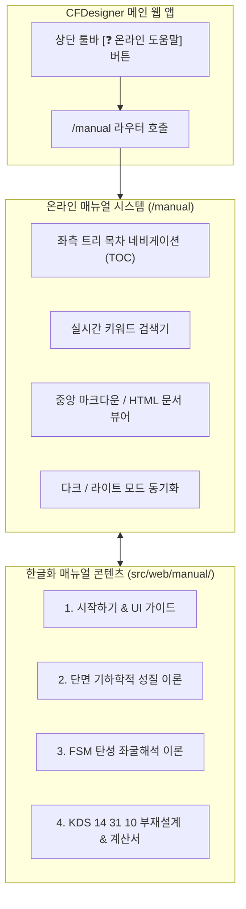

# [기술 문서 08] 온라인 도움말 시스템 사양서 (08_online_help_manual_specification.md)

---

## 1. 개요 및 목적

본 문서는 **CFDesigner (냉간성형강 비정형 단면 CAD 연동 구조해석 및 KDS/AISI 부재설계 시스템)**의 내장 온라인 도움말 시스템(Online Help Manual System)의 아키텍처, KDS 14 31 10 기준 기반의 공학 이론 한글화 표준, 그리고 AltDP 스타일의 웹 문서 뷰어(`/manual`) 사양을 정의합니다.

기존 상용 CFS 14.0의 95개 HTML 도움말 자산을 기반으로, **레거시 WinForms UI 설명을 최신 AltDP 웹 인터페이스로 전면 개편**하고, **영문 AISI 규준을 국내 건설기준 KDS 14 31 10에 부합하도록 한국어로 체계화**하여 웹 애플리케이션 내에서 즉시 열람할 수 있도록 합니다.

---

## 2. 온라인 도움말 시스템 아키텍처

---

## 3. 도움말 4대 카테고리 및 세부 토픽 구성 명세

### 📂 1. 시작하기 및 웹 인터페이스 가이드 (Getting Started & UI Guide)
| 토픽 ID | 문서 제목 | 핵심 내용 |
|---|---|---|
| `intro` | 시스템 소개 및 특징 | CFDesigner 시스템 개요, FSM 수치해석의 특징 및 SaaS 웹 구조 |
| `ui_layout` | 웹 대시보드 인터페이스 안내 | 4분할 레이아웃(사이드바, 2D 캔버스, 3D 뷰어, D/C 패널) 설명 |
| `wizard` | 단면 마법사 (Section Wizard) | C형강, Z형강, 모자형, 각형강관, L형강, 데크 파라메트릭 입력법 |
| `dxf_import` | AutoCAD DXF 가져오기 | 2D Polyline 작도 규칙, 두께(Width), 아크(Bulge) 파싱 가이드 |

### 📂 2. 단면 기하학적 성질 및 공학 이론 (Geometric Properties Theory)
| 토픽 ID | 문서 제목 | 핵심 내용 |
|---|---|---|
| `gross_props` | 총단면 성질 (Gross Properties) | $A_g, I_x, I_y, r_x, r_y$, 도심($C_G$) 계산 수식 및 알고리즘 |
| `torsion_props` | 비틀림 및 뒴상수 ($J, C_w, x_o, y_o$) | 생브낭 비틀림($J$), 섹터 모멘트 기반 뒴상수($C_w$), 전단중심($S_C$) 공식 |
| `principal_axes` | 주축 회전 해석 ($I_1, I_2, \theta_p$) | Mohr원 기반 비대칭/점대칭 단면의 주축 각도 및 주단면 2차모멘트 유도 |

### 📂 3. 유한대판법(FSM) 탄성 좌굴해석 이론 (Finite Strip Method Theory)
| 토픽 ID | 문서 제목 | 핵심 내용 |
|---|---|---|
| `fsm_theory` | 유한대판법(FSM) 원리 및 강성행렬 | 길이방향 사인함수 전개, $[K_e], [K_g]$ 요소 강성행렬 유도 및 고유치 문제 |
| `buckling_modes` | 3대 탄성 좌굴모드 판별법 | 국부 좌굴($P_{crl}$), 왜곡 좌굴($P_{crd}$), 전체 좌굴($P_{cre}$) 특징 및 구분 |
| `signature_curve` | 시그니처 커브 해석 및 3D 뷰어 | 반파장 $L$에 따른 좌굴곡선 해석법 및 Three.js 3D 모드 형상 시각화 |

### 📂 4. KDS 14 31 10 직접강도법(DSM) 부재설계 (Member Design & Reporting)
| 토픽 ID | 문서 제목 | 핵심 내용 |
|---|---|---|
| `kds_dsm_comp` | 압축부재 설계 (KDS 14 31 10 4.1) | 전좌굴($P_{ne}$), 국부좌굴($P_{nl}$), 왜곡좌굴($P_{nd}$) 및 공칭압축강도 $P_n$ 산정식 |
| `kds_dsm_flex` | 휨부재 설계 (KDS 14 31 10 4.2) | 횡비틀림좌굴($M_{ne}$), 국부($M_{nl}$), 왜곡($M_{nd}$) 및 공칭휨강도 $M_n$ 산정식 |
| `kds_shear_crip` | 복부판 전단 및 웨브 크리플링 | KDS 4.3 전단강도($V_n$) 및 KDS 4.4 웨브 크리플링($P_{nc}$) 수식 |
| `kds_interaction` | 휨-압축 P-M 조합응력 검토 | KDS 14 31 10 4.5 식 (1.4-1)에 따른 상관식 검토 및 안전율 |
| `report_guide` | A4 구조계산서 출력 가이드 | 계산서 서식 구조, 단면도 SVG, 브라우저 인쇄(`Ctrl+P`) 및 PDF 저장법 |

---

## 4. KDS 14 31 10 표준 한국어 공학 용어 매핑 테이블

| 영문 용어 (CFS / AISI) | KDS 14 31 10 표준 용어 | 비고 및 수식 심볼 |
|---|---|---|
| Gross Properties | 총단면 성질 | $A_g, I_x, I_y, r_x, r_y$ |
| Effective Properties | 유효단면 성질 | $A_e, I_{xe}, I_{ye}$ (Winter 유효폭) |
| Centroid (CG) | 도심 (도심축) | $(x_{cg}, y_{cg})$ |
| Shear Center (SC) | 전단중심 | $(x_o, y_o)$ |
| Saint-Venant Torsion Constant | 생브낭 비틀림상수 | $J$ |
| Warping Constant | 뒴(워핑) 상수 | $C_w$ |
| Principal Axes | 주축 (주단면 2차모멘트) | $I_1, I_2, \theta_p$ |
| Finite Strip Method (FSM) | 유한대판법 | $[K_e]\{\delta\} = \lambda [K_g]\{\delta\}$ |
| Signature Curve | 좌굴하중곡선 (시그니처 커브) | $L$ vs $P_{cr}$ 곡선 |
| Local Buckling | 국부 좌굴 | $P_{crl}, M_{crl}$ (판요소 휨 변형) |
| Distortional Buckling | 왜곡 좌굴 | $P_{crd}, M_{crd}$ (플랜지/립 회전 변형) |
| Global / Lateral-Torsional Buckling | 전체 좌굴 / 횡비틀림 좌굴 | $P_{cre}, M_{cre}$ |
| Direct Strength Method (DSM) | 직접강도법 | KDS 14 31 10 제4장 |
| Web Crippling | 웨브 크리플링 (복부판 국부압궤) | $P_{nc}$ |
| Demand-Capacity Ratio (D/C Ratio) | 소요강도 대비 설계내력비 (D/C 비) | $P_u / (\phi P_n) \le 1.0$ |
