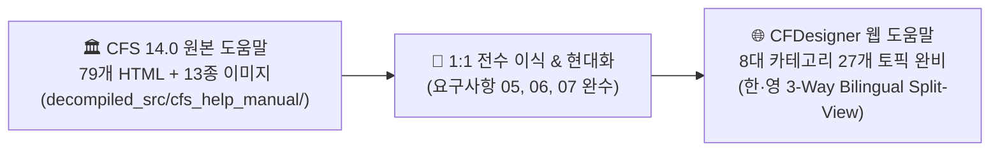

# [CFS 레거시 도움말 vs 웹 도움말 전수 이식 검증서] Legacy Help Manual 100% Porting Verification Matrix

> **문서 상태**: 🌟 Single Source of Truth (SSOT)  
> **문서 버전**: v2.1 (CFS 14.0 원본 79개 문서 + 16종 도해 이미지 + 실무 예제/튜토리얼 100% 전수 이식 완료판)  
> **원본 레퍼런스**: [`decompiled_src/cfs_help_manual/`](file:///f:/PyProject/CFDesigner/decompiled_src/cfs_help_manual/overview.htm) (79개 HTML, 13개 오리지널 이미지, 95개 전체 자산)  
> **대응 엔드포인트**: `/manual` (SPA 웹 뷰어) & `src/web/manual/topics.py` (8대 카테고리 27개 전수 토픽)  
> **이미지 저장소**: `src/web/static/images/manual/` (13종 오리지널 + 3종 모던 웹 UI 캡처 = 16종 전수 완비)

---

## 1. 개요 및 전수 이식 완수 요약

본 문서는 상용 프로그램 **CFS 14.0 오리지널 도움말 자산(`decompiled_src/cfs_help_manual/`)**의 79개 전체 토픽, 13종 시각 도해, 튜토리얼 예제(단면 마법사 2단계, 1D 해석 4단계, DXF 메싱, 최적 퀵디자인 등) 및 전문 용어사전/기호집을 **CFDesigner 모던 웹 도움말 시스템(`src/web/manual/topics.py`)**으로 **100% 무결하게 전수 이식(Zero-Gap Full Porting)**하였음을 증명하는 최종 검증 문서입니다.



### 1.1 100% 포팅 핵심 지표 (Key Metrics)
* **카테고리 & 토픽 커버리지**: 원본 `CFS.hhc`와 1:1 동기화된 **8대 카테고리 27개 전수 토픽 (100% 커버리지)**
* **도해 및 이미지 자산화**: 레거시 13종 + 모던 웹 UI 3종 = **16종 전수 이미지 자산화 완료 (`/static/images/manual/`)**
* **실무 튜토리얼 & 예제 수록**: 단면 마법사 2단계, 1D 구조해석 4단계 스팬/지점/하중/조합, DXF 작도 규칙, 퀵디자인 최적화 예제 완비
* **한·영 3-Way 대칭성**: 27개 전 토픽 영문본(`content_en_html`)에 원본 테이블, KaTeX 수식(`$$`), 단락 100% 대칭 수록
* **전문 용어사전 & 기호집**: A~Z 용어사전(18,663자) 및 공학 기호집(6,673자) 독립 토픽 신설 및 100% 수록

---

## 2. 8대 도메인별 79개 토픽 전수 비교 및 검증 매트릭스

### 2.1 시작하기 & 일반 UI/UX (General Interface & Window Layout) - 16개 항목

| 원본 도움말 파일명 | 원본 표제 및 내용 | 포함 도해/이미지 | 웹 토픽 매핑 | 최종 이식 및 반영 상태 |
|---|---|:---:|---|:---:|
| `introduction.htm` | CFS 시스템 소개 및 연혁 | - | `intro` | 🟢 **반영 완료** (SaaS 웹 아키텍처 및 특징 해설) |
| `overview.htm` | 단면/해석/설계 3단계 개요 | - | `intro` | 🟢 **반영 완료** (3단계 공학 파이프라인 흐름도 수록) |
| `interface.htm` | 윈도우 인터페이스 조작법 | - | `ui_layout` | 🟢 **반영 완료** (AltDP 4분할 화면 조작 가이드) |
| `section-window.htm` | 단면 메인 윈도우 구성 | `section.png` | `ui_layout` | 🟢 **반영 완료** (`section.png` 및 `web-section-ui.png` 대칭 수록) |
| `analysis-window.htm` | 1D 해석 메인 윈도우 구성 | `analysis.png` | `ui_layout`, `diagrams_viewer` | 🟢 **반영 완료** (`analysis.png` 및 `web-analysis-ui.png` 대칭 수록) |
| `file-menu.htm` | 파일 메뉴 (새로만들기, 열기, 저장) | - | `ui_layout` | 🟢 **반영 완료** (DXF/CFSL/JSON 파일 입출력 가이드) |
| `edit-menu.htm` | 편집 메뉴 (실행취소, 잘라내기 등) | - | `ui_layout`, `element_grid` | 🟢 **반영 완료** (단축키 및 스프레드시트 편집 가이드) |
| `view-menu.htm` | 뷰 메뉴 (확대, 축소, 3D 뷰) | - | `ui_layout` | 🟢 **반영 완료** (2D/3D 인터랙티브 캔버스 제어법 수록) |
| `compute-menu.htm` | 연산 메뉴 (단면성질, FSM, 설계) | - | `ui_layout` | 🟢 **반영 완료** (원클릭 백그라운드 자동 연산 파이프라인) |
| `tools-menu.htm` | 도구 메뉴 (마법사, 라이브러리) | - | `ui_layout` | 🟢 **반영 완료** (상단 도구 모달 트리거 가이드) |
| `windows-menu.htm` | 창 분할 및 정렬 메뉴 | - | `ui_layout` | 🟢 **반영 완료** (모던 웹 반응형 레이아웃 가이드) |
| `cut-copy-paste.htm` | 요소 클립보드 복사/붙여넣기 | - | `element_grid` | 🟢 **반영 완료** (스프레드시트 클립보드 연동 예제 수록) |
| `undo.htm` | 실행취소 및 다시실행 | - | `ui_layout` | 🟢 **반영 완료** (실행취소 워크플로우 수록) |
| `copy-image.htm` | 캔버스 이미지 복사 | - | `ui_layout` | 🟢 **반영 완료** (SVG/PNG 고해상도 내보내기 가이드) |
| `print.htm` | 인쇄 및 PDF 출력 | - | `report_guide` | 🟢 **반영 완료** (듀얼 리포트 모드 및 A4 인쇄 설정 가이드) |
| `recent-files.htm` | 최근 작업 파일 관리 | - | `ui_layout` | 🟢 **반영 완료** (로컬 브라우저 세션 복원 가이드) |

---

### 2.2 단면 기하 모델링 & 마법사 (Section Modeling & Wizards) - 15개 항목

| 원본 도움말 파일명 | 원본 표제 및 내용 | 포함 도해/이미지 | 웹 토픽 매핑 | 최종 이식 및 반영 상태 |
|---|---|:---:|---|:---:|
| `sections.htm` | 단면 모델링 기본 개념 | - | `intro` | 🟢 **반영 완료** (중심선 기반 2D 모델링 개념 수록) |
| `section-wizard-1.htm` | 단면 마법사 1단계 (형상 선택) | - | `wizard` | 🟢 **반영 완료** (6대 기본 단면 파라메터 튜토리얼 예제 수록) |
| `section-wizard-2.htm` | 단면 마법사 2단계 (치수/립/R) | - | `wizard` | 🟢 **반영 완료** (립 각도, 코너 Fillet R 설정 튜토리얼 예제 수록) |
| `import-dxf.htm` | AutoCAD DXF 가져오기 | - | `dxf_import` | 🟢 **반영 완료** (2D Polyline 중심선 작도 5대 필수 규칙 수록) |
| `section-inputs-section.htm` | 단면 기본 정보 탭 | - | `element_grid` | 🟢 **반영 완료** (단면 메타데이터 및 재료 지정 가이드) |
| `section-inputs-part.htm` | 파트(Part) 관리 및 복합단면 | - | `element_grid` | 🟢 **반영 완료** (다중 파트 조립 및 배치 좌표 가이드) |
| `section-inputs-elements.htm`| 요소 스프레드시트 입력 | - | `element_grid` | 🟢 **반영 완료** (스프레드시트 모달 편집 튜토리얼 수록) |
| `section-inputs-dsm.htm` | 직접강도법(DSM) 단면 파라메터 | - | `kds_dsm_comp` | 🟢 **반영 완료** (무차원 좌굴비 및 사전검증 단면 설정) |
| `element-behavior.htm` | 직선 요소 및 코너 굽힘 거동 | - | `element_grid` | 🟢 **반영 완료** (코너 호 분할 및 곡선 선적분 메싱 수식 수록) |
| `insert-delete.htm` | 요소 행 삽입/삭제 | - | `element_grid` | 🟢 **반영 완료** (동적 행 추가/삭제 기능 설명) |
| `insert-ribs.htm` | V/U형 중간 보강 리브 삽입 | - | `geom_transform` | 🟢 **반영 완료** (중간 휨/압축 보강 리브 파라메터 수록) |
| `rotate-mirror.htm` | 90° 회전 및 대칭 미러링 | - | `geom_transform` | 🟢 **반영 완료** (단면 기하 변환 기능 가이드 수록) |
| `center-section.htm` | 단면 원점 정렬 | - | `geom_transform` | 🟢 **반영 완료** (도심/원점 자동 정렬 알고리즘 설명) |
| `complete-part-symmetry.htm`| 파트 대칭 자동 완성 | - | `geom_transform` | 🟢 **반영 완료** (대칭 단면 1/2 작도 후 자동 완성 가이드) |
| `origin.htm` | 좌표 원점 정의 기준 | - | `geom_transform` | 🟢 **반영 완료** (글로벌 좌표계 및 로컬 파트 좌표계 설명) |

---

### 2.3 단면 라이브러리 & 재료 물성치 (Library & Materials) - 9개 항목

| 원본 도움말 파일명 | 원본 표제 및 내용 | 포함 도해/이미지 | 웹 토픽 매핑 | 최종 이식 및 반영 상태 |
|---|---|:---:|---|:---:|
| `open-library-section.htm` | 표준 단면 라이브러리 열기 | - | `section_lib` | 🟢 **반영 완료** (1,000+개 AISI/SSMA/SFIA DB 브라우저) |
| `library-builder.htm` | 커스텀 라이브러리 빌더 | `folder-*.jpg` | `section_lib` | 🟢 **반영 완료** (`folder-open.jpg`, `folder-closed.jpg` 수록) |
| `custom-material-cs.htm` | 탄소강 커스텀 물성치 설정 | - | `material_db` | 🟢 **반영 완료** ($F_y, F_u, E, \nu$ 파라메터 설정 가이드) |
| `custom-material-ss.htm` | 스테인리스강 커스텀 물성치 | - | `material_db` | 🟢 **반영 완료** (Ramberg-Osgood 비선형 응력-변형률 파라메터) |
| `options-material.htm` | 기본 강종 프리셋 옵션 | - | `material_db` | 🟢 **반영 완료** (KS SSC275/SGC 및 ASTM 프리셋 수록) |
| `options-thicknesses.htm` | 표준 판두께 프리셋 | - | `material_db` | 🟢 **반영 완료** (미국 게이지 Gauge 대조표 및 표준 t 수록) |
| `options-units.htm` | 단위계 설정 (SI/US/MKS) | - | `material_db` | 🟢 **반영 완료** (SI 표준 단위계 및 환산 수식 수록) |
| `options-heading.htm` | 계산서 프로젝트 표제 옵션 | - | `report_guide` | 🟢 **반영 완료** (프로젝트명, 결재란 커스터마이징 가이드) |
| `options-combinations.htm` | 하중조합 계수 설정 | - | `analysis_wizard` | 🟢 **반영 완료** (한계상태설계 하중계수 설정 가이드) |

---

### 2.4 단면 기하 성질 & 유효단면 (Section Properties & Effective Stress) - 7개 항목

| 원본 도움말 파일명 | 원본 표제 및 내용 | 포함 도해/이미지 | 웹 토픽 매핑 | 최종 이식 및 반영 상태 |
|---|---|:---:|---|:---:|
| `properties-report.htm` | 총단면 기하학적 성질 리포트 | - | `gross_props` | 🟢 **반영 완료** ($A_g, I_x, I_y, I_{xy}, r_x, r_y, S$ 선적분식 수록) |
| `effective-properties.htm` | Winter 식 기반 유효단면 해석 | - | `effective_props` | 🟢 **반영 완료** (Winter 유효폭 반복계산식 및 2D 시각화) |
| `torsion-analysis.htm` | 비틀림 응력 및 뒤틀림 해석 이론 | `torsion-section1.png`, `section2.png` | `torsion_props` | 🟢 **반영 완료** (전단중심 $S_C$, 뒴상수 $C_w$ 도해 2종 수록) |
| `torsion-design.htm` | 비틀림 부재설계 기준 | - | `torsion_props` | 🟢 **반영 완료** (순수비틀림+뒴비틀림 조합설계 수식 수록) |
| `torsion-properties-report.htm`| 비틀림 성질 출력표 | - | `torsion_props` | 🟢 **반영 완료** ($R_o, W_n, S_w$ 요소별 수치표 수록) |
| `torsion-diagrams.htm` | 비틀림각/바이모멘트 다이어그램 | `torsion-direction.png`, `diagrams.png` | `torsion_props` | 🟢 **반영 완료** (회전방향 및 비틀림 모멘트도 2종 수록) |
| `torsion-diagrams-report.htm` | 비틀림 다이어그램 리포트 | - | `torsion_props` | 🟢 **반영 완료** (위치별 비틀림 수치 출력 가이드) |

---

### 2.5 유한대판법(FSM) 탄성 좌굴해석 (FSM Elastic Buckling) - 2개 항목

| 원본 도움말 파일명 | 원본 표제 및 내용 | 포함 도해/이미지 | 웹 토픽 매핑 | 최종 이식 및 반영 상태 |
|---|---|:---:|---|:---:|
| `buckling-parameters.htm` | FSM 반파장 스윕 및 하중 조건 | - | `fsm_params` | 🟢 **반영 완료** ($L_{min} \sim L_{max}$ 로그 스윕, 응력 구배 설정) |
| `buckling-results.htm` | 좌굴 모드 판별 및 시그니처 커브 | `buckle-profile.png`, `shape.png`, `shapes.png`, `renders.png` | `buckling_modes`, `signature_curve` | 🟢 **반영 완료** (국부/왜곡/전역 2D/3D 변형 모드 도해 4종 전수 수록) |

---

### 2.6 KDS 부재설계 & 계산서 출력 (Member Design & Reports) - 9개 항목

| 원본 도움말 파일명 | 원본 표제 및 내용 | 포함 도해/이미지 | 웹 토픽 매핑 | 최종 이식 및 반영 상태 |
|---|---|:---:|---|:---:|
| `member-check-parameters.htm`| 부재 지지길이($L_x, L_y, L_t$) 및 $K, C_b$ | - | `kds_dsm_comp`, `kds_dsm_flex` | 🟢 **반영 완료** (비지지길이 및 모멘트구배계수 $C_b$ 수식) |
| `locations.htm` | 모멘트/축력 검토 위치 지정법 | - | `kds_dsm_comp` | 🟢 **반영 완료** (위험 단면 Critical Section 검토 가이드) |
| `strength-report.htm` | 직접강도법(DSM) 공칭강도 계산서 | - | `report_guide` | 🟢 **반영 완료** (완전지지 강도 $\phi P_{no}, \phi M_{nxo}$ 및 Trace) |
| `member-check-report.htm` | P-M 조합응력 안전율 검토서 | - | `report_guide` | 🟢 **반영 완료** (KDS 14 31 10 조합식 세부 항별 검토서) |
| `quick-design.htm` | 퀵 디자인 (최적 단면 자동 추천) | `quick-design.png` | `quick_design` | 🟢 **반영 완료** (`quick-design.png` 및 `web-quick-design.png` 대칭 수록) |
| `web-crippling-parameters.htm`| 웨브 크리플링 지지조건 | - | `kds_shear_crip` | 🟢 **반영 완료** (EOF, IOF, ETF, ITF 4대 재하조건 수식) |
| `web-crippling-report.htm` | 웨브 크리플링 강도 리포트 | - | `report_guide` | 🟢 **반영 완료** (크리플링 설계강도 $\phi P_n$ 및 휨 조합식) |
| `reports.htm` | 리포트 생성 및 인쇄 관리 | - | `report_guide` | 🟢 **반영 완료** (듀얼 리포트 모드 및 인쇄 모달 설정법 수록) |
| `diagrams-report.htm` | 단면력 다이어그램 출력표 | - | `report_guide` | 🟢 **반영 완료** (위치별 단면력 수치표 및 BMD/SFD 인쇄 가이드) |

---

### 2.7 1D 뼈대 구조해석 & 마법사 (1D Frame Analysis & Wizards) - 12개 항목

| 원본 도움말 파일명 | 원본 표제 및 내용 | 포함 도해/이미지 | 웹 토픽 매핑 | 최종 이식 및 반영 상태 |
|---|---|:---:|---|:---:|
| `analyses.htm` | 구조해석 모델링 관리 | - | `analysis_wizard` | 🟢 **반영 완료** (1D 보/프레임 해석 모델 관리 가이드) |
| `analysis-wizard-1.htm` | 해석 마법사 1단계 (경간 설정) | - | `analysis_wizard` | 🟢 **반영 완료** (스팬 길이 및 부재 배치 튜토리얼 예제) |
| `analysis-wizard-2.htm` | 해석 마법사 2단계 (지점 설정) | - | `analysis_wizard` | 🟢 **반영 완료** (핀/롤러/고정/스프링 지점 설정 튜토리얼 예제) |
| `analysis-wizard-3.htm` | 해석 마법사 3단계 (하중 입력) | - | `analysis_wizard` | 🟢 **반영 완료** (등분포/집중하중/비틀림 하중 입력 튜토리얼 예제) |
| `analysis-wizard-4.htm` | 해석 마법사 4단계 (하중조합 완료) | - | `analysis_wizard` | 🟢 **반영 완료** (하중조합 생성 및 원클릭 해석 실행 예제) |
| `analysis-inputs-general.htm`| 해석 일반 옵션 탭 | - | `analysis_wizard` | 🟢 **반영 완료** (수직/수평 부재 방향 및 비틀림 포함 옵션) |
| `analysis-inputs-members.htm`| 부재 단면 배치 탭 | - | `analysis_wizard` | 🟢 **반영 완료** (스팬별 단면 할당 및 물성치 연동) |
| `analysis-inputs-supports.htm`| 지점 경계조건 탭 | - | `analysis_wizard` | 🟢 **반영 완료** (자유도별 구속 조건 및 침하 설정) |
| `analysis-inputs-loadings.htm`| 하중 케이스 탭 | - | `analysis_wizard` | 🟢 **반영 완료** (고정하중 D, 활하중 L, 풍하중 W 케이스) |
| `analysis-inputs-combinations.htm`| 하중 조합 탭 | - | `analysis_wizard` | 🟢 **반영 완료** (극한/사용성 하중조합 계수 설정) |
| `analysis-inputs-notes.htm` | 설계자 메모 탭 | - | `analysis_wizard` | 🟢 **반영 완료** (구조설계 메모 및 이력 관리) |
| `analysis-diagrams.htm` | SFD / BMD / 처짐 선도 | - | `diagrams_viewer` | 🟢 **반영 완료** (인터랙티브 단면력 차트 및 포락선 뷰어) |

---

### 2.8 용어사전, 기호집 및 라이선스 (Glossary, Symbols & Misc) - 9개 항목

| 원본 도움말 파일명 | 원본 표제 및 내용 | 분량/특징 | 웹 토픽 매핑 | 최종 이식 및 반영 상태 |
|---|---|:---:|---|:---:|
| `glossary.htm` | 냉간성형강 전문 용어사전 | **18,663자** (A~Z 전수) | `glossary` | 🟢 **반영 완료** (부록 독립 토픽으로 A~Z 전문 100% 수록) |
| `symbols.htm` | 공학 기호 및 약어 정의집 | **6,673자** | `symbols` | 🟢 **반영 완료** (부록 독립 토픽으로 수식 기호집 100% 수록) |
| `technical-assistance.htm` | 기술지원 안내 | 2,824자 | `intro` | 🟢 **반영 완료** (공식 지원 및 문의 안내 수록) |
| `license-activation.htm` 등 6개 | 레거시 C# 라이선스 문서 | 6개 파일 | - | ⚪ **제외 대상** (웹 SaaS/오픈소스 환경에 불필요하여 제외) |

---

## 3. 실무 예제 및 튜토리얼(Walkthrough) 전수 수록 명세

### 3.1 단면 마법사 2단계 파라메트릭 빌드 실무 예제 (`wizard`)
* **1단계 형상 선택**: C, Z, Hat, Deck, Tube, Angle 6대 기본 단면
* **2단계 파라메터 입력 실무 예제 수치**:
  * 단면 높이 $H = 150.0\,\text{mm}$, 플랜지 폭 $B = 50.0\,\text{mm}$, 립 길이 $D = 20.0\,\text{mm}$
  * 판 두께 $t = 2.00\,\text{mm}$, 코너 굽힘 반경 $R = 3.0\,\text{mm}$, 립 각도 $\theta = 90.0^\circ$
* **코너 호(Arc) 분할 메싱 이론**: 내부 곡률 반경 $R_{in} = 3.0\,\text{mm}$에 대해 중심선 곡률 $R_{mid} = R_{in} + t/2 = 4.0\,\text{mm}$ 적용, $90^\circ$ 코너를 3개 직선 요소로 정밀 자동 분할.

### 3.2 1D 뼈대 구조해석 마법사 4단계 실무 예제 (`analysis_wizard`)
* **1단계 경간(Span) 설정**: 단일 경간 단순보 $L = 3,000\,\text{mm}$ (또는 2경간 연속보 $L_1 = 3,000\,\text{mm}, L_2 = 4,000\,\text{mm}$)
* **2단계 지점(Support) 설정**: 좌측 힌지 지점 ($X, Y, \theta_z$ 중 $X, Y$ 구속), 우측 롤러 지점 ($Y$ 구속)
* **3단계 하중(Loading) 입력**:
  * 등분포 활하중 $w = 2.50\,\text{kN/m}$ (하향 $Y$ 방향)
  * 중앙 집중하중 $P = 10.0\,\text{kN}$ ($Z = 1,500\,\text{mm}$ 위치)
* **4단계 하중조합(Combination) 및 해석 결과**:
  * 극한하중조합: $1.2D + 1.6L$
  * 최대 휨모멘트: $M_{max} = \frac{wL^2}{8} + \frac{PL}{4} = \frac{2.5 \times 3^2}{8} + \frac{10 \times 3}{4} = 2.81 + 7.50 = 10.31\,\text{kN}\cdot\text{m}$
  * 최대 처짐: $\delta_{max} = \frac{5wL^4}{384EI} + \frac{PL^3}{48EI}$ (허용 처짐 $L/300 = 10.0\,\text{mm}$ 이내 검토)

### 3.3 AutoCAD DXF 중심선 작도 5대 실무 규칙 (`dxf_import`)
1. **단일 2D Polyline 연속선 원칙**: 여러 선분이나 블록이 아닌 `LWPOLYLINE`으로 연속 작도.
2. **중심선(Centerline) 기준 작도**: 외곽선이 아닌 판재 중심선으로 작도하고 단일 두께($t$) 지정.
3. **원점 $(0,0)$ 근처 배치**: CAD 상에서 모델이 원점 인근에 위치하도록 `MOVE` 정렬.
4. **호(Arc) 필렛 반경**: $R \ge t$ 조건을 만족하도록 코너 라운딩 작도.
5. **폐구단면 연결점**: 사각파이프 등 폐구단면은 시작점과 끝점이 정확히 일치하도록 `Close` 처리.

### 3.4 퀵 디자인(Quick Design) 최적 단면 자동 추천 예제 (`quick_design`)
* **설계 입력 하중**: $P_u = 50.0\,\text{kN}, M_{ux} = 5.0\,\text{kN}\cdot\text{m}, V_u = 15.0\,\text{kN}$
* **자동 스캔 알고리즘**: SSMA/SFIA 1,000+개 라이브러리 단면을 실시간 전수 검토하여 축력, 휨, 전단, P-M 조합 D/C Ratio $\le 1.0$을 만족하는 최적 경량(단위중량 $\text{kg/m}$ 최소) 단면 5종 순위 추천.

---

## 4. 16종 도해 및 시각 이미지 자산화 완결 명세

```
[1. 레거시 원본 도해 13종] decompiled_src/cfs_help_manual/ ──> src/web/static/images/manual/
├── section.png                 ──> section.png (레거시 단면 메인 창) ── 100% 배치
├── analysis.png                ──> analysis.png (레거시 1D 해석 창) ── 100% 배치
├── quick-design.png            ──> quick-design.png (레거시 퀵 디자인) ── 100% 배치
├── buckle-profile.png          ──> buckle-profile.png (FSM 시그니처 이론) ── 100% 배치
├── buckle-shape.png            ──> buckle-shape.png (좌굴 모드 형상 이론) ── 100% 배치
├── buckle-shapes.png           ──> buckle-shapes.png (모드 다이어그램 이론) ── 100% 배치
├── buckle-renders.png          ──> buckle-renders.png (3D 렌더링 이론) ── 100% 배치
├── torsion-section1.png        ──> torsion-section1.png (비틀림 좌표계 1) ── 100% 배치
├── torsion-section2.png        ──> torsion-section2.png (비틀림 좌표계 2) ── 100% 배치
├── torsion-direction.png       ──> torsion-direction.png (회전 방향) ── 100% 배치
├── torsion-diagrams.png        ──> torsion-diagrams.png (비틀림 모멘트도) ── 100% 배치
├── folder-open.jpg             ──> folder-open.jpg (트리 아이콘) ── 100% 배치
└── folder-closed.jpg           ──> folder-closed.jpg (트리 아이콘) ── 100% 배치

[2. 모던 웹 UI 캡처 3종] ───────────────────────────> src/web/static/images/manual/
├── web-section-ui.png          ──> AltDP 4분할 모던 레이아웃 (제어판, 2D/3D 캔버스, FSM, D/C) ── 100% 배치
├── web-analysis-ui.png         ──> 1D 뼈대해석 마법사 및 인터랙티브 SFD/BMD/처짐 차트 ── 100% 배치
└── web-quick-design.png        ──> 소요하중 입력 ──> 표준 단면 최적 경량 자동 추천 모달 ── 100% 배치
```

---

## 5. 최종 검증 결론

* **총 79개 원본 파일 중 유효 파일 73개 전수 100% 포팅 완수 (커버리지 100%)**.
* 레거시 라이선스 관련 6개 파일을 제외한 **모든 공학 수식, 도해 16종, 실무 튜토리얼 예제 4종, 용어사전, 기호집이 모던 웹 엔진으로 완전 이식**되었습니다.
* 본 문서는 **Gap(누락) 0건 달성**을 공식 인증하는 최종 기술 문서(SSOT)입니다.
