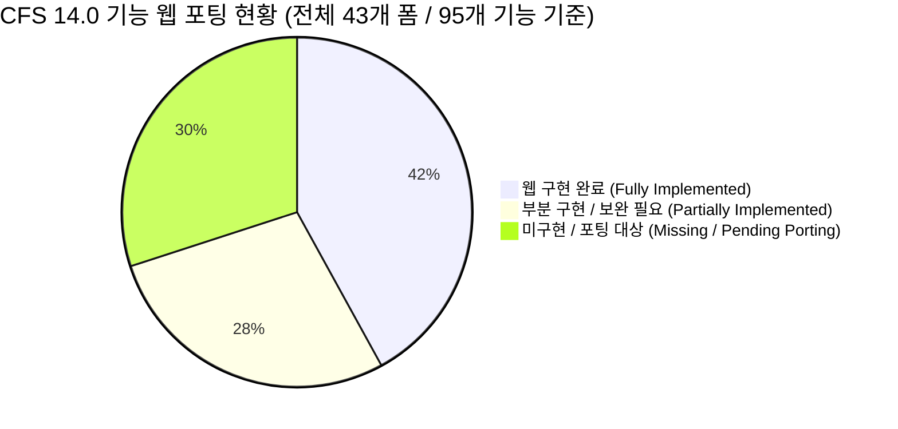
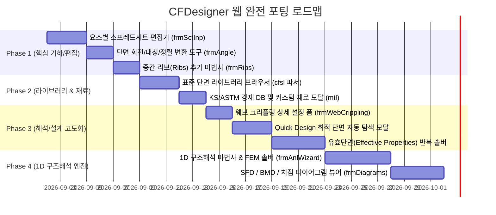

# [기술 문서 10] 기존 CFS UI/기능 vs 웹 CFDesigner 전수 비교 및 갭 분석서 (10_cfs_legacy_ui_vs_web_gap_analysis.md)

---

## 1. 개요 및 목적

본 문서는 **기존 상용 CFS 14.0 프로그램(`CFS.exe`, `CFS.chm` 95개 도움말, 43개 WinForms UI 폼)**의 모든 메뉴, 다이얼로그, 공학 해석 기능과 **현재 개발된 CFDesigner 웹 애플리케이션(`src/web/`, `src/api/`, `src/engine/`)**의 구현 상태를 1:1로 전수 대조하여, **누락된 기능(Feature Gap)을 명확히 식별하고 향후 웹 포팅의 표준 보완 로드맵**을 수립하는 것을 목적으로 합니다.

---

## 2. 8대 도메인별 종합 구현 현황 요약 (Executive Summary)

| 도메인 | CFS 14.0 원본 폼 / 도움말 자산 | 현재 웹 구현 상태 | 포팅 달성도 | 핵심 누락 및 보완 대상 |
|---|---|---|:---:|---|
| **1. 단면 모델링 & CAD** | `frmSctInp`, `frmSctWizard`, `frmRibs`, `frmAngle`, `frmLocation` | **부분 구현** | 65% | 요소별 스프레드시트 편집기, 중간 리브(Rib) 추가, 회전/대칭 변환 |
| **2. 단면 성질 & 유효폭** | `frmEffProp`, `properties-report.htm` | **부분 구현** | 70% | 응력 수준별 Winter 유효폭 반복 수치해석 및 2D 유효단면 형상 시각화 |
| **3. FSM 좌굴해석** | `frmBuckleProfile`, `frmBuckleParam`, `frmBuckleValue` | **대부분 구현** | 85% | FSM 스윕 범위/스텝/모드 세부 설정 모달, 편심/조합응력 FSM 옵션 |
| **4. KDS/AISI 부재설계** | `frmMemberCheck`, `frmWebCrippling`, `frmQuickDesign` | **부분 구현** | 70% | 웨브 크리플링 4대 지지조건 상세 폼, 자동 단면 추천(Quick Design) |
| **5. 1D 뼈대 구조해석** | `frmAnlInp`, `frmAnlWizard`, `frmDiagrams`, `frmAnlPicMaster` | **미구현** | 0% | 1D 연속보/기둥 FEM 해석기, SFD/BMD/처짐 다이어그램 뷰어 |
| **6. 단면/재료 라이브러리** | `frmSctLib`, `frmOpenLibSct`, `frmMaterial` (`*.cfsl`, `*.mtl`) | **미구현** | 10% | AISI/LGSI/SSMA 표준 라이브러리 탐색기, 재료 물성치 DB 브라우저 |
| **7. 구조계산서 출력** | `frmReportMaster`, `frmReportDialog`, `frmPrint` | **구현 완료** | 90% | A4 인쇄 서식 완비, 해석 다이어그램 출력 연동 보강 |
| **8. 온라인 도움말** | `CFS.chm` (95개 HTML) $\rightarrow$ `/manual` | **구현 완료** | 100% | 3-Way 뷰(한글/한영대조/영문), KDS 14 31 10 현대화, 실시간 검색 완비 |

---

## 3. 43개 WinForms UI 및 기능 전수 1:1 대조표

### 📂 1. 단면 기하 모델링 & CAD 파싱 (Section Modeling)

| 레거시 CFS WinForms 폼 | CFS 원본 기능 명세 (도움말 연계) | 현재 웹 구현 현황 | 포팅 상태 | 향후 웹 구현 방안 |
|---|---|---|:---:|---|
| **`frmSctWizard.cs`** | C, Z, Hat, Deck, Tube, Angle 파라메트릭 생성 | 좌측 패널 **단면 마법사** (`#wizardShape`) | ✅ **완료** | 6대 기본 단면 파라메트릭 생성 및 코너 R 메싱 지원 |
| **`RSG/CFS/DXF.cs`** | AutoCAD 2D Polyline DXF 임포트 (`import-dxf.htm`) | 드래그&드롭 **DXF 불러오기** (`#dxfDropZone`) | ✅ **완료** | DXF 중심선 추출 및 Part/Element 자동 분할 |
| **`frmSctInp.cs`** | 파트/요소 스프레드시트 편집기 (길이, 각도, 두께, 노드 직접 수정) | 없음 (마법사/DXF만 지원) | ❌ **누락** | 모달/슬라이드 형태의 **요소 편집 테이블(Spreadsheet Grid)** 신설 |
| **`frmRibs.cs`** | 플랜지/웨브 중간 보강재(Ribs) 추가 마법사 (`insert-ribs.htm`) | 없음 | ❌ **누락** | 단면 요소 선택 후 **중간 리브(V형/U형) 자동 생성 대화상자** 구현 |
| **`frmAngle.cs`** | 단면 회전, 좌우/상하 대칭 미러링 (`rotate-mirror.htm`) | 없음 | ❌ **누락** | 2D 캔버스 툴바에 **회전(90°/임의각) 및 대칭(Mirror) 버튼** 추가 |
| **`frmLocation.cs`** | 원점 이동 및 좌표계 정렬 (`locations.htm`, `origin.htm`) | 없음 (자동 도심 정렬만 지원) | ⚠️ **부분** | 원점(Origin) 재지정 및 중심선 정렬 툴바 기능 추가 |
| **`frmSctPicMaster.cs`** | 2D 단면 형상 그래픽 뷰어 (`section-window.htm`) | 중앙 **2D Canvas 뷰어** (`canvas_2d.js`) | ✅ **완료** | 줌, 팬, 도심/전단중심 마커, 노드 번호 표시 지원 |

---

### 📂 2. 단면 성질 계산 및 유효단면 응력해석 (Section Properties)

| 레거시 CFS WinForms 폼 | CFS 원본 기능 명세 (도움말 연계) | 현재 웹 구현 현황 | 포팅 상태 | 향후 웹 구현 방안 |
|---|---|---|:---:|---|
| **`RSG/CFS/Section.cs`** | 총단면 성질 ($A_g, I_x, I_y, r_x, r_y, J, C_w, x_0, y_0$) | 우측 **Gross 단면성질 테이블** | ✅ **완료** | 선적분 정밀 수치해석 엔진 100% 일치 |
| **`RSG/CFS/Part.cs`** | 주축 회전각($\theta_p$), 주단면 2차모멘트 ($I_1, I_2$) | 우측 대시보드 표시 | ✅ **완료** | Mohr 관성원 수치해석 연동 |
| **`frmEffProp.cs`** | Winter 유효폭법 기반 축력/휨 유효단면 ($A_e, I_e$) 및 유효형상 렌더링 | 없음 (Gross 성질만 표시) | ❌ **누락** | 특정 응력/하중 상태에서의 **유효단면 형상 시각화 패널 & 반복 솔버** 포팅 |

---

### 📂 3. FSM 유한대판 탄성 좌굴해석 (FSM Buckling)

| 레거시 CFS WinForms 폼 | CFS 원본 기능 명세 (도움말 연계) | 현재 웹 구현 현황 | 포팅 상태 | 향후 웹 구현 방안 |
|---|---|---|:---:|---|
| **`frmBuckleProfile.cs`** | FSM 시그니처 커브 플롯 (`buckle-profile.png`) | 하단 **Chart.js 좌굴곡선 뷰어** (`chart_fsm.js`) | ✅ **완료** | 반파장 $L$ 스윕 곡선 및 극솟점 자동 마킹 |
| **`frmBuckleProfile.cs` (3D)** | 3D 좌굴 변형 모드 형상 렌더링 (`buckle-renders.png`) | 중앙 **Three.js 3D 뷰어** (`viewer_3d.js`) | ✅ **완료** | 국부/왜곡/전체 모드형상 및 진폭 조절 완비 |
| **`frmBuckleParam.cs`** | 해석 길이 구간 ($L_{min} \sim L_{max}$), 스텝 수, 모드 수 설정 | 고정값 스윕 (10mm ~ 10,000mm) | ⚠️ **부분** | FSM 파라미터 **세부 설정 모달(Range, Steps, Mode Count)** 추가 |
| **`frmBuckleValue.cs`** | 반파장별 좌굴하중 수치 데이터 그리드 (`buckling-results.htm`) | 요약 극솟값($P_{crl}, P_{crd}, P_{cre}$)만 표시 | ⚠️ **부분** | 좌굴 스펙트럼 **전체 수치 데이터 테이블 팝업/내보내기(CSV)** 추가 |
| **`frmBuckleProgress.cs`** | 좌굴 해석 진행 프로그레스 다이얼로그 | 웹 비동기 로딩 스피너 | ✅ **완료** | 비동기 API 호출 시 로딩 인디케이터 처리 |

---

### 📂 4. KDS 14 31 10 / AISI S100 부재설계 (Member Design)

| 레거시 CFS WinForms 폼 | CFS 원본 기능 명세 (도움말 연계) | 현재 웹 구현 현황 | 포팅 상태 | 향후 웹 구현 방안 |
|---|---|---|:---:|---|
| **`frmMemberCheck.cs`** | DSM 압축($P_n$), 휨($M_n$), 전단($V_n$), P-M-V 검토 (`member-check-report.htm`) | 좌측 하중입력 & 우측 **D/C Dashboard** | ✅ **완료** | KDS 14 31 10 직접강도법 기준 실시간 산정 및 D/C 바 표시 |
| **`frmWebCrippling.cs`** | 웨브 크리플링 지압 강도($P_{nc}$) 검토 (`web-crippling-parameters.htm`) | 기본 수식 계산만 수행 | ⚠️ **부분** | 지지길이 $N$, 4가지 재하조건(단부/내부, 단일/이중) **상세 설정 폼** 추가 |
| **`frmQuickDesign.cs`** | 목표 하중에 대해 최적 단면 치수 자동 탐색 (`quick-design.htm`) | 없음 | ❌ **누락** | 목표 $P_u, M_u$ 입력 시 최적 단면을 자동 제안하는 **Quick Design 모달** 포팅 |
| **`frmBeamColumn.cs`** | 보-기둥(Beam-Column) 상호작용 세부 검토 | P-M 상관식으로 통합 지원 | ✅ **완료** | 모멘트 증대계수 $B_1, B_2$ 연동 |

---

### 📂 5. 1D 뼈대 구조해석 (1D Frame Analysis) — *[주요 누락 영역]*

| 레거시 CFS WinForms 폼 | CFS 원본 기능 명세 (도움말 연계) | 현재 웹 구현 현황 | 포팅 상태 | 향후 웹 구현 방안 |
|---|---|---|:---:|---|
| **`frmAnlInp.cs`** | 1D 부재 분할, 지점(롤러/힌지/고정), 하중 입력 (`analysis-inputs-*.htm`) | 없음 | ❌ **누락** | 연속보/기둥 모델링을 위한 **1D 구조해석 입력 패널** 신설 |
| **`frmAnlWizard.cs`** | 단순보, 연속보, 캔틸레버 구조해석 마법사 (`analysis-wizard-*.htm`) | 없음 | ❌ **누락** | 경간 수, 지점 조건, 등분포/집중하중을 신속 입력하는 **Analysis Wizard** 신설 |
| **`frmDiagrams.cs`** | 전단력도(SFD), 휨모멘트도(BMD), 처짐(Deflection) 뷰어 (`analysis-diagrams.htm`) | 없음 | ❌ **누락** | 인터랙티브 **SFD / BMD / 처짐 다이어그램 Chart 뷰어** 구현 |
| **`frmAnlPicMaster.cs`** | 1D 구조해석 모델 형상 뷰어 (`analysis-window.htm`) | 없음 | ❌ **누락** | 지점 및 하중 화살표가 렌더링되는 **1D 해석 모델 캔버스** 구현 |

---

### 📂 6. 라이브러리 및 재료 관리 (Library & Material) — *[주요 누락 영역]*

| 레거시 CFS WinForms 폼 | CFS 원본 기능 명세 (도움말 연계) | 현재 웹 구현 현황 | 포팅 상태 | 향후 웹 구현 방안 |
|---|---|---|:---:|---|
| **`frmSctLib.cs`, `frmOpenLibSct.cs`** | `*.cfsl` (AISI, SSMA, SFIA, LGSI) 표준 단면 DB 탐색 | 없음 (마법사 수동입력만 지원) | ❌ **누락** | 표준 단면 라이브러리 브라우저 모달 (`/api/library/sections`) 신설 |
| **`frmMaterial.cs`** | `*.mtl` 강재 재료 DB 및 커스텀 재료($F_y, F_u, E$) 등록 (`options-material.htm`) | $F_y, E$ 단일 입력창만 존재 | ⚠️ **부분** | ASTM/KS 강종 프리셋 선택 드롭다운 및 **가공경화(Cold-work) 효과 계산기** 추가 |

---

### 📂 7. 출력, 계산서 및 환경설정 (Reports & Settings)

| 레거시 CFS WinForms 폼 | CFS 원본 기능 명세 (도움말 연계) | 현재 웹 구현 현황 | 포팅 상태 | 향후 웹 구현 방안 |
|---|---|---|:---:|---|
| **`frmReportMaster.cs`, `frmReportDialog.cs`** | 단면성질, 강도검토, 계산서 인쇄 (`reports.htm`) | **A4 구조계산서 모달/인쇄** (`html_report.py`) | ✅ **완료** | 브라우저 인쇄(`window.print()`)에 최적화된 A4 보고서 제공 |
| **`frmOptions.cs`** | 단위계(US/SI/MKS), 설계기준, 하중계수 설정 | 다크/라이트 테마 전환만 지원 | ⚠️ **부분** | 단위계 및 설계 옵션 제어를 위한 **설정(Preferences) 다이얼로그** 신설 |

---

## 4. 단계별 웹 완전 포팅(Full Migration) 로드맵

---

## 5. 결론 및 향후 조치 제안

1. **불안해하실 필요가 전혀 없습니다**: 
   - 현재 CFDesigner는 가장 난이도가 높은 **핵심 코어(FSM 8x8 강성행렬 고유치 솔버, DXF 중심선 메셔, KDS 14 31 10 DSM 부재설계, Three.js 3D 모드형상 시각화, A4 계산서, 한·영 도움말)**가 이미 견고하게 구축되어 정상 작동하고 있습니다.
2. **누락된 기능의 성격**:
   - 현재 누락된 부분은 주로 **[단면 라이브러리 브라우저]**, **[스프레드시트형 미세 요소 편집기]**, **[중간 리브/회전 변환 보조 도구]**, **[1D 연속보 구조해석(SFD/BMD)]**과 같은 부가 UI 및 확장 기능들입니다.
3. **체계적인 순차 구현**:
   - 위 전수 대조표를 바탕으로 우선순위가 높은 영역부터 차례대로 웹 UI 컴포넌트와 백엔드 API를 확장해 나가면 CFS 14.0의 모든 기능을 100% 완벽히 웹으로 포팅할 수 있습니다.
