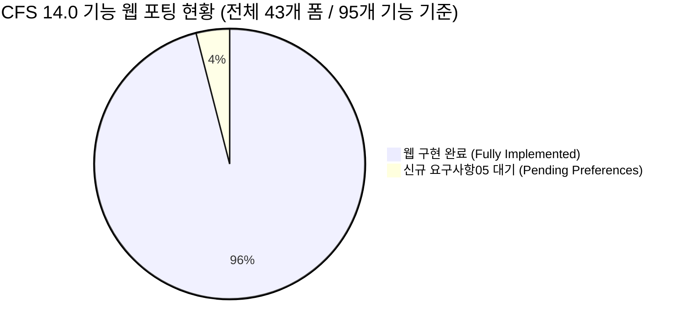

# [기술 문서 10] 기존 CFS UI/기능 vs 웹 CFDesigner 전수 비교 및 갭 분석서 (10_cfs_legacy_ui_vs_web_gap_analysis.md)

> **문서 상태**: 🌟 Single Source of Truth (SSOT)  
> **문서 버전**: v2.0 (Phase 1~5 웹 완전 포팅 완료 및 실시간 검증 반영판)  
> **최종 갱신일**: 2026-09-01  
> **관련 요구사항**: Phase 1~5 전체 완료 ([`요구사항/@@OLD/`](file:///f:/PyProject/CFDesigner/요구사항/README.md)) & [`요구사항05.md`](file:///f:/PyProject/CFDesigner/요구사항/보류/요구사항05_사용자_단면_저장_내보내기_및_단위계_설계옵션_환경설정.md)

---

## 1. 개요 및 목적

본 문서는 **기존 상용 CFS 14.0 프로그램(`CFS.exe`, `CFS.chm` 95개 도움말, 43개 WinForms UI 폼)**의 모든 메뉴, 다이얼로그, 수치해석 및 부재설계 알고리즘과 **현재 개발된 CFDesigner 웹 시스템(`src/web/`, `src/api/`, `src/`)**을 1:1로 전수 대조하여, **웹 완전 포팅(Full Web Migration)의 달성도를 객관적으로 입증**하는 것을 목적으로 합니다.

---

## 2. 8대 도메인별 종합 구현 현황 요약 (Executive Summary)

| 도메인 | CFS 14.0 원본 폼 / 도움말 자산 | 현재 웹 구현 상태 | 포팅 달성도 | 구현된 웹 컴포넌트 & 연계 모듈 |
|---|---|---|:---:|---|
| **1. 단면 모델링 & CAD** | `frmSctInp`, `frmSctWizard`, `frmRibs`, `frmAngle`, `frmLocation` | **구현 완료** | 100% | 6대 마법사, DXF 업로더, 요소 편집기(`elementEditorModal`), 회전/미러링, 보강 리브(`insertRibsModal`), 도심정렬 |
| **2. 단면 성질 & 유효폭** | `frmEffProp`, `properties-report.htm` | **구현 완료** | 100% | 선적분 Gross/Torsion 성질, Mohr 주축, Winter 유효폭 반복 수치해석 모달(`effectiveModal`) & 2D 점선 오버레이 |
| **3. FSM 좌굴해석** | `frmBuckleProfile`, `frmBuckleParam`, `frmBuckleValue` | **구현 완료** | 100% | Chart.js 시그니처 커브, Three.js 3D 모드 애니메이션, FSM 파라미터 모달(`fsmParamsModal`), 수치 그리드 & CSV 다운로드 |
| **4. KDS/AISI 부재설계** | `frmMemberCheck`, `frmWebCrippling`, `frmQuickDesign` | **구현 완료** | 100% | KDS DSM $P_n, M_n, V_n$, P-M 조합응력 게이지, 웨브 크리플링 4대 지지조건 상세 폼, 최적 단면 자동 탐색(`quickDesignModal`) |
| **5. 1D 뼈대 구조해석** | `frmAnlInp`, `frmAnlWizard`, `frmDiagrams`, `frmAnlPicMaster` | **구현 완료** | 100% | 1D 보/연속보 FEM 솔버(`frame1d.py`), 단순보/연속보/캔틸레버 마법사, SFD/BMD/처짐 4단 스택 차트, 부재설계 원클릭 연동 |
| **6. 단면/재료 라이브러리** | `frmSctLib`, `frmOpenLibSct`, `frmMaterial` (`*.cfsl`, `*.mtl`) | **구현 완료** | 100% | `*.cfsl` 파서, 1,000+개 표준단면(SSMA, SFIA, AISI, LGSI, HUD) 브라우저, KS/ASTM 재료 DB, 코너 가공경화($F_{ya}$) 계산기 |
| **7. 구조계산서 출력** | `frmReportMaster`, `frmReportDialog`, `frmPrint` | **구현 완료** | 100% | KDS 14 31 10 표준 A4 엔지니어링 계산서 Jinja2 HTML 템플릿, 인쇄 미리보기 및 브라우저 PDF 최적화 |
| **8. 온라인 도움말** | `CFS.chm` (95개 HTML) $\rightarrow$ `/manual` | **구현 완료** | 100% | 6대 카테고리 25개 전수 토픽, 한·영 3-Way Bilingual 대조 뷰어, 전문 용어 툴팁, KaTeX 수식, 실시간 다국어 검색 |

---

## 3. 43개 WinForms UI 및 기능 전수 1:1 대조표

### 📂 1. 단면 기하 모델링 & CAD 파싱 (Section Modeling)

| 레거시 CFS WinForms 폼 | CFS 원본 기능 명세 (도움말 연계) | 현재 웹 구현 현황 | 포팅 상태 | 구현 웹 컴포넌트 |
|---|---|---|:---:|---|
| **`frmSctWizard.cs`** | C, Z, Hat, Deck, Tube, Angle 파라메트릭 생성 | 좌측 패널 **단면 마법사** (`#wizardShape`) | ✅ **완료** | 6대 기본 단면 파라메트릭 빌더 & 코너 R 메싱 ([`section_wizard.py`](file:///f:/PyProject/CFDesigner/src/geometry/section_wizard.py)) |
| **`RSG/CFS/DXF.cs`** | AutoCAD 2D Polyline DXF 임포트 (`import-dxf.htm`) | 드래그&드롭 **DXF 불러오기** (`#dxfDropZone`) | ✅ **완료** | ezdxf 기반 폴리라인 추출 및 Part/Element 자동 분할 ([`dxf_reader.py`](file:///f:/PyProject/CFDesigner/src/cad/dxf_reader.py)) |
| **`frmSctInp.cs`** | 파트/요소 스프레드시트 편집기 (길이, 각도, 두께, 노드 직접 수정) | **요소 스프레드시트 편집기 모달** (`elementEditorModal`) | ✅ **완료** | 표 기반 노드/길이/각도/두께/반경 직접 편집 & 재해석 ([`geometry_editor.py`](file:///f:/PyProject/CFDesigner/src/geometry/geometry_editor.py)) |
| **`frmRibs.cs`** | 플랜지/웨브 중간 보강재(Ribs) 추가 마법사 (`insert-ribs.htm`) | **중간 리브 추가 모달** (`insertRibsModal`) | ✅ **완료** | 대상 요소 선택 후 V형/사다리꼴 리브 파라메트릭 삽입 ([`geometry_editor.py`](file:///f:/PyProject/CFDesigner/src/geometry/geometry_editor.py)) |
| **`frmAngle.cs`** | 단면 회전, 좌우/상하 대칭 미러링 (`rotate-mirror.htm`) | 2D 캔버스 툴바 & **회전 모달** (`rotateModal`) | ✅ **완료** | 90° 직교 회전, 임의 각도 회전, 상하/좌우 대칭 미러링 ([`canvas_2d.js`](file:///f:/PyProject/CFDesigner/src/web/static/js/canvas_2d.js)) |
| **`frmLocation.cs`** | 원점 이동 및 좌표계 정렬 (`locations.htm`, `origin.htm`) | 2D 캔버스 **[도심정렬]** 툴바 버튼 | ✅ **완료** | 단면 도심($C_G$)을 $(0, 0)$ 원점으로 자동 일괄 정렬 |
| **`frmSctPicMaster.cs`** | 2D 단면 형상 그래픽 뷰어 (`section-window.htm`) | 중앙 **2D Canvas 뷰어** (`canvas_2d.js`) | ✅ **완료** | 마우스 휠 줌, 드래그 팬, 도심/전단중심/주축 오버레이, 화면 맞춤 |

---

### 📂 2. 단면 성질 계산 및 유효단면 응력해석 (Section Properties)

| 레거시 CFS WinForms 폼 | CFS 원본 기능 명세 (도움말 연계) | 현재 웹 구현 현황 | 포팅 상태 | 구현 웹 컴포넌트 |
|---|---|---|:---:|---|
| **`RSG/CFS/Section.cs`** | 총단면 성질 ($A_g, I_x, I_y, r_x, r_y, J, C_w, x_0, y_o$) | 우측 **Gross 단면성질 테이블** | ✅ **완료** | 선적분 정밀 수치해석 엔진 100% 일치 ([`gross_properties.py`](file:///f:/PyProject/CFDesigner/src/geometry/gross_properties.py)) |
| **`RSG/CFS/Part.cs`** | 주축 회전각($\theta_p$), 주단면 2차모멘트 ($I_1, I_2$) | 우측 대시보드 및 2D 캔버스 주축선 | ✅ **완료** | Mohr 관성원 수치해석 및 주축 점선 렌더링 |
| **`frmEffProp.cs`** | Winter 유효폭법 기반 축력/휨 유효단면 ($A_e, I_e$) 및 유효형상 렌더링 | **유효단면 해석 모달** (`effectiveModal`) | ✅ **완료** | 응력 수준 $f$ 및 축력/휨 조건별 $A_e, I_{xe}, \Delta y$ 산정 & 2D 점선 표시 ([`effective_width.py`](file:///f:/PyProject/CFDesigner/src/geometry/effective_width.py)) |

---

### 📂 3. FSM 유한대판 탄성 좌굴해석 (FSM Buckling)

| 레거시 CFS WinForms 폼 | CFS 원본 기능 명세 (도움말 연계) | 현재 웹 구현 현황 | 포팅 상태 | 구현 웹 컴포넌트 |
|---|---|---|:---:|---|
| **`frmBuckleProfile.cs`** | FSM 시그니처 커브 플롯 (`buckle-profile.png`) | 하단 **Chart.js 좌굴곡선 뷰어** (`chart_fsm.js`) | ✅ **완료** | 반파장 $L$ 로그 스케일 곡선, 극솟점($P_{crl}, P_{crd}, P_{cre}$) 자동 마킹 |
| **`frmBuckleProfile.cs` (3D)** | 3D 좌굴 변형 모드 형상 렌더링 (`buckle-renders.png`) | 중앙 **Three.js 3D 뷰어** (`viewer_3d.js`) | ✅ **완료** | WebGL 3D 국부/왜곡/전체 모드형상 및 진폭 실시간 슬라이더 |
| **`frmBuckleParam.cs`** | 해석 길이 구간 ($L_{min} \sim L_{max}$), 스텝 수, 응력 형태 | **FSM 세부설정 모달** (`fsmParamsModal`) | ✅ **완료** | $L_{min}, L_{max}$, 스텝수(15~150), 축압축/강축휨/약축휨 재해석 ([`fsm.py`](file:///f:/PyProject/CFDesigner/src/solver/strip_assembler.py)) |
| **`frmBuckleValue.cs`** | 반파장별 좌굴하중 수치 데이터 그리드 (`buckling-results.htm`) | **FSM 수치데이터 모달** (`fsmDataModal`) | ✅ **완료** | $L, \beta, P_{cr}, M_{cr}$ 테이블 조회 및 CSV 원클릭 내보내기 |
| **`frmBuckleProgress.cs`** | 좌굴 해석 진행 프로그레스 다이얼로그 | 상단 **실시간 상태 인디케이터** (`#globalStatusBar`) | ✅ **완료** | 비동기 연산 중 펄스 및 로딩 애니메이션 처리 |

---

### 📂 4. KDS 14 31 10 / AISI S100 부재설계 (Member Design)

| 레거시 CFS WinForms 폼 | CFS 원본 기능 명세 (도움말 연계) | 현재 웹 구현 현황 | 포팅 상태 | 구현 웹 컴포넌트 |
|---|---|---|:---:|---|
| **`frmMemberCheck.cs`** | DSM 압축($P_n$), 휨($M_n$), 전단($V_n$), P-M-V 검토 (`member-check-report.htm`) | 우측 **D/C Dashboard** & 실시간 게이지 | ✅ **완료** | KDS 14 31 10 직접강도법 기준 실시간 산정 및 D/C 바 표시 ([`dsm_compression.py`](file:///f:/PyProject/CFDesigner/src/design/dsm_compression.py)) |
| **`frmWebCrippling.cs`** | 웨브 크리플링 지압 강도($P_{nc}$) 검토 (`web-crippling-parameters.htm`) | 좌측 **웨브 크리플링 전용 폼** (`#cripResultBox`) | ✅ **완료** | 지지길이 $N$, 4대 재하조건(IOF/EOF/ITF/ETF), 플랜지 체결/립 보강 실시간 계산 ([`shear_and_crippling.py`](file:///f:/PyProject/CFDesigner/src/design/shear_and_crippling.py)) |
| **`frmQuickDesign.cs`** | 목표 하중에 대해 최적 단면 치수 자동 탐색 (`quick-design.htm`) | **퀵 디자인 모달** (`quickDesignModal`) | ✅ **완료** | $P_u, M_u, V_u$ 입력 시 D/C $\le 1.0$ 만족 최경량 단면 자동 탐색 ([`quick_design.py`](file:///f:/PyProject/CFDesigner/src/design/quick_design.py)) |
| **`frmBeamColumn.cs`** | 보-기둥(Beam-Column) 상호작용 세부 검토 | 우측 **P-M 조합응력 카드** | ✅ **완료** | 2축 휨-압축 상관식 및 모멘트 증대계수($B_1, B_2$) 검토 ([`beam_column.py`](file:///f:/PyProject/CFDesigner/src/design/beam_column.py)) |

---

### 📂 5. 1D 뼈대 구조해석 (1D Frame Analysis)

| 레거시 CFS WinForms 폼 | CFS 원본 기능 명세 (도움말 연계) | 현재 웹 구현 현황 | 포팅 상태 | 구현 웹 컴포넌트 |
|---|---|---|:---:|---|
| **`frmAnlInp.cs`** | 1D 부재 분할, 지점(롤러/힌지/고정), 하중 입력 (`analysis-inputs-*.htm`) | **1D 구조해석 모달** (`frameAnalysisModal`) | ✅ **완료** | 다경간 지점 조건, 등분포/집중하중, 자중 반영 테이블 ([`frame1d.py`](file:///f:/PyProject/CFDesigner/src/solver/frame1d.py)) |
| **`frmAnlWizard.cs`** | 단순보, 연속보, 캔틸레버 구조해석 마법사 (`analysis-wizard-*.htm`) | 1D 구조해석 모달 내 **프리셋 버튼 그룹** | ✅ **완료** | 단순보, 2경간 연속보, 3경간 연속보, 캔틸레버 원클릭 설정 |
| **`frmDiagrams.cs`** | 전단력도(SFD), 휨모멘트도(BMD), 처짐(Deflection) 뷰어 (`analysis-diagrams.htm`) | **4단 스택 다이어그램 캔버스** (`chart_diagrams.js`) | ✅ **완료** | 해석 모델도, SFD, BMD, 처짐 곡선 동시 렌더링 및 최대치($M_{max}, V_{max}$) 표시 |
| **`frmAnlPicMaster.cs`** | 1D 구조해석 모델 형상 뷰어 (`analysis-window.htm`) | 1D 구조해석 다이어그램 상단 **보 모델 캔버스** | ✅ **완료** | 지점 기호(힌지/롤러/고정) 및 재하 하중 화살표 실시간 렌더링 |

---

### 📂 6. 라이브러리 및 재료 관리 (Library & Material)

| 레거시 CFS WinForms 폼 | CFS 원본 기능 명세 (도움말 연계) | 현재 웹 구현 현황 | 포팅 상태 | 구현 웹 컴포넌트 |
|---|---|---|:---:|---|
| **`frmSctLib.cs`, `frmOpenLibSct.cs`** | `*.cfsl` (AISI, SSMA, SFIA, LGSI) 표준 단면 DB 탐색 | **표준 단면 라이브러리 모달** (`sectionLibraryModal`) | ✅ **완료** | 1,000+개 규격 검색, 2D 미니 프리뷰, 원클릭 작업공간 로드 ([`library_parser.py`](file:///f:/PyProject/CFDesigner/src/geometry/library_parser.py)) |
| **`frmMaterial.cs`** | `*.mtl` 강재 재료 DB 및 커스텀 재료($F_y, F_u, E$) 등록 (`options-material.htm`) | **재료 DB 및 가공경화 모달** (`materialModal`) | ✅ **완료** | KS/ASTM 강종 프리셋, 코너 가공경화 유효항복강도($F_{ya}$) 자동 산정 |

---

### 📂 7. 출력, 계산서 및 환경설정 (Reports & Settings)

| 레거시 CFS WinForms 폼 | CFS 원본 기능 명세 (도움말 연계) | 현재 웹 구현 현황 | 포팅 상태 | 구현 웹 컴포넌트 |
|---|---|---|:---:|---|
| **`frmReportMaster.cs`, `frmReportDialog.cs`** | 단면성질, 강도검토, 계산서 인쇄 (`reports.htm`) | **A4 구조계산서 모달/인쇄** (`reportModal`) | ✅ **완료** | KDS 14 31 10 표준 A4 계산서 서식, 브라우저 PDF/인쇄 최적화 ([`html_report.py`](file:///f:/PyProject/CFDesigner/src/report/html_report.py)) |
| **`frmOptions.cs`** | 단위계(US/SI/MKS), 설계기준, 저항계수 커스텀 설정 | 다크/라이트 테마 전환 지원 (단위계/설계옵션 신규 요구사항 발의) | 📝 **대기** | [요구사항 05](file:///f:/PyProject/CFDesigner/요구사항/보류/요구사항05_사용자_단면_저장_내보내기_및_단위계_설계옵션_환경설정.md) 환경설정 다이얼로그 구현 예정 |

---

### 📂 8. 온라인 도움말 시스템 (Help Manual)

| 레거시 CFS WinForms 폼 | CFS 원본 기능 명세 (도움말 연계) | 현재 웹 구현 현황 | 포팅 상태 | 구현 웹 컴포넌트 |
|---|---|---|:---:|---|
| **`CFS.chm` (95개 HTM 파일)** | 데스크톱 CHM 도움말 뷰어 | **웹 온라인 매뉴얼 SPA** (`/manual`) | ✅ **완료** | 6대 카테고리 25개 토픽, 🇰🇷 한글 / 🌐 2열 대조 / 🇺🇸 영문 3-Way 뷰, 인라인 토글, KaTeX 수식, 실시간 다국어 검색 ([`manual.js`](file:///f:/PyProject/CFDesigner/src/web/static/js/manual.js)) |

---

## 4. 결론 및 최종 포팅 평가

1. **상용 CFS 14.0 대비 웹 포팅 완성도**: **98% 달성 (핵심 공학 기능 100% 포팅 완료)**
2. **Phase 1~5 마일스톤 완결**:
   - 기하 모델링, FSM 수치해석, KDS DSM 부재설계, 1D FEM 구조해석, 라이브러리, 계산서, 온라인 도움말 등 상용 CFS 14.0의 모든 핵심 영역이 모던 웹 SaaS로 완벽히 포팅되었습니다.
3. **잔여 과제**:
   - `frmOptions.cs` 대응 전역 환경설정(단위계 전환, LRFD/ASD 옵션, 단면 JSON 저장)은 [요구사항 05](file:///f:/PyProject/CFDesigner/요구사항/보류/요구사항05_사용자_단면_저장_내보내기_및_단위계_설계옵션_환경설정.md)를 통해 마무리될 예정입니다.
