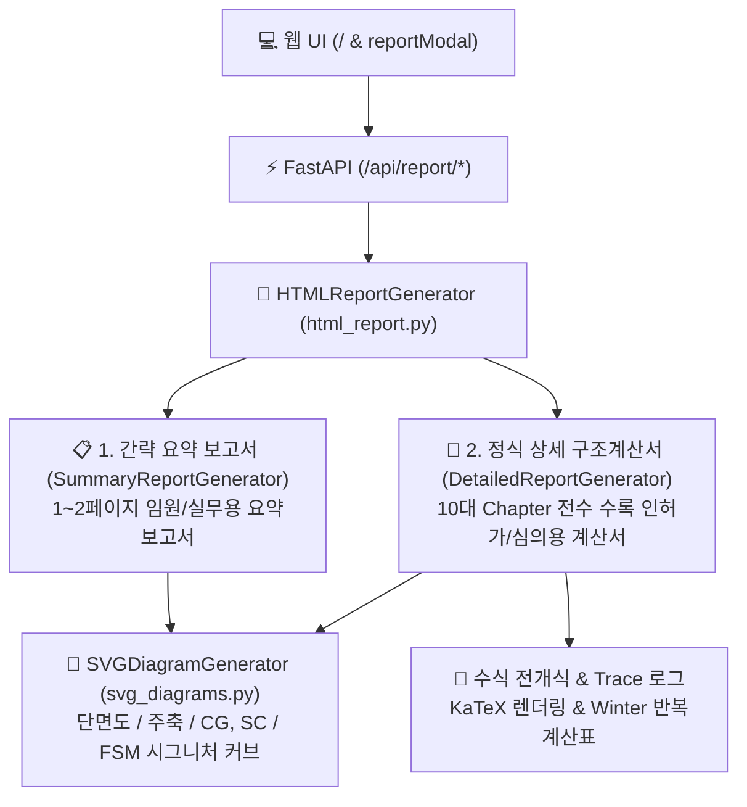

# [구조계산서 및 출력 시스템 명세서] CFDesigner Structural Calculation Report Specification

> **문서 상태**: 🌟 Single Source of Truth (SSOT)  
> **문서 버전**: v1.0 (요구사항 07 CFS 원본 리포트 전수 이식 및 듀얼 리포트 모드 완성판)  
> **관련 모듈**: `src/report/` (`models.py`, `summary_report.py`, `detailed_report.py`, `svg_diagrams.py`, `html_report.py`)  
> **관련 엔드포인트**: `POST /api/report/html`, `POST /api/report/summary`, `POST /api/report/detailed`  
> **원본 레퍼런스 (Ground Truth)**:
> - [`decompiled_src/RSG/CFS/Report.cs`](file:///f:/PyProject/CFDesigner/decompiled_src/RSG/CFS/Report.cs) (`rptHeading`, `rptSctInp`, `rptProperties`, `rptTorsionProp`, `rptEffProperties`, `rptStrength`, `rptDSMData`, `rptMemberCheck`, `rptWebCrippling`, `rptDiagrams` 등 2,090줄)
> - [`decompiled_src/RSG/CFS/PrintRoutines.cs`](file:///f:/PyProject/CFDesigner/decompiled_src/RSG/CFS/PrintRoutines.cs) (`PrintReports`, `PrintBuckling`, `PrintDiagrams`, `PrintDiagEnv`, `PrintHeader`, `PrintFooter` 등 1,600줄)
> - [`decompiled_src/_Global/frmPrint.cs`](file:///f:/PyProject/CFDesigner/_Global/frmPrint.cs) (인쇄 항목 다중 선택 다이얼로그)

---

## 1. 시스템 개요 및 설계 철학

CFDesigner 구조계산서 및 출력 시스템은 냉간성형강 구조설계 기준(**KDS 14 31 10** 및 **AISI S100 Direct Strength Method**)에 따라 해석·설계된 결과를 실무 엔지니어링 문서로 변환하는 고품질 리포팅 엔진입니다.



### 1.1 듀얼 리포트 모드 (Dual Report Mode)
1. **📋 간략 요약 보고서 (Summary / Quick Report)**:
   - **목적**: 설계 화면 내에서의 빠른 확인, 의사결정자 브리핑, 1~2페이지 분량의 핵심 내력 요약.
   - **구성**: 프로젝트 정보 및 결재란 $\rightarrow$ 단면 형상 SVG & 주요 기하성질 $\rightarrow$ FSM 탄성 좌굴 요약 $\rightarrow$ KDS 부재 내력(D/C Ratio, OK/NG) 종합 판정.
2. **📑 정식 상세 구조계산서 (Detailed Engineering Calculation Sheet)**:
   - **목적**: 관공서 인허가 제출, 구조기술사 심의, 세부 계산 근거 보존용 다중 페이지 정식 계산서.
   - **구성**: 표지 및 엔지니어링 결재란, 재료 물성, 요소 전수 명세표, 총단면/주축/순단면 성질, 비틀림 뒴($W_n, S_w$), Winter 유효폭 반복계산표, 완전지지 강도 및 Trace, FSM 시그니처 커브, KDS 부재설계 수식 전개, 웨브 크리플링 검토, 1D 해석 단면력 다이어그램.

---

## 2. CFS 원본 리포트 vs 웹 구조계산서 1:1 전수 매핑 매트릭스

| CFS 원본 리포트 함수 | 원본 소스 위치 | 수록 주요 공학 데이터 및 수식 | 신규 웹 계산서 챕터 매핑 |
|---|---|---|---|
| `rptHeading` / `PrintHeader` | `Report.cs:112` | CFS 버전, 프로젝트명, 부재명, 파일명, 설계자/검토자/승인자, 회사명, 로고, 개정일자, 연락처, 출력일시, 결재란 | **표지 & 결재란 (Cover & Approvals)** |
| `rptSctInp` | `Report.cs:1319` | 재료 물성($E, F_y, F_u$, 연신율, 가공경화, 비탄성예비), 파트 배치, 요소 전수 명세표($L, \theta, R, t$, Web type, $k$, Hole, Dist), DSM 파라미터 | **제1장. 설계 개요 및 단면 입력 제원** |
| `rptProperties` | `Report.cs:1222` | $A_g, W, \bar{x}, \bar{y}, I_x, I_y, I_{xy}, r_x, r_y, S_{xt}, S_{xb}, S_{yl}, S_{yr}$, 주축($\theta_p, I_1, I_2, r_1, r_2, S_1, S_2$), 순단면($A_n, I_{xn}, I_{yn}$) | **제2장. 단면 기하학적 성질 (Gross/Net)** |
| `rptTorsionProp` | `Report.cs:1537` | 전단중심($x_o, y_o$), $C_w, J, r_o, \beta_w, \beta_y$, 요소별 위치(Loc), 전단중심 거리($R_o$), 정규화 단위뒴함수($W_n$), 뒴단면1차모멘트($S_w$) | **제3장. 비틀림 및 뒴(Warping) 특성** |
| `rptEffProperties` | `Report.cs:1276` | 하중($P, M_x, M_y$) 하 $A_e, I_{xe}, I_{ye}, S_{xe}, S_{ye}$, 요소별 Winter 유효폭($f_1, f_2, \psi, k, w/t, \lambda, \rho, b_e, b_1, b_2$, 무효폭) | **제4장. 유효단면 성질 및 Winter 반복해석** |
| `rptStrength` | `Report.cs:1467` | KDS/LRFD ($\phi P_{no}, \phi M_{nxo}, \phi M_{nyo}, \phi T_n, \phi V_n, \phi B_n$), ASD 허용강도, 정/부 휨 비교, 상세 Trace 로그 | **제5장. 완전지지 단면 강도 및 Trace** |
| `rptDSMData` / `PrintBuckling` | `Report.cs:1978` | FSM 시그니처 커브 최소점(Local, Distortional, Global) 반파장($L_{cr}$), $P_{cr}/P_y, M_{cr}/M_y$, 사전검증(Prequalified) 판정표, 시그니처 커브 SVG | **제6장. FSM 탄성 좌굴해석 & DSM 파라미터** |
| `rptMemberCheck` | `Report.cs:920` | 비지지길이($K_x L_x, K_y L_y, K_t L_t, L_b$), $C_b, B_1, B_2$, 압축($P_n, \phi P_n$), 휨($M_n, \phi M_n$), 전단/비틀림, P-M 상호작용 조합식 ($\le 1.0$) | **제7장. KDS 14 31 10 부재 내력 검토** |
| `rptWebCrippling` | `Report.cs:1631` | 지지길이 $N$, 재하조건(IOF, EOF, ETF, ITF), 플랜지 부착 여부, 크리플링 강도($P_n, \phi P_n$), 휨-크리플링 조합식 ($0.91 \frac{P}{\phi P_n} + \frac{M}{\phi M_n} \le 1.33$) | **제8장. 웨브 크리플링 국부 좌굴 검토** |
| `rptAnlInp` / `rptDiagrams` | `Report.cs:176, 367` | 1D 해석 제원, 위치($Z$)별 단면력($M_x, M_y, V_x, V_y, P, T, B$) 및 변위 수치표, 포락선(Envelope), BMD/SFD 그래프 | **제9장. 1D 보/기둥 구조해석 및 다이어그램** |
| `frmPrint` (Print Dialog) | `frmPrint.cs:222` | 출력 항목 다중 선택(`lstPrint`), 전체선택/해제(`cmdSelectAll`), 머리말/결재란 설정(`cmdHeading`), 인쇄 미리보기 | **웹 인쇄 설정 모달 드로어 (`#reportConfigDrawer`)** |

---

## 3. 리포트 데이터 모델 (`src/report/models.py`)

### 3.1 ProjectMetadata (프로젝트 및 결재란 모델)
```python
@dataclass
class ProjectMetadata:
    project_name: str = "CFDesigner Project"
    section_name: str = "Cold-Formed Section"
    file_name: str = "Section1.cfs"
    company: str = "Structural Engineering Corp."
    designed_by: str = "Structural Engineer"
    checked_by: str = "PE / SE"
    approved_by: str = "Lead Engineer"
    doc_number: str = "CALC-CFS-001"
    rev_number: str = "Rev. 0"
    rev_date: str = ""
    remarks: str = "Cold-Formed Steel Section Design per KDS 14 31 10 / AISI S100"
    client: str = ""
    address: str = ""
    phone: str = ""
    email: str = ""
```

### 3.2 ReportOptions (인쇄 항목 선택 옵션 모델)
```python
@dataclass
class ReportOptions:
    report_mode: str = "detailed"  # 'summary' or 'detailed'
    include_cover: bool = True
    include_section_inputs: bool = True
    include_gross_properties: bool = True
    include_torsion_properties: bool = True
    include_effective_properties: bool = True
    include_fully_braced_strength: bool = True
    include_fsm_buckling: bool = True
    include_member_design: bool = True
    include_web_crippling: bool = True
    include_1d_analysis: bool = True
    include_trace_details: bool = True
    unit_system: str = "SI"
```

---

## 4. 10대 장(Chapter)별 세부 수식 및 렌더링 명세

### 4.1 제1장: 설계 개요 및 단면 입력 제원 (`rptSctInp`)
* **재료 물성 테이블**: 강종, $E = 205,000\,\text{MPa}, F_y, F_u, G = 79,000\,\text{MPa}, \nu = 0.30$, 가공경화 증대 여부, 비탄성 예비강도 여부.
* **단면 형상 SVG**: 요소 중심선 및 판 두께, 요소 번호 배지, 도심(CG) 및 전단중심(SC) 마커 오버레이.
* **요소 전수 명세표**:
  $$\text{Table: } [\text{Elem \#}, L(\text{mm}), \theta(^\circ), R(\text{mm}), t(\text{mm}), \text{Web Type}, k, \text{Hole Size}, \text{Hole Dist}]$$

### 4.2 제2장: 단면 기하학적 성질 (`rptProperties`)
* **Gross vs Net 성질 대조 테이블**:
  * 단면적 $A_g, A_n$, 단위중량 $W = A_g \times 7.85 \times 10^{-3}\,\text{kg/m}$.
  * 도심 $\bar{x}, \bar{y}$, 단면 2차모멘트 $I_x, I_y, I_{xy}$, 단면 2차반경 $r_x, r_y$.
  * 주축 회전각 $\theta_p = \frac{1}{2} \tan^{-1}\left(\frac{-2I_{xy}}{I_x - I_y}\right)$, 주축 관성모멘트 $I_1, I_2$, 주축 단면계수 $S_1, S_2$.

### 4.3 제3장: 비틀림 및 뒴(Warping) 특성 (`rptTorsionProp`)
* **전단중심 및 비틀림 상수**: $S_C(x_o, y_o)$, 생브낭 $J$, 뒴상수 $C_w$, 극단면 2차반경 $r_o = \sqrt{r_x^2 + r_y^2 + x_o^2 + y_o^2}$, 비대칭계수 $\beta_w, \beta_y$.
* **요소별 뒴함수 일람표**:
  $$\sigma_w = \frac{B \cdot W_n}{C_w}, \quad \tau_w = \frac{M_{w} \cdot S_w}{C_w \cdot t}$$
  * $R_o$: 전단중심에서 요소 중심선까지의 수직거리 ($\text{mm}$)
  * $W_n$: 정규화 단위 뒴함수 ($\text{mm}^2$) $\rightarrow$ 종방향 직응력 산정 근거
  * $S_w$: 뒴단면 1차모멘트 ($\text{mm}^4$) $\rightarrow$ 전단 뒴응력 산정 근거

### 4.4 제4장: 유효단면 성질 및 Winter 유효폭 해석 (`rptEffProperties`)
* **Winter 판폭 감소식 (Winter Equation)**:
  $$\lambda = \sqrt{\frac{F_y}{F_{cr}}} = \frac{1.052}{\sqrt{k}} \left(\frac{w}{t}\right) \sqrt{\frac{F_y}{E}}$$
  $$\rho = \begin{cases} 1.0 & (\lambda \le 0.673) \\ \frac{1 - 0.22/\lambda}{\lambda} & (\lambda > 0.673) \end{cases}, \quad b_e = \rho \cdot w$$
* **요소별 반복계산표**: Elem #, $w, t, w/t, k, \lambda, \rho, b_e$, 무효폭($w - b_e$), 플랜지 컬링.

### 4.5 제5장: 완전지지 단면 강도 (`rptStrength`)
* **KDS 14 31 10 / LRFD 및 ASD 강도 일람표**:
  * 축압축: $\phi P_{no} = \phi_c A_g F_y$ ($\phi_c = 0.85$)
  * 휨모멘트: $\phi M_{nxo} = \phi_b S_{xe} F_y$ ($\phi_b = 0.90$)
  * 전단: $\phi V_{ny} = \phi_v 0.60 A_w F_y$ ($\phi_v = 0.90$)
* **Trace 로그**: 항복하중, 항복모멘트, 전단내력의 상세 중간 수치 대입 과정 출력.

### 4.6 제6장: FSM 탄성 좌굴해석 & DSM 파라미터 (`rptDSMData`)
* **시그니처 커브 3대 임계점 수치표**:
  * 국부 좌굴 (Local): 반파장 $L_{crl}$, 탄성좌굴하중 $P_{crl}$, 좌굴비 $P_{crl}/P_y$.
  * 왜곡 좌굴 (Distortional): 반파장 $L_{crd}$, 탄성좌굴하중 $P_{crd}$, 좌굴비 $P_{crd}/P_y$.
  * 전역 좌굴 (Global): 반파장 $L_{cre}$, 탄성좌굴하중 $P_{cre}$, 좌굴비 $P_{cre}/P_y$.
* **사전검증 단면 판정**: 판폭두께비 한계 검토 및 직접강도법(DSM) 적용 적합성 판정.

### 4.7 제7장: KDS 14 31 10 직접강도법 부재 내력 검토 (`rptMemberCheck`)
* **공칭압축강도 $P_n$**:
  $$P_{ne} = \begin{cases} (0.658^{\lambda_c^2}) P_y & (\lambda_c \le 1.5) \\ \left(\frac{0.877}{\lambda_c^2}\right) P_y & (\lambda_c > 1.5) \end{cases}, \quad P_n = \min(P_{ne}, P_{nl}, P_{nd})$$
* **공칭휨강도 $M_n$**:
  $$M_{ne} = f(M_{cre}), \quad M_n = \min(M_{ne}, M_{nl}, M_{nd})$$
* **P-M 조합응력 검토 (KDS 14 31 10 식 4.4-1)**:
  $$\frac{P_u}{\phi_c P_n} + \frac{B_1 M_{ux}}{\phi_b M_{nx}} + \frac{B_2 M_{uy}}{\phi_b M_{ny}} \le 1.0$$

### 4.8 제8장: 웨브 크리플링 검토 (`rptWebCrippling`)
* **공칭 크리플링 강도 $P_n$**:
  $$P_n = C t^2 F_y \sin\theta \left(1 - C_R \sqrt{\frac{R}{t}}\right) \left(1 + C_N \sqrt{\frac{N}{t}}\right) \left(1 - C_h \sqrt{\frac{h}{t}}\right)$$
* **휨-크리플링 조합 검토**:
  $$0.91 \frac{P_u}{\phi_w P_n} + \frac{M_u}{\phi_b M_n} \le 1.33$$

---

## 5. 고해상도 SVG 다이어그램 모듈 (`src/report/svg_diagrams.py`)

1. **단면 형상도 (`render_section_svg`)**:
   - 반응형 viewBox 및 자동 패딩 산정 ($pad = max\_span \times 0.35$).
   - 요소 중심선 렌더링 (두께 비례 stroke-width).
   - 요소 번호 배지 원형 태그 및 좌표계.
   - 도심(CG, 빨강) 및 전단중심(SC, 파랑) 마커.
   - 주축 1-1, 2-2 축선 (녹색 점선 및 축 라벨).
2. **FSM 시그니처 커브 (`render_signature_curve_svg`)**:
   - 반파장 길이 $L$의 로그 스케일($\log_{10} L$) 축 매핑.
   - 좌굴 하중비 $P_{cr}/P_y$ 선형 축 매핑.
   - 국부(Local), 왜곡(Distortional) 최소점 하이라이트 원형 마커 및 수치 라벨.

---

## 6. 웹 UI/UX 및 인쇄/PDF 파이프라인

### 6.1 인쇄 모달 UI 구성 (`#reportModal`)
* **상단 툴바 (`.report-modal-toolbar`)**:
  * 듀얼 모드 토글 세그먼트: `[ 📋 간략 요약 ]` / `[ 📑 정식 상세 ]`
  * `📂 수식 전체 펼치기 / 접기` (`#btnToggleAllTrace`): 계산서 내 모든 `<details class="trace-accordion">` 일괄 개폐
  * `⚙️ 출력 설정` (`#btnToggleReportConfig`): 우측 슬라이드 드로어 토글
  * `🖨️ 인쇄 / PDF 저장` (`#btnPrintReportFrame`): iframe `contentWindow.print()` 연동
  * `✕ 닫기` (`#btnCloseReportModal`)
* **출력 설정 드로어 (`#reportConfigDrawer`)**:
  * 제1장부터 제8장/제9장 체크박스 필터링 및 "📝 상세 계산 과정(Trace) 수식 포함" 옵션 지원.
  * [🔄 계산서 다시 생성] 버튼 클릭 시 실시간 갱신.

### 6.2 A4 인쇄 CSS 최적화 및 Trace 아코디언 강제 개폐
```css
@page {
  size: A4 portrait;
  margin: 15mm 15mm 15mm 15mm;
}
@media print {
  body { background: transparent; padding: 0; }
  .sheet-page {
    width: 100%;
    min-height: auto;
    box-shadow: none;
    margin: 0;
    padding: 0;
    border-radius: 0;
    page-break-after: always;
  }
  .trace-accordion {
    border: 1px solid #cbd5e1 !important;
    background: #ffffff !important;
    page-break-inside: avoid;
  }
  .trace-accordion > summary { display: none !important; }
  .trace-accordion-content { display: block !important; padding: 4px 0 !important; }
  .page-break { page-break-before: always; }
  .no-print { display: none !important; }
}
```

---

## 7. REST API 사양 (`src/api/routes.py`)

| 엔드포인트 | 메서드 | 파라미터 | 반환값 | 설명 |
|---|---|---|---|---|
| `/api/report/html` | `POST` | `payload: Dict[str, Any]` | `{"html": "..."}` | `options.report_mode`에 따라 summary/detailed 자동 분기 및 KaTeX 수식 전개(Trace) 주입 |
| `/api/report/summary` | `POST` | `payload: Dict[str, Any]` | `{"html": "..."}` | 1~2페이지 간략 요약 보고서 HTML 반환 |
| `/api/report/detailed` | `POST` | `payload: Dict[str, Any]` | `{"html": "..."}` | 10대 장 다중 페이지 정식 상세 구조계산서 HTML 반환 |

---

## 8. 테스트 및 품질 검증 명세 (`tests/ui/test_report_generation.py`)

* **AC 11-1 ~ 11-5 (Trace 엔진 및 수식 렌더링)**: `test_trace_rendering_in_detailed_report`
* **AC 7-1 (듀얼 리포트)**: `test_summary_report_generation`, `test_detailed_report_generation`
* **AC 7-2 (SVG 다이어그램)**: `test_svg_diagram_generator`
* **AC 7-3 (디스패처 검증)**: `test_html_report_dispatcher`
* **AC 7-4 (API 라우트 검증)**: `test_api_report_endpoints`
* **검증 명령**: `pytest tests/ui/test_report_generation.py` (6개 테스트 100% Pass)

