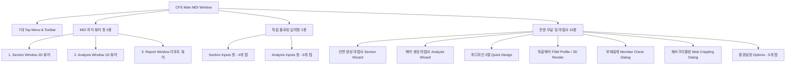
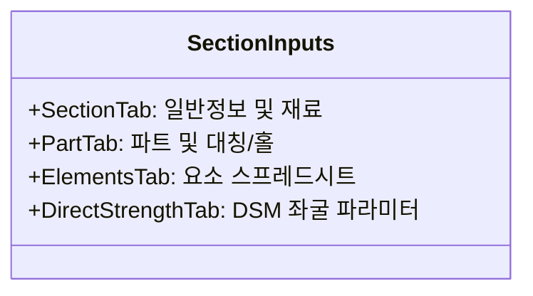
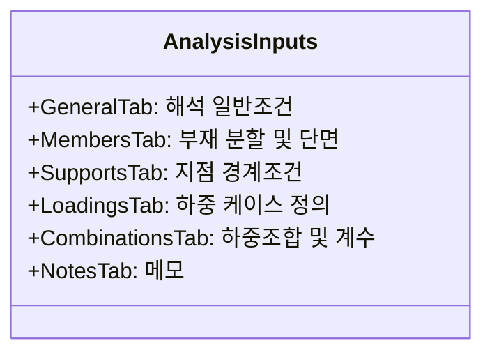
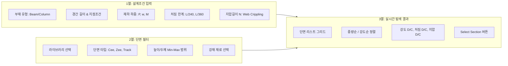
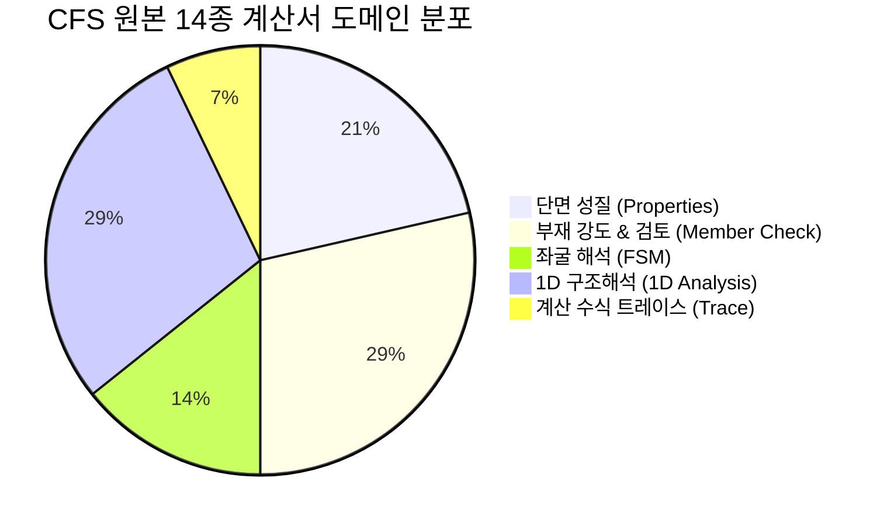

# [기술 문서 15] CFS 원본 프로그램 UI/메뉴/창 구성 및 입출력 상세 명세서 (15_cfs_legacy_ui_menu_and_dialog_specification.md)

> **문서 상태**: 🌟 Single Source of Truth (SSOT)  
> **문서 버전**: v1.0 (CFS 14.0 상용 프로그램 역공학 코드 및 공식 도움말 기반 전수 명세서)  
> **최종 갱신일**: 2026-09-02  
> **기반 소스 자산**: [`decompiled_src/`](file:///f:/PyProject/CFDesigner/decompiled_src/) (`CFSInterface.cs`, `Section.cs`, `Analysis.cs`, `Report.cs`, `FiniteStrip.cs` 외 51개 C# 소스) & [`decompiled_src/cfs_help_manual/`](file:///f:/PyProject/CFDesigner/decompiled_src/cfs_help_manual/) (95개 공식 도움말 HTML)

---

## 1. 개요 및 UI 아키텍처

기존 상용 냉간성형강 해석/설계 프로그램인 **CFS 14.0**은 Microsoft Windows 기반의 **MDI (Multiple Document Interface)** 아키텍처를 채택하고 있습니다. 메인 MDI 컨테이너 창 내에서 여러 개의 단면(Section), 1D 뼈대해석(Analysis), 구조계산서(Report) 창이 독립적으로 열리며, 이와 연동되는 **독립 플로팅 입력 창(Floating Input Windows)**과 **특수 목적 대화창(Dialogs & Wizards)**이 유기적으로 데이터를 교환합니다.

---

## 2. 메인 메뉴 구성 (Top-Level Menu & Context Menus)

### 2.1. 7대 상단 메뉴 (Top-Level Menus)

| 메뉴명 | 하위 항목 (Command) | 단축키 | 원본 C# 핸들러 / 역할 | 연계 창 및 기능 |
|---|---|:---:|---|---|
| **File** | **New Section** | `Ctrl+N` | `frmSctWizard` 호출 | 6대 기본 단면 마법사 시작 |
| | **New Analysis** | `Ctrl+Shift+N` | `frmAnlWizard` 호출 | 1D 보/연속보 해석 모델 마법사 시작 |
| | **Quick Design** | `Ctrl+Q` | `frmQuickDesign` 호출 | 하중/경간 기반 3열 최적 단면 자동 탐색기 |
| | **Open** | `Ctrl+O` | `OpenFileDialog` | 단면(`.cfss`), 라이브러리(`.cfsl`), 해석(`.cfsa`) 열기 |
| | **Recent Files** | - | `frmRecentFiles` / 레지스트리 | 최근 사용한 파일 목록(최대 32개) 하위 메뉴 표시 |
| | **Import DXF** | - | `DXF.ImportDXF` | AutoCAD 2D Polyline/Arc DXF 파일 읽기 |
| | **Save** | `Ctrl+S` | `SaveSection` / `SaveAnalysis` | 현재 활성 창 파일 저장 (리포트 포함) |
| | **Save As** | `F12` | `SaveFileDialog` | 다른 이름 저장 / DXF 내보내기 / Word(`.doc`) / RTF |
| | **Close** | `Ctrl+F4` | `CloseWindow` | 현재 활성 MDI 창 닫기 |
| | **Report Inputs** | - | `Report.SectionInputs` | 현재 단면/해석의 모든 입력 데이터 리포트 출력 |
| | **Print** | `Ctrl+P` | `frmPrint` / `PrintRoutines` | 활성 창 인쇄 다이얼로그 호출 |
| | **Exit** | `Alt+F4` | `Application.Exit` | 프로그램 종료 (미저장 변경사항 확인) |
| **Edit** | **Undo** | `Ctrl+Z` | `UndoAction` | 최근 기하/입력 수정 취소 |
| | **Redo** | `Ctrl+Y` | `RedoAction` | 최근 취소한 동작 재실행 |
| | **Cut / Copy / Paste** | `Ctrl+X/C/V`| `FlexCell.Clipboard` | 그리드 행(Row) 잘라내기, 복사, 붙여넣기 |
| | **Copy Image** | `Ctrl+Shift+C`| `Clipboard.SetImage` | 2D 단면 / 1D 해석 / 3D 좌굴 그래픽 클립보드 복사 |
| | **Insert Row / Delete Row**| `Ins` / `Del` | `Grid.InsertRow` | 스프레드시트 그리드 행 삽입 및 삭제 |
| | **Rotate and Mirror** | - | `frmAngle` 호출 | 단면 90°/임의각 회전, 상하/좌우 대칭 변환 |
| | **Center Section** | - | `frmLocation` 호출 | 단면 도심($C_G$) 또는 지정 기준점을 원점(0,0)으로 이동 |
| | **Complete Part Symmetry**| - | `Part.MakeSymmetric` | 대칭 단면 절반 입력 시 전체 단면 자동 대칭 복제 |
| | **Insert Ribs** | - | `frmRibs` 호출 | 플랜지/웨브 요소에 중간 V-Rib / 사다리꼴 리브 삽입 |
| **View** | **Toolbar** | - | `Toolbar.Visible` | 상단 툴바 표시/숨김 토글 |
| | **Input Windows on Top** | - | `Form.TopMost` | 플로팅 입력창(Section/Analysis Inputs) 항상 위 토글 |
| | **Section Inputs** | `F3` | `frmSctInp.Show()` | 단면 플로팅 입력창 표시/활성화 |
| | **Analysis Inputs** | `F4` | `frmAnlInp.Show()` | 1D 해석 플로팅 입력창 표시/활성화 |
| | **Render Members** | - | `RenderMembersToggle`| 1D 해석 창에서 부재를 선이 아닌 3D 형상으로 렌더링 |
| | **X-Y Axes** | - | `ShowAxesToggle` | 2D/1D 그래픽 화면의 X-Y 좌표축 표시 토글 |
| **Compute** | **Properties** | `F5` | `Report.GrossProperties` | 전단면(Gross) 및 순단면(Net) 기하학적 성질 계산서 출력 |
| | **Effective Properties**| `F6` | `frmEffProp` 호출 | 하중 수준별 Winter 유효단면($A_e, I_e$) 계산 및 리포트 |
| | **Strength** | `F7` | `Report.Strength` | 완전지지 부재 공칭강도($P_n, M_{nx}, M_{ny}, V_n$) 계산서 |
| | **Member Check** | `F8` | `frmMemberCheck` 호출 | 부재설계(축력+2축휨+전단+비틀림 조합검토) 계산서 |
| | **Web Crippling** | `F9` | `frmWebCrippling` 호출 | 4대 조건별 웨브 크리플링 지압강도($P_{nc}$) 계산서 |
| | **Torsion Properties** | - | `Report.TorsionProperties`| 부재별 뜀상수($C_w$), 전단중심, 와핑 함수($W_n, S_w$) 리포트 |
| | **Elastic Buckling** | `F11` | `frmBuckleParam` 호출 | FSM 유한대판 탄성 좌굴해석 (시그니처 커브 & 3D 모드) |
| | **Diagrams** | `F12` | `frmDiagrams` 호출 | 1D 구조해석 SFD(전단력), BMD(휨모멘트), 처짐도 다이어그램 |
| **Tools** | **Specification** | - | `SetSpecification` | 설계 기준 선택 (KDS 14 31 10, AISI S100-16/12/07, ASCE 8 등) |
| | **Global Buckling** | - | `SetBucklingMethod` | 전체 좌굴 계산 방식 선택 (Spec Equations vs Elastic Theory) |
| | **Include Trace** | - | `SetTraceLevel` | 계산서 내 상세 수식 전개 과정(Equation Trace) 포함 여부 |
| | **Options** | - | `frmOptions` 호출 | 단위계, 재료 기본값, 두께 게이지, 서식, 하중조합 설정 |
| | **License** | - | `frmLicense*` 호출 | 단일 사용자 / 네트워크 라이선스 활성화 및 관리 |
| | **Library Builder** | - | `frmSctLib` 호출 | 표준 단면 데이터베이스(`.cfsl`) 생성 및 편집기 |
| **Windows** | **Cascade / Tile H / Tile V**| - | `LayoutMdi` | 열린 MDI 창 계단식/수평바둑판/수직바둑판 정렬 |
| | **Window List** | - | `MdiChildren` | 현재 열려 있는 Section, Analysis, Report 창 활성화 전환 |
| **Help** | **Help Topics** | `F1` | `Help.ShowHelp` | 오프라인 도움말(`CFS.chm`) 목차 및 색인 브라우저 |
| | **Symbols** | - | `symbols.htm` | 수식 기호, 첨자 및 그리스 문자 정의집 |
| | **Glossary** | - | `glossary.htm` | 냉간성형강 구조 전문 용어사전 |
| | **About CFS** | - | `frmAbout` 호출 | 소프트웨어 버전, 빌드 번호, 라이선스 정보 |

---

## 3. MDI 주 창 구성 (Main MDI Windows)

### 3.1. 단면 뷰어 창 (`Section Window` / `frmSctPicMaster`)
* **목적**: 단면 기하 형상, 요소 배치, 응력 상태, 도심 및 주축을 2D 그래픽으로 시각화.
* **사용자 인터랙션 (입력)**:
  * 마우스 휠: 줌 인 / 줌 아웃 (최대 32배 확대 ~ 1배 축소)
  * 마우스 좌클릭 드래그: 캔버스 팬(Pan) 이동
  * 요소 좌클릭: 해당 요소 선택 및 `Section Inputs` 창의 해당 행으로 포커스 이동
  * 우클릭 팝업 메뉴: Copy Image, Center Section, Rotate & Mirror, Properties 실행
* **화면 출력 내용 (Rendering Output)**:
  1. **단면 요소선**: 요소별 두께를 실선 또는 중심선으로 표현 (색상: 파트별 구분)
  2. **코너 R (Fillet)**: 원호 밴딩 부위의 라운딩 곡선 표현
  3. **단면 기하학적 기준점**:
     * 녹색 십자선: 원점 $(0, 0)$
     * 적색 원/십자: 도심(Centroid, $C_G: x_c, y_c$)
     * 청색 다이아몬드: 전단중심(Shear Center, $C_S: x_0, y_0$)
  4. **좌표축 및 주축선**:
     * 기본 X-Y 직교 좌표축
     * 점선: 관성주축($1-1, 2-2$ Principal Axes) 및 주축 회전각($\theta_p$)
  5. **유효단면 오버레이 (F6 해석 시)**:
     * 좌굴 및 유효폭 감소에 의해 탈락된 요소를 점선(Dotted) 또는 회색으로 표시
     * 이동된 유효도심($C_{Ge}$) 위치 렌더링

---

### 3.2. 1D 구조해석 뷰어 창 (`Analysis Window` / `frmAnlPicMaster`)
* **목적**: 1D 보/기둥 프레임 구조 모델, 지점 조건, 재하 하중 및 변형 형상을 시각화.
* **사용자 인터랙션**:
  * 마우스 드래그/휠: 줌 및 팬
  * 부재/지점 클릭: `Analysis Inputs` 창의 해당 행 선택
  * Render Members 토글: 단선(Line) 표현 $\leftrightarrow$ 3D 솔리드 단면 형상 압출 표현
* **화면 출력 내용**:
  1. **부재 형상 (Members)**: 부재 번호, 경간 길이, 단면 프로파일
  2. **지점 기호 (Supports)**:
     * 단순 롤러 (Roller): 바닥 롤러 기호
     * 핀 힌지 (Pinned/Hinge): 고정 힌지 삼각 기호
     * 고정단 (Fixed): 빗금 친 벽체 기호
     * 탄성 스프링 (Spring): 스프링 파형 기호
  3. **재하 하중 (Loads)**:
     * 등분포하중: 다중 수직 화살표 및 상단 연결선 + 하중값($kN/m, kips/ft$)
     * 집중하중: 대형 단일 수직 화살표 + 하중값($kN, kips$)
     * 모멘트: 회전 곡선 화살표 + 모멘트값($kN\cdot m$)
     * 축하중: 부재 축방향 화살표

---

### 3.3. 구조계산서 리포트 창 (`Report Window` / `frmReportMaster`)
* **목적**: 수치해석, 기하성질, 부재설계 및 FSM 좌굴 결과를 표준 계산서 서식으로 출력.
* **사용자 인터랙션**:
  * 텍스트 블록 선택 및 복사 (`Ctrl+C`)
  * 상단 인쇄 버튼: 인쇄 다이얼로그 호출
  * 파일 저장: Word(`.doc`), Rich Text(`.rtf`), 텍스트(`.txt`) 형식으로 내보내기
* **화면 출력 내용**:
  * 문서 헤더: 회사명, 프로젝트명, 설계자, 일자, 소프트웨어 버전
  * 단면 형상 ASCII/벡터 다이어그램
  * 수치 결과 테이블 (성질표, 하중-변위표, 부재 강도표, D/C 검토표)
  * AISI/KDS 조항 번호 및 단계별 계산식(Trace 활성화 시)

---

## 4. 플로팅 입력 창 구성 (Floating Input Windows)

### 4.1. 단면 입력 창 (`Section Inputs` / `frmSctInp`)

단면 모델링을 정의하는 4개 탭으로 구성됩니다.

#### ① Section Tab (일반 정보 및 재료)
* **사용자 입력 데이터**:
  | 입력 필드명 | 컨트롤 타입 | 데이터 타입 / 단위 | 설명 및 제약조건 |
  |---|---|:---:|---|
  | **Description** | TextBox | String (최대 50자) | 단면 명칭 (예: `800S162-54`) |
  | **Project** | TextBox | String (최대 50자) | 프로젝트 또는 적용 부재명 |
  | **Revised** | Label (자동) | Date & User | 마지막 수정 일시 및 작업자 이름 |
  | **Material Type** | Dropdown | Code (Enum) | 강재 종류 (A653, A1003, A36, Stainless 등) |
  | **Material Detail (`...`)**| Button | Modal | 상세 재료 탄성계수/항복강도 수정 대화창 호출 |
  | **Apply Cold Work** | CheckBox | Boolean | 성형 가공경화 강도 증가($F_{ya}$) 적용 여부 |
  | **Inelastic Reserve**| CheckBox | Boolean | 비탄성 모멘트 여력($M_{10}$) 산정 여부 |
  | **Yield Strength ($F_y$)**| Dropdown/Text | Stress ($MPa, ksi$) | 설계 항복강도 |
  | **Tensile Strength ($F_u$)**| Dropdown/Text | Stress ($MPa, ksi$) | 인장강도 |
  | **J Override** | TextBox | Inertia ($mm^4, in^4$) | 세인트 베넌 비틀림 상수 수동 재정의 |
  | **Cw Override** | TextBox | Warping ($mm^6, in^6$)| 뜀상수(Warping Constant) 수동 재정의 |
  | **Connector Spacing**| TextBox | Length ($mm, in$) | 조립단면(Built-up) 전단 커넥터 길이 간격 |
  | **Hole Length** | TextBox | Length ($mm, in$) | 웨브/플랜지 타공 홀 길이 (0 입력 시 무시) |
  | **Hole Spacing** | TextBox | Length ($mm, in$) | 종방향 타공 홀 중심 간격 |

#### ② Part Tab (파트 관리 및 좌표/대칭)
* **사용자 입력 데이터**:
  | 입력 필드명 | 컨트롤 타입 | 설명 |
  |---|---|---|
  | **Part Selection** | Dropdown / Spin | 편집 대상 파트 번호 선택 (Part 1, Part 2...) |
  | **Description** | TextBox | 파트 명칭 (예: `Stud Web`, `Track`) |
  | **Symmetry** | Dropdown | `None`, `Symmetric (X)`, `Symmetric (Y)`, `Doubly Symmetric`, `Point Symmetric` |
  | **Thickness** | Dropdown/Text | 파트 강판 두께 (표준 게이지 또는 직접 입력) |
  | **Origin X / Y** | TextBox | 파트 시작 노드의 기준 좌표계 오프셋 |
  | **Rotation Angle** | TextBox | 파트 회전각 (도, Degree) |
  | **Hole Type** | Dropdown | `None`, `Standard Slotted`, `Circular`, `Rectangular` |
  | **Hole Dimensions**| TextBox 2개 | 타공 폭(Width) 및 높이(Depth) |

#### ③ Elements Tab (요소 스프레드시트 그리드 - FlexCell)
* **스프레드시트 컬럼 구성**:
  | 컬럼명 | 입력 형식 | 단위 / 허용값 | 설명 |
  |---|:---:|:---:|---|
  | **Element** | 자동 번호 | 1, 2, 3... | 요소 식별 번호 |
  | **Type** | Dropdown | `Flat`, `Arc` | 직선 평판 요소 또는 원호 코너 요소 |
  | **Length / Radius**| Numeric | $mm, in$ | 평판의 길이 또는 원호의 안쪽 굴곡반경($r$) |
  | **Angle / Sweep** | Numeric | Degree (°) | 절대 배치 각도 또는 원호 중심각(Sweep Angle) |
  | **Thickness** | Numeric | $mm, in$ | 요소별 두께 (파트 두께와 다를 경우 개별 지정) |
  | **Net Width Ratio**| Numeric | 0.0 ~ 1.0 | 타공 부위 순단면적 유효율 (기본 1.0) |
  | **Restraint** | Dropdown | `None`, `One Edge`, `Both Edges` | 판 요소 양단 지지 경계조건 (보강/비보강 판 판정) |
  | **Color** | Color Picker | Palette | 2D 캔버스 표시 색상 |

#### ④ Direct Strength (DSM) Tab
* **사용자 입력 데이터**:
  * **Use Direct Strength Method**: 체크박스 (DSM 설계 활성화)
  * **Local Buckling ($P_{crl}, M_{crlx}, M_{crly}$)**: 수치 입력 또는 `[FSM Auto-Compute]` 버튼
  * **Distortional Buckling ($P_{crd}, M_{crdx}, M_{crdy}$)**: 수치 입력 또는 `[FSM Auto-Compute]` 버튼
  * **Global Buckling ($P_{cre}, M_{crex}, M_{crey}$)**: 수치 입력 또는 이론식 연동

---

### 4.2. 1D 구조해석 입력 창 (`Analysis Inputs` / `frmAnlInp`)

1D 보-기둥 해석 모델을 구성하는 6개 탭으로 구성됩니다.

#### ① General Tab
* **Design Specification**: KDS 14 31 10, AISI S100 (2016/2012/2007)
* **Design Method**: `ASD` (허용응력설계법), `LRFD` (하중저항계수설계법), `LSD` (한계상태설계법)
* **Include Self-Weight**: 체크박스 (단면적 $\times$ 강재 단위중량 자중 자동 계산)
* **P-Delta (2차 효과)**: 2차 기하 비선형 효과 고려 여부

#### ② Members Tab (부재 배치 그리드)
* **컬럼 구성**:
  * `Member ID`: 부재 일련번호
  * `Section Name`: 사용 단면 선택 드롭다운 (현재 열린 `.cfss` 또는 라이브러리)
  * `Length`: 부재 분할 길이
  * `Orientation`: 회전각 ($0^\circ, 90^\circ, 180^\circ, 270^\circ$)
  * `Unbraced Lengths`: $L_{ux}$ (강축 비지지길이), $L_{uy}$ (약축 비지지길이), $L_t$ (비틀림 비지지길이)
  * `Effective Factors`: $K_x, K_y, K_t$ (유효좌굴길이계수)
  * `Moment Coefficients`: $C_b$ (횡비틀림좌굴 보정계수), $C_{mx}, C_{my}$ (모멘트 증대계수)

#### ③ Supports Tab (지점 경계조건 그리드)
* **컬럼 구성**:
  * `Node`: 지점 위치 노드 번호
  * `Location X`: 보 시작점 기준 절대 거리
  * `Support Type`: `Simple/Roller`, `Pinned/Hinge`, `Fixed`, `Spring`
  * `Restraints`: 이동 구속($\Delta_x, \Delta_y, \Delta_z$) 및 회전 구속($\theta_x, \theta_y, \theta_z$) 체크박스
  * `Spring Stiffness`: 탄성 지점 시 스프링 강성값 ($kN/m, kN\cdot m/rad$)

#### ④ Loadings Tab (하중 케이스 및 하중 그리드)
* **하중 케이스 목록**: `Dead (D)`, `Live (L)`, `Wind (W)`, `Roof Live (Lr)`, `Snow (S)`, `Earthquake (E)`
* **하중 입력 그리드**:
  * `Load Type`: `Uniform (등분포)`, `Concentrated (집중하중)`, `Moment (집중모멘트)`, `Axial (축력)`
  * `Direction`: `+Y (하향)`, `-Y (상향)`, `+X`, `-X`, `+Z`
  * `Magnitude`: 하중 크기 ($kN/m, kN, kN\cdot m$)
  * `Start Loc / End Loc`: 재하 시작 위치 및 종료 위치

#### ⑤ Combinations Tab (하중조합 그리드)
* **컬럼 구성**:
  * `Comb Name`: 하중조합 명칭 (예: `1.2D + 1.6L`)
  * `Type`: `Strength (강도검토용)` vs `Serviceability (처짐/사용성검토용)`
  * `Load Factors`: 각 하중 케이스별 승수 계수 (D 계수, L 계수, W 계수 등)

---

## 5. 15대 전문 다이얼로그 및 마법사 상세 명세

### 5.1. 단면 생성 마법사 (`Section Wizard` / `frmSctWizard`)
* **창 구성 (2단계 마법사)**:
  * **Step 1: 단면 형상 템플릿 선택**:
    * 6대 표준 형상: Cee, Zee, Hat, Deck/Panel, Tube (Square/Rect/Round), Angle
    * 조립 형상: I-Shape, Built-up Back-to-Back Cee, Built-up Toe-to-Toe Cee
  * **Step 2: 치수 파라미터 입력**:
    * $D$ (Depth): 단면 전체 높이
    * $B$ (Flange Width): 플랜지 폭 (상/하 플랜지 독립 지정 가능)
    * $d$ (Lip Length): 립 보강재 길이
    * $\theta$ (Lip Angle): 립 절곡 각도 (기본 $90^\circ$)
    * $r$ (Inside Bend Radius): 모서리 안쪽 굴곡반경
    * $t$ (Thickness): 판 두께
    * Material Type 및 강도
* **출력 결과**: 파라미터에 따라 요소(Flat/Arc)를 자동 분할하고 `Section Window`에 2D 렌더링.

---

### 5.2. 퀵 디자인 3열 창 (`Quick Design` / `frmQuickDesign`)
* **창 구성 (좌-중-우 3열 동시 대화창)**:

* **출력 내용**:
  * 설계 조건을 만족하는 모든 단면의 중량($kg/m$), 단면 높이($D$), 두께($t$)
  * 축력/휨/전단/처짐/웨브크리플링 5대 항목의 D/C(Demand/Capacity) 비율
  * `[Select Section]` 클릭 시 해당 최적 단면이 메인 단면 창으로 즉시 임포트됨.

---

### 5.3. FSM 유한대판 탄성 좌굴해석 창 (`frmBuckleParam` & `frmBuckleProfile`)
* **입력 데이터 (`frmBuckleParam`)**:
  * 반파장 해석 범위: 최소 길이 $L_{min}$ (예: $10\,mm$), 최대 길이 $L_{max}$ (예: $10,000\,mm$)
  * 해석 스텝 수: 15 ~ 150 (로그 스케일 등간격)
  * 응력 상태(Stress Profile): Pure Compression ($P$), Pure Bending ($M_x, M_y$), Eccentric Axial ($P + M$)
  * 경간 경계조건: Simply Supported (Navier 모드)
* **출력 내용 (`frmBuckleProfile`, `frmBuckleValue`)**:
  1. **시그니처 커브 (Signature Curve)**:
     * X축: 반파장 길이 $L$ (Log scale, $mm$)
     * Y축: 임계 좌굴응력비 $\beta = \sigma_{cr} / F_y$ 또는 임계하중 $P_{cr}, M_{cr}$
     * 자동 검출 극솟점 마커:
       * $L_l, P_{crl}$ (Local Buckling, 국부좌굴)
       * $L_d, P_{crd}$ (Distortional Buckling, 왜곡좌굴)
       * $L_e, P_{cre}$ (Global Buckling, 전체좌굴)
  2. **3D 좌굴 변형 모드 뷰어 (OpenGL / WebGL)**:
     * 선택한 반파장 $L$에서의 3D 파형 메쉬 렌더링
     * 모드 진폭(Scale Factor) 슬라이더 바
     * 파형 애니메이션 재생/정지
  3. **수치 테이블 그리드 (`frmBuckleValue`)**:
     * $L$, $\beta$, $P_{cr}$, $M_{cr}$ 수치 전수 나열 및 CSV 내보내기

---

### 5.4. 부재설계 검토 창 (`Member Check Parameters` / `frmMemberCheck`)
* **입력 데이터**:
  * 부재 길이 및 비지지길이: $L_x, L_y, L_t$
  * 유효좌굴길이계수: $K_x, K_y, K_t$
  * 모멘트 보정계수: $C_b, C_{mx}, C_{my}$
  * 소요 하중(Required Demands):
    * 축력 $P_u$ (Tension / Compression)
    * 강축 휨모멘트 $M_{ux}$ (Top Flange in Tension / Compression)
    * 약축 휨모멘트 $M_{uy}$ (Left Flange in Tension / Compression)
    * 전단력 $V_{ux}, V_{uy}$
    * 비틀림 토크 $T_u$
* **출력 내용 (`Member Check Report`)**:
  * 인장 공칭강도 $\phi P_n$ 및 $P_u / \phi P_n$
  * 압축 공칭강도 $\phi P_n$ (국부/왜곡/전체 좌굴 고려) 및 D/C
  * 강축/약축 휨 공칭강도 $\phi M_{nx}, \phi M_{ny}$
  * 전단 공칭강도 $\phi V_{nx}, \phi V_{ny}$
  * 2축 휨-압축 상호작용 검토식 (P-M Interaction Equation D/C):
    $$\frac{P_u}{\phi P_n} + \frac{C_{mx} M_{ux}}{\phi M_{nx} (1 - P_u / P_{Ex})} + \frac{C_{my} M_{uy}}{\phi M_{ny} (1 - P_u / P_{Ey})} \le 1.0$$

---

### 5.5. 웨브 크리플링 검토 창 (`Web Crippling` / `frmWebCrippling`)
* **입력 데이터**:
  * 베어링 지지길이 $N$ ($mm, in$)
  * 재하 조건 선택:
    * `EOF`: End One-Flange Loading (단부 1플랜지 재하)
    * `IOF`: Interior One-Flange Loading (내부 1플랜지 재하)
    * `ETF`: End Two-Flange Loading (단부 2플랜지 대향재하)
    * `ITF`: Interior Two-Flange Loading (내부 2플랜지 대향재하)
  * 플랜지 체결 여부: `Fastened to Support` vs `Unfastened`
  * 플랜지 보강 상태: `Stiffened / Partially Stiffened Flanges` vs `Unstiffened Flanges`
  * 웨브 개수: `Single Web` vs `Built-up / Back-to-Back Web`
  * 소요 반력/집중하중 $P_u$ ($kN, kips$)
* **출력 내용 (`Web Crippling Report`)**:
  * KDS 14 31 10 / AISI S100 공식 계수 ($C, C_R, C_N, C_h$)
  * 웨브 경사각 $\theta$, 내측 굴곡반경 $R/t$, 지압길이비 $N/t$, 세장비 $h/t$
  * 공칭 지압강도 $P_n$ 및 설계 지압강도 $\phi P_{nc}$
  * 웨브 크리플링 D/C 비율 ($P_u / \phi P_{nc}$)

---

### 5.6. 1D 구조해석 다이어그램 창 (`Analysis Diagrams` / `frmDiagrams`)
* **입력 데이터**:
  * 검토 하중조합 선택 드롭다운
  * 검토 축 선택: `Major Axis (Y-Bending)` vs `Minor Axis (X-Bending)`
* **출력 내용 (4단 수직 스택 차트)**:
  1. **구조 모델도**: 경간, 지점, 하중 화살표
  2. **SFD (전단력도)**: 구간별 전단력 분포 곡선, 최대 전단력 $V_{max}$, 영점 통과 위치
  3. **BMD (휨모멘트도)**: 구간별 휨모멘트 곡선, 최대 정모멘트 $M_{max}^{(+)}$, 최대 부모멘트 $M_{max}^{(-)}$
  4. **처짐 곡선 (Deflection Curve)**: 최대 처짐량 $\Delta_{max}$ 및 처짐비 ($L/\Delta$)

---

### 5.7. 환경설정 창 (`Options` / `frmOptions`)
* **5개 탭 구성**:
  1. **Units Tab**: 길이($mm, cm, m, in, ft$), 두께($mm, in$), 면적($mm^2, in^2$), 단면계수($mm^3, in^3$), 관성모멘트($mm^4, in^4$), 힘($N, kN, lb, kip$), 응력($MPa, ksi$) 단위계 선택
  2. **Material Tab**: 기본 강재 물성치 ($E = 205,000\,MPa, \nu = 0.30, G = 78,800\,MPa$)
  3. **Thicknesses Tab**: 미국 표준 게이지(Gauge 10~26) 공칭 두께 및 최소 설계 두께($t_{design} = 0.95 t_{nominal}$) 매핑 테이블
  4. **Heading Tab**: 인쇄 리포트 상단 머리말 (Company Name, Address, Engineer, Title)
  5. **Combinations Tab**: ASCE 7 / KDS 기본 하중조합 세트 프리셋 관리

---

### 5.8. 기타 보조 다이얼로그 (Utility Dialogs)
* **Rotate & Mirror (`frmAngle`)**:
  * 입력: 회전 각도 ($90^\circ, 180^\circ, 270^\circ$ 또는 임의각), 대칭 축 (X축 반전, Y축 반전)
* **Center Section (`frmLocation`)**:
  * 입력: 도심($C_G$) 이동, 전단중심($C_S$) 이동, 좌측하단 기준점 이동
* **Insert Ribs (`frmRibs`)**:
  * 입력: 대상 평판 요소 번호, 리브 형태(V-Rib / Trapezoidal), 리브 깊이, 리브 폭, 굴곡 각도
* **Open Library Section (`frmOpenLibSct`)**:
  * 입력: 라이브러리 파일(`.cfsl`) 선택, 제조사(SSMA, SFIA, Dietrich 등) 필터, 단면 치수 리스트 검색
* **Print Dialog (`frmPrint`)**:
  * 입력: 프린터 선택, 인쇄 범위, 페이지 레이아웃(세로/가로), 폰트 크기

---

## 6. CFS 원본 14종 구조계산서 리포트 출력 구성

CFS 프로그램의 모든 연산 결과는 `Report.cs` 및 `PrintRoutines.cs`를 통해 다음과 같은 14종의 표준 텍스트/표 계산서로 출력됩니다.

1. **Full Section Properties Report (전단면 성질)**:
   * $A_g$, $I_x, I_y, I_{xy}$, $r_x, r_y$, $x_c, y_c$, $\theta_p$, $I_1, I_2$, $S_{x+}, S_{x-}, S_{y+}, S_{y-}$, $J, C_w, x_0, y_0, r_0, \beta_w$
2. **Net Section Properties Report (순단면 성질)**:
   * 타공 부위 유효 순단면적 $A_{net}$, 순관성모멘트 $I_{x,net}, I_{y,net}$, 순단면계수 $S_{net}$
3. **Effective Properties Report (유효단면 성질)**:
   * 축압축 유효단면: 응력 수준 $f_c$에서의 $A_e$, 유효도심 이동량 $\Delta y$
   * 강축/약축 휨 유효단면: 연단 항복 시 상/하 플랜지 압축에 따른 $I_{xe}, S_{xe}, I_{ye}, S_{ye}$
4. **Fully Braced Strength Report (완전지지 부재강도)**:
   * $P_{nt}$ (인장), $P_{nc0}$ (완전지지 압축), $M_{nx0}, M_{ny0}$ (항복 모멘트 및 비탄성 여력), $V_{nx}, V_{ny}$ (전단강도)
5. **Member Check Report (부재설계 종합 검토서)**:
   * 축력, 휨, 전단, 비틀림에 대한 공칭강도, 저항계수($\phi$), 소요강도, 2축 P-M 조합 D/C 비율
6. **Web Crippling Report (웨브 크리플링 지압 검토서)**:
   * 지점별 지압길이 $N$, 4대 재하조건 계수, $P_n, \phi P_{nc}$ 및 D/C
7. **Torsion Properties Report (비틀림 상세 성질)**:
   * 요소별 섹터 좌표($W_n$), 전단류 함수($S_w$), 뜀상수($C_w$), 세인트 베넌 비틀림 상수($J$)
8. **Torsion Design Report (비틀림 부재 설계서)**:
   * 바이모멘트($B$), 와핑 모멘트($T_w$), 순수 비틀림($T_s$), 조합 휨-비틀림 수직응력 검토
9. **Elastic Buckling Results Report (FSM 탄성 좌굴 결과서)**:
   * 반파장 $L$별 좌굴하중계수($\beta$), 임계하중($P_{cr}$), 극솟점($P_{crl}, P_{crd}, P_{cre}$) 요약
10. **Analysis Summary Report (1D 해석 입력 및 모델 요약)**:
    * 부재 제원, 재료 물성, 지점 구속, 하중 케이스 및 조합 정의표
11. **Analysis Member Forces Report (1D 해석 부재력 결과서)**:
    * 부재별 절점 및 구간별 축력($N$), 전단력($V$), 휨모멘트($M$) 수치표
12. **Analysis Displacements Report (1D 해석 변위/처짐 결과서)**:
    * 절점 변위($\Delta_x, \Delta_y$), 회전각($\theta$), 경간 내 최대 처짐량
13. **Analysis Diagrams Report (1D 해석 다이어그램 출력)**:
    * SFD, BMD, 처짐 곡선 그래픽 및 주요 수치 캡처
14. **Calculation Trace Report (상세 계산 수식 전개서)**:
    * AISI S100 / KDS 14 31 10 기준식 번호 참조, 중간 변수($F_e, \lambda, \rho, k_v$ 등) 산출 단계별 전개

---

## 7. 웹 CFDesigner 포팅 매핑 요약

| CFS 원본 UI 컴포넌트 | 레거시 형태 | 웹 CFDesigner 대응 컴포넌트 | 웹 구현 위치 |
|---|---|---|---|
| **Main MDI Frame** | Win32 MDI 컨테이너 | 반응형 Single Page App (SPA) | [`index.html`](file:///f:/PyProject/CFDesigner/src/web/index.html) |
| **Section Window** | `frmSctPicMaster` (GDI+) | HTML5 2D Canvas 뷰어 | [`canvas_2d.js`](file:///f:/PyProject/CFDesigner/src/web/static/js/canvas_2d.js) |
| **Analysis Window** | `frmAnlPicMaster` (GDI+) | 1D 뼈대 해석 다이어그램 뷰어 | [`chart_diagrams.js`](file:///f:/PyProject/CFDesigner/src/web/static/js/chart_diagrams.js) |
| **Report Window** | `frmReportMaster` (RichText)| Jinja2 HTML/CSS 구조계산서 뷰어 | [`report_viewer.js`](file:///f:/PyProject/CFDesigner/src/web/static/js/report_viewer.js) |
| **Section Inputs** | `frmSctInp` (FlexCell 플로팅) | 좌측 패널 + 요소 편집기 모달 | [`geometry_editor.py`](file:///f:/PyProject/CFDesigner/src/geometry/geometry_editor.py) |
| **Analysis Inputs** | `frmAnlInp` (플로팅 탭) | 1D 구조해석 통합 모달 | `frameAnalysisModal` |
| **Section Wizard** | `frmSctWizard` (2단계 모달) | 좌측 패널 파라메트릭 폼 | [`section_wizard.py`](file:///f:/PyProject/CFDesigner/src/geometry/section_wizard.py) |
| **Quick Design** | `frmQuickDesign` (3열 창) | 퀵 디자인 3열 풀스펙 모달 | `quickDesignModal` |
| **FSM Buckling** | `frmBuckleProfile` (2D/3D) | Chart.js 2D 곡선 + Three.js 3D | [`chart_fsm.js`](file:///f:/PyProject/CFDesigner/src/web/static/js/chart_fsm.js), [`viewer_3d.js`](file:///f:/PyProject/CFDesigner/src/web/static/js/viewer_3d.js) |
| **Online Help** | `CFS.chm` (Windows Help) | 한·영 Bilingual 3-Way 뷰어 | [`/manual`](file:///f:/PyProject/CFDesigner/src/web/manual.html) |
