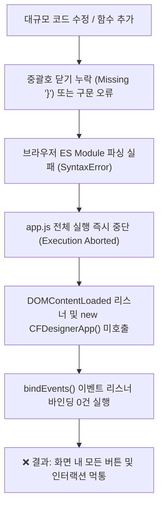
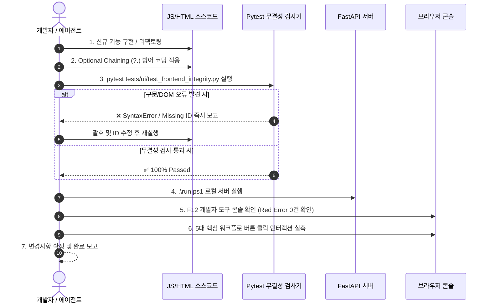

# 16. 프론트엔드 무결성 유지 및 대규모 업데이트 재발 방지 가이드
*(Frontend Integrity Assurance & Update Regression Prevention Guide)*

본 문서는 **CFDesigner**의 대규모 기능 업데이트, 리팩토링 및 신규 UI 모달 추가 시 발생할 수 있는 **"프론트엔드 버튼 불통 및 스크립트 실행 중단(Total Freeze)"** 현상의 원인을 규명하고, 이를 원천적으로 방지하기 위한 **자동화 검증 파이프라인 및 안전 작업 프로토콜(Safe Update Protocol)**을 정의합니다.

---

## 1. 문제의 본질 및 재발 메커니즘 분석 (Root Cause Analysis)

### 1.1. 증상: "모든 버튼이 작동하지 않음 (Total Freeze)"
웹 페이지는 정상 렌더링되고 HTML 요소들도 화면에 표시되지만, 상단 툴바, 탭 전환, 모달 열기, 계산 실행 등 **화면 내 모든 버튼 클릭에 아무런 반응이 없는 현상**입니다.

### 1.2. 장애 발생 메커니즘 (Cascading Failure Pipeline)



1. **ES Module의 원자적 파싱 특성**:
   * `<script type="module" src="/static/js/app.js">`는 브라우저가 파일을 로드할 때 전체 파일을 먼저 구문 분석(Parse)합니다.
   * 단 1개의 닫는 괄호(`}`), 쉼표(`,`), 또는 오타로 인한 `SyntaxError`가 발생하면, 파일 내의 어떠한 코드도 단 1줄조차 실행되지 않습니다.
2. **초기화 체인 단절**:
   * `app.js` 하단의 `window.addEventListener('DOMContentLoaded', () => { window.app = new CFDesignerApp(); });`가 실행되지 않습니다.
   * `CFDesignerApp.prototype.bindEvents()`가 호출되지 않아 DOM 버튼들에 `click` 이벤트 리스너가 전혀 등록되지 않습니다.
3. **런타임 무음 실패 (Silent Failure in Production)**:
   * 브라우저 화면에는 에러 알림창이 뜨지 않고 오직 개발자 도구(F12) 콘솔에만 빨간색 `Uncaught SyntaxError`가 기록되므로, 사용자는 "버튼이 왜 안 눌리지?"라는 답답한 상황을 겪게 됩니다.

---

## 2. 대규모 업데이트 시 4대 핵심 취약 패턴 (Top 4 Vulnerability Patterns)

| 번호 | 취약 패턴 | 발생 원인 예시 | 방어 및 해결 방안 |
|:---:|---|---|---|
| **1** | **블록 괄호/중괄호 불일치**<br>*(Brace Mismatch)* | 메서드 끝에 `}` 닫기 누락, 또는 if/forEach 블록의 중괄호 개수 오차 | Node.js AST 구문 검사 자동화 (`pytest`) |
| **2** | **DOM Selector Null 에러**<br>*(Uncaught TypeError)* | `document.getElementById('xyz').addEventListener` 호출 시 HTML에 해당 ID가 없어 `null.addEventListener` 예외 발생 후 이후 스크립트 중단 | Optional Chaining (`?.`) 및 DOM 존재 검증 테스트 |
| **3** | **ES Module Import 경로/심볼 오타**<br>*(Module Resolution Error)* | `./modules/xyz.js` 파일명 오타, export되지 않은 함수명 import | 모듈 임포트 정적 분석 테스트 |
| **4** | **서브 컴포넌트 메서드 시그니처 불일치**<br>*(Interface Mismatch)* | `app.js`에서 `this.viewer3d.methodA()`를 호출했으나 `viewer_3d.js`에 해당 메서드가 미정의 | 클래스 메서드 인터페이스 완성도 검사 |

---

## 3. 영구 방어: 자동화 무결성 검증 파이프라인 (Automated Defense)

CFDesigner는 이러한 회귀 결함을 사전에 100% 차단하기 위해 **3대 프론트엔드 무결성 자동화 테스트**를 `tests/ui/test_frontend_integrity.py`에 탑재하여 운용합니다.

### 3.1. 자동화 테스트 4대 항목 (`tests/ui/test_frontend_integrity.py`)

1. **`test_javascript_syntax_and_brace_integrity` (구문 및 괄호 무결성 검사)**:
   * `src/web/static/js/` 내 모든 `.js` 파일(메인 스크립트 및 8대 모듈)에 대해 Node.js 구문 컴파일러 또는 정밀 괄호 매칭 AST 파서를 구동하여 `SyntaxError`를 0.1초 내 즉시 감지.
2. **`test_html_dom_id_binding_integrity` (DOM ID 양방향 바인딩 검사)**:
   * `index.html`에 정의된 DOM ID와 JS에서 참조하는 `getElementById`, `querySelector`의 ID를 전수 교차 검증하여 Null Pointer 에러 원천 방지.
3. **`test_js_class_method_interface_completeness` (컴포넌트 인터페이스 완성도 검사)**:
   * `viewer_3d.js`, `canvas_2d.js`, `chart_fsm.js` 등의 필수 메서드가 실제 정의되어 있는지 정적 분석.
4. **`test_static_assets_and_manual_images_exist` (정적 자산 물리 파일 검사)**:
   * CSS, JS, 이미지, 매뉴얼 그래픽 파일이 디스크 상에 실제로 존재하는지 404 방지 검증.

---

## 4. 대규모 업데이트 안전 작업 7단계 수칙 (Safe Update Protocol)

에이전트 및 개발자는 대규모 UI/JS 작업 시 다음 **7단계 안전 수칙**을 의무적으로 준수합니다.



### 규칙 1: 안전한 DOM 이벤트 리스너 등록 패턴 (Safe Event Binding Pattern)
DOM 요소를 바인딩할 때는 요소가 존재하지 않더라도 스크립트가 죽지 않도록 **Optional Chaining(`?.`)** 또는 **안전 헬퍼**를 사용합니다.

```javascript
// ❌ 위험한 방식: ID가 없으면 스크립트 전체 크래시 발생
document.getElementById('btnDoSomething').addEventListener('click', () => { ... });

// ✅ 안전한 표준 방식: 요소가 없어도 안전하게 무시되고 스크립트 정상 지속
document.getElementById('btnDoSomething')?.addEventListener('click', () => { ... });

// ✅ 안전 헬퍼 함수 활용
function safeBindClick(id, handler) {
  const el = document.getElementById(id);
  if (el) {
    el.addEventListener('click', handler);
  } else {
    console.warn(`[DOM Warning] Element #${id} not found for click binding.`);
  }
}
```

### 규칙 2: 모듈 믹스인(Mixin) 분리 원칙
`app.js`가 비대해질 경우(2,000줄 초과), 단일 파일에 코드를 무리하게 이어붙이지 않고 `src/web/static/js/modules/` 하위의 독립 믹스인 파일로 기능을 분리합니다.
* 각 믹스인은 `export function applyFeatureMixin(AppClass) { AppClass.prototype.methodName = ...; }` 형태로 작성.
* 메인 `app.js`의 문법 복잡도를 대폭 낮추어 괄호 누락 위험을 원천 감소시킵니다.

### 규칙 3: 작업 완료 전 3초 자가 검증 명령 실행 (Mandatory Self-Check)
모든 프론트엔드/JS 수정 후에는 다음 명령어를 즉시 실행하여 회귀 결함을 검증합니다.

```powershell
# 프론트엔드 무결성 및 구문 검사 (0.5초 소요)
.venv\Scripts\pytest tests/ui/test_frontend_integrity.py -v

# UI 전체 회귀 테스트 (2~3초 소요)
.venv\Scripts\pytest tests/ui/
```

---

## 5. 트러블슈팅 치트시트 (Emergency Troubleshooting)

버튼이 동작하지 않거나 UI 반응이 없을 때 3초 만에 원인을 찾고 조치하는 가이드입니다.

### 5.1. 즉시 원인 진단 명령어
```powershell
# 1. 모든 JS 파일의 구문 오류(Syntax Error)를 일괄 검사
.venv\Scripts\python.exe -c "
import glob, subprocess
for js in glob.glob('src/web/static/js/**/*.js', recursive=True):
    r = subprocess.run(['node', '--input-type=module', '-e', f'import \"./{js.replace(chr(92), \"/\")}\"'], capture_output=True, text=True)
    if 'SyntaxError' in r.stderr:
        print(f'[SYNTAX ERROR] {js}:\n{r.stderr.strip()}')
"
```

### 5.2. 체크리스트 및 조치 플로우
1. **[F12 콘솔 확인]**: 브라우저 개발자 도구의 Console 탭에 `Uncaught SyntaxError` 또는 `TypeError: Cannot read properties of null`이 표시되는지 확인.
2. **[에러 라인 추적]**: 에러 로그에 표시된 파일명과 줄 번호(Line Number)로 직행.
3. **[괄호 매칭 확인]**: 해당 함수 또는 직전 함수의 여는 중괄호 `{`와 닫는 중괄호 `}`의 쌍이 1:1로 일치하는지 확인.
4. **[테스트 재실행]**: `pytest tests/ui/test_frontend_integrity.py`를 실행하여 통과 확인 후 새로고침(Ctrl + F5).
