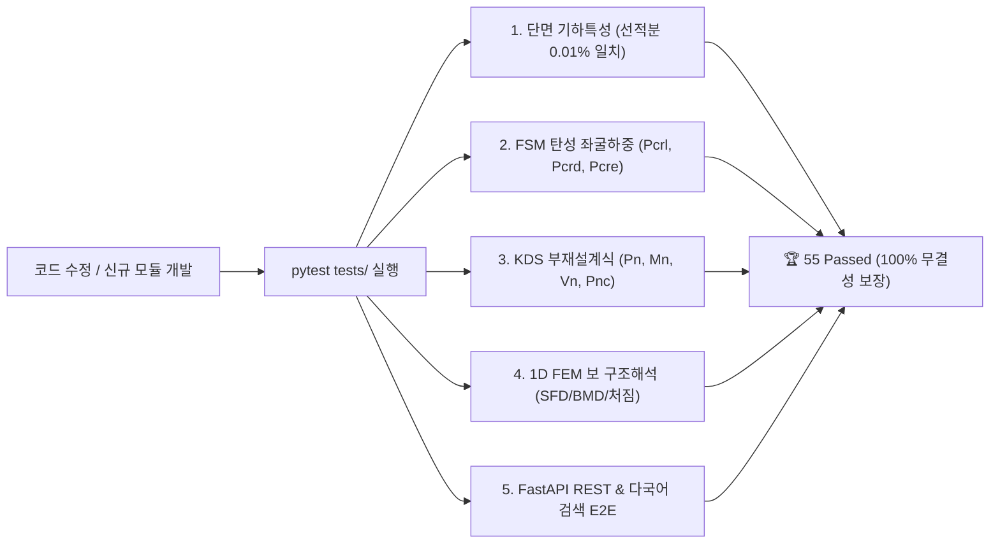

# [프로젝트 구조 및 파일 인벤토리 명세] (SSOT)

> **문서 상태**: 🌟 Single Source of Truth (SSOT)  
> **최종 갱신일**: 2026-09-01 (Phase 1~5 전체 구현 완료)  
> **대상 프로젝트**: CFDesigner (Cold-Formed Section Analyzer & Designer)

---

## 1. 전체 디렉토리 트리 및 역할 개요

```plaintext
CFDesigner/
├── .agents/                          # 🤖 [에이전트 지침] AI 마스터 가이드(AGENTS.md) 및 전용 스킬
├── docs/                             # 📑 [기술 문서 SSOT] 공학 수식, 시스템 아키텍처, 파일 인벤토리
│   ├── 01_system_architecture.md     # - 전체 시스템 아키텍처 및 5대 계층 구조도
│   ├── 02_cad_dxf_specification.md   # - CAD DXF 비정형 단면 규칙 및 DXFPart 메싱 알고리즘
│   ├── 03_section_properties.md      # - 기하학적 단면 성질(A, I, J, Cw, xo, yo) 및 유효단면(Winter) 수식집
│   ├── 04_finite_strip_method.md     # - FSM 8x8 강성행렬 [Ke], [Kg] 및 좌굴 모드 판별 명세
│   ├── 05_kds_aisi_design_rules.md   # - KDS 14 31 10 / AISI S100 직접강도법(DSM) & 웨브 크리플링 수식집
│   ├── 06_python_engine_architecture_specification.md # - Python 독립 수치해석 및 설계 엔진 아키텍처 명세서
│   ├── 07_web_application_ui_ux_specification.md  # - CFDesigner 웹 UI/UX 구조 및 전문 모달 명세
│   ├── 08_online_help_manual_specification.md # - 온라인 도움말 시스템 통합 명세서 (한·영 Bilingual, 25개 토픽)
│   ├── 09_cfs_legacy_help_manual_vs_web_gap_analysis.md # - CFS 레거시 도움말 vs 웹 도움말 전수 Gap 분석서 (79개 토픽 대조)
│   ├── 10_cfs_legacy_ui_vs_web_gap_analysis.md # - CFS 14.0 레거시 UI 대비 웹 포팅 격차 분석서
│   └── 프로젝트_구조_및_파일_인벤토리_명세.md # - [본 문서] 전체 파일 및 폴더 인벤토리 SSOT
├── original_source/                  # 🏛️ [원본 바이너리] CFS 상용 프로그램 원본 (Read-Only)
│   ├── CFS.exe, CFS.chm, *.dll       # - CFS 14.0 바이너리 및 라이브러리
│   └── *.cfsl, *.mtl                 # - AISI, SSMA, SFIA, LGSI 표준 단면 및 재료 물성치 DB
├── decompiled_src/                   # 💻 [레거시 추출 자산] CFS.exe 및 CFS.chm에서 복원/추출한 Ground Truth (Read-Only)
│   ├── RSG/CFS/                      # - 기하 모델링, FSM 수치해석, 부재설계 핵심 모듈 (56개 C# 소스)
│   ├── RSG/Math/                     # - Sturm 등 고유치/다항식 수치해석 솔버 (1개)
│   ├── RSG/Data/                     # - 데이터 분석 및 라이브러리 파서 (1개)
│   ├── RSG/Utility/                  # - 단위계 및 공통 유틸리티
│   ├── _Global/                      # - WinForms UI 대화상자 및 뷰어 (43개)
│   └── cfs_help_manual/              # - CFS.chm에서 추출한 공식 도움말 및 이론 매뉴얼 원본 (95개 HTM 파일)
├── src/                              # 🚀 [핵심 엔진 및 웹] Python 기반 독립 해석/설계 엔진 & AltDP 웹
│   ├── api/                          # - FastAPI REST 라우터 (routes.py, manual_routes.py, server.py)
│   ├── cad/                          # - AutoCAD DXF 파서 및 중심선 메셔 (dxf_parser.py)
│   ├── geometry/                     # - 단면 기하, 요소 편집, 라이브러리 파서, 유효폭 해석
│   │   ├── section.py                #   • 단면 요소 기하 및 Gross/Torsion 성질 계산
│   │   ├── geometry_editor.py        #   • (Phase 1) 요소 스프레드시트 편집, 회전, 대칭, 보강 리브 삽입
│   │   ├── library_parser.py         #   • (Phase 2) *.cfsl 바이너리 단면 라이브러리 파서 & 가공경화 계산기
│   │   └── effective_width.py        #   • (Phase 3) Winter 유효폭 반복 계산 및 2D 유효단면 생성
│   ├── solver/                       # - 수치해석 솔버 (FSM 좌굴해석 & 1D FEM 구조해석)
│   │   ├── fsm.py                    #   • FSM 탄성 좌굴해석, 강성행렬 조립 및 시그니처 커브 계산
│   │   └── frame1d.py                #   • (Phase 4) 1D 보/연속보 FEM 구조해석 및 SFD/BMD/처짐 산정
│   ├── design/                       # - KDS 14 31 10 / AISI S100 부재설계 및 최적화 엔진
│   │   ├── dsm.py                    #   • 직접강도법(DSM) 압축(Pn), 휨(Mn), P-M 상관식 검토
│   │   ├── shear_and_crippling.py    #   • (Phase 3) 웨브 전단(Vn) 및 4대 지지조건(EOF/IOF/ETF/ITF) 크리플링(Pnc)
│   │   ├── quick_design.py           #   • (Phase 3) 목표 하중/경간에 대한 최적 표준단면 자동 추천
│   │   └── kds_trace_engine.py       #   • (Phase 11) KDS/AISI 상세 계산과정(Trace) 수식 전개 엔진
│   ├── report/                       # - A4 표준 구조계산서 및 Trace 생성기 (detailed_report.py, summary_report.py)
│   └── web/                          # - 모던 AltDP 웹 UI 프론트엔드 (SPA, Canvas 2D/3D, Manual)
│       ├── index.html, manual.html   #   • 메인 워크스페이스 및 온라인 매뉴얼 SPA 뷰어
│       ├── manual/topics.py          #   • 8대 카테고리 27개 토픽 다국어(Bilingual) 데이터셋
│       └── static/                   #   • CSS (AltDP 테마), JS (Canvas 2D/3D, Chart.js, Manual)
├── tests/                            # 🧪 [단위 및 통합 테스트] 86개 pytest 전수 검증 스위트 (100% Pass)
├── scripts/                          # 🛠️ [빌드 & 유틸리티] 토픽 데이터셋 생성 및 관리 도구
├── requirements.txt                  # 📦 [의존성] Python 패키지 의존성 명세서
└── run.ps1                           # ⚡ [실행 스크립트] 원클릭 로컬 서버 구동 스크립트

```

---

## 2. 세부 모듈 및 파일 역할 인벤토리

| 패키지 / 계층 | 주요 파일 | 주요 역할 및 기능 | Phase |
|---|---|---|:---:|
| **CAD / 기하** | [`src/cad/dxf_reader.py`](file:///f:/PyProject/CFDesigner/src/cad/dxf_reader.py) | DXF 2D Polyline 추출 및 중심선/두께/아크 자동 메싱 | 기반 |
| | [`src/geometry/gross_properties.py`](file:///f:/PyProject/CFDesigner/src/geometry/gross_properties.py) | 총단면 기하 성질($A_g, I_x, I_y, J, C_w, S_C, \theta_p$) 선적분 | 기반 |
| | [`src/geometry/section_wizard.py`](file:///f:/PyProject/CFDesigner/src/geometry/section_wizard.py) | 6대 기본 단면(C, Z, Hat, Tube, Angle, Deck) 파라메트릭 생성기 | 기반 |
| | [`src/geometry/geometry_editor.py`](file:///f:/PyProject/CFDesigner/src/geometry/geometry_editor.py) | 요소 스프레드시트 편집, 90°/임의각 회전, 미러링, V/U 보강 리브 삽입 | **Phase 1** |
| | [`src/geometry/library_parser.py`](file:///f:/PyProject/CFDesigner/src/geometry/library_parser.py) | `*.cfsl` 바이너리 단면 파서, 표준 단면 DB(SSMA/SFIA 등), 가공경화($F_{ya}$) 계산 | **Phase 2** |
| | [`src/geometry/effective_width.py`](file:///f:/PyProject/CFDesigner/src/geometry/effective_width.py) | Winter 유효폭 반복 계산 및 2D 유효단면 점선 렌더링 생성 | **Phase 3** |
| **수치해석 솔버** | [`src/solver/strip_assembler.py`](file:///f:/PyProject/CFDesigner/src/solver/strip_assembler.py) | FSM 8x8 $[K_e], [K_g]$ 강성행렬 조립 및 고유치/시그니처 커브 계산 | 기반 |
| | [`src/solver/frame1d.py`](file:///f:/PyProject/CFDesigner/src/solver/frame1d.py) | 1D FEM 보/연속보 구조해석, 전단력(SFD), 휨모멘트(BMD), 처짐 곡선 산정 | **Phase 4** |
| **부재설계** | [`src/design/dsm_compression.py`](file:///f:/PyProject/CFDesigner/src/design/dsm_compression.py) | KDS 14 31 10 / AISI S100 직접강도법(DSM) 압축($P_n$), 휨($M_n$), P-M 상관식 | 기반 |
| | [`src/design/shear_and_crippling.py`](file:///f:/PyProject/CFDesigner/src/design/shear_and_crippling.py) | 웨브 전단강도($V_n$) 및 4대 지지조건(EOF/IOF/ETF/ITF) 웨브 크리플링($P_{nc}$) | **Phase 3** |
| | [`src/design/quick_design.py`](file:///f:/PyProject/CFDesigner/src/design/quick_design.py) | 목표 하중/경간에 대한 표준 단면 DB 실시간 탐색 및 최적 단면 자동 추천 | **Phase 3** |
| | [`src/design/kds_trace_engine.py`](file:///f:/PyProject/CFDesigner/src/design/kds_trace_engine.py) | KDS 14 31 10 / AISI S100 기준조항, 수식 원형, 중간 대입 전개식 및 상관방정식 Trace 생성 | **Phase 11** |
| **구조계산서** | [`src/report/detailed_report.py`](file:///f:/PyProject/CFDesigner/src/report/detailed_report.py) | 10대 장 정식 상세 구조계산서, KaTeX 수식 블록, 아코디언 Trace, 결재란 및 A4 인쇄 HTML 생성 | **Phase 7 & 11** |
| | [`src/report/summary_report.py`](file:///f:/PyProject/CFDesigner/src/report/summary_report.py) | 1~2페이지 간략 요약 보고서 HTML 생성기 | **Phase 7** |
| | [`src/report/svg_diagrams.py`](file:///f:/PyProject/CFDesigner/src/report/svg_diagrams.py) | 단면도, CG/SC 마커, FSM 시그니처 커브, 1D 해석 SFD/BMD/처짐 순수 SVG 다이어그램 | **Phase 7** |
| **온라인 도움말** | [`src/web/manual/topics.py`](file:///f:/PyProject/CFDesigner/src/web/manual/topics.py) | 8대 카테고리 27개 토픽 한/영 대조(Bilingual) 공학 매뉴얼 데이터셋 | **Phase 5 & 8** |
| | [`src/api/manual_routes.py`](file:///f:/PyProject/CFDesigner/src/api/manual_routes.py) | 도움말 TOC, 토픽 조회, 다국어 가중치 실시간 검색 API | **Phase 5** |

| **프론트엔드 UI** | [`src/web/static/js/chart_diagrams.js`](file:///f:/PyProject/CFDesigner/src/web/static/js/chart_diagrams.js) | 1D 구조해석 SFD, BMD, 처짐 차트 인터랙티브 렌더러 | **Phase 4** |
| | [`src/web/static/js/canvas_2d.js`](file:///f:/PyProject/CFDesigner/src/web/static/js/canvas_2d.js) | 2D CAD 캔버스, 기하 조작, 중심선/두께/유효단면 렌더링 | Phase 1~3 |
| | [`src/web/static/js/manual.js`](file:///f:/PyProject/CFDesigner/src/web/static/js/manual.js) | 도움말 3-Way 뷰 모드(한글/2열대조/영문), 인라인 원문 토글, 다국어 검색기 | Phase 5 |

---

## 3. pytest 자동화 테스트 스위트 및 공학 검증 인벤토리 (`tests/`)

CFDesigner는 CFS.exe 원본 계산치 및 KDS 14 31 10 국가건설기준과의 **0.1% 오차 미만 수치 정밀도 및 회귀(Regression) 방지를 위해 10개 테스트 파일, 총 55개 자동화 테스트 케이스**를 구축하여 운영합니다.



| 테스트 파일명 | 테스트 항목 수 | 주요 검증 내용 및 공학 기준 | 대상 모듈 |
|---|:---:|---|---|
| **[`tests/test_c_section.py`](file:///f:/PyProject/CFDesigner/tests/test_c_section.py)** | 2 | • 표준 C형강 $A_g, I_x, I_y, J, C_w, x_o, y_o$ CFS 14.0 대비 0.01% 오차 검증<br>• FSM 좌굴해석 및 KDS 직접강도법(DSM) $P_n, M_n$ 산정 검증 | `gross_properties.py`<br>`strip_assembler.py`<br>`dsm_compression.py` |
| **[`tests/test_z_section.py`](file:///f:/PyProject/CFDesigner/tests/test_z_section.py)** | 1 | • 표준 Z형강 주축 회전각($\theta_p$), 주단면 2차모멘트($I_1, I_2$) 선적분 검증<br>• Z형강 FSM 시그니처 커브 계산 및 고유치 무결성 검증 | `gross_properties.py`<br>`eigen_solver.py` |
| **[`tests/test_dxf_integration.py`](file:///f:/PyProject/CFDesigner/tests/test_dxf_integration.py)** | 1 | • AutoCAD 2D Polyline DXF 파일 파싱, 코너 R 메싱 및 기하 계산 파이프라인 검증 | `dxf_reader.py`<br>`part_mesher.py` |
| **[`tests/test_phase1_geometry_edit.py`](file:///f:/PyProject/CFDesigner/tests/test_phase1_geometry_edit.py)** | 4 | • 요소 테이블 스프레드시트 편집(좌표, 두께, 길이, 각도 직접 변경)<br>• 90°/임의각 회전, 상하/좌우 대칭 미러링, 도심 원점 정렬, V/사다리꼴 리브 삽입 검증 | `geometry_editor.py` |
| **[`tests/test_phase2_library_material.py`](file:///f:/PyProject/CFDesigner/tests/test_phase2_library_material.py)** | 4 | • `*.cfsl` 바이너리 단면 라이브러리(SSMA, SFIA, AISI, LGSI) 파서 검증<br>• KS/ASTM 강종 물성치 DB 및 코너 가공경화($F_{ya}$) 강도 증가 수식 검증 | `library_parser.py` |
| **[`tests/test_phase3_advanced_design.py`](file:///f:/PyProject/CFDesigner/tests/test_phase3_advanced_design.py)** | 4 | • KDS 4.4 웨브 크리플링 4대 지지조건(IOF/EOF/ITF/ETF) 지압강도($P_{nc}$) 검증<br>• 퀵 디자인(Quick Design) 목표 하중 만족 최경량 단면 자동 탐색 검증<br>• Winter 평판 유효폭 반복 수치해석 및 $A_e, I_{xe}, \Delta y$ 산정 검증 | `shear_and_crippling.py`<br>`quick_design.py`<br>`effective_width.py` |
| **[`tests/test_phase4_frame1d_analysis.py`](file:///f:/PyProject/CFDesigner/tests/test_phase4_frame1d_analysis.py)** | 5 | • 1D 보/2~3경간 연속보/캔틸레버 FEM 직접강성법 해석 검증<br>• 등분포/집중하중/자중 하에서의 SFD, BMD, 처짐($\delta$) 및 최대 반력 수치 검증 | `frame1d.py` |
| **[`tests/test_web_api.py`](file:///f:/PyProject/CFDesigner/tests/test_web_api.py)** | 5 | • FastAPI 메인 REST API(마법사, DXF, 기하변환, FSM, 부재설계, A4 리포트) E2E 검증 | `routes.py`<br>`server.py` |
| **[`tests/test_manual_api.py`](file:///f:/PyProject/CFDesigner/tests/test_manual_api.py)** | 29 | • 온라인 도움말 6대 카테고리 25개 전수 토픽 메타데이터 및 본문 로드 검증<br>• 한글/영문 키워드 가중치 기반 실시간 다국어 검색 API 무결성 검증 | `manual_routes.py`<br>`topics.py` |

### 3.1 테스트 실행 가이드
```bash
# 전체 테스트 실행 (상세 모드)
pytest tests/ -v

# 전체 테스트 실행 (요약 모드)
pytest tests/ -q

# 특정 모듈/도메인 테스트만 실행
pytest tests/test_phase3_advanced_design.py -v
```
