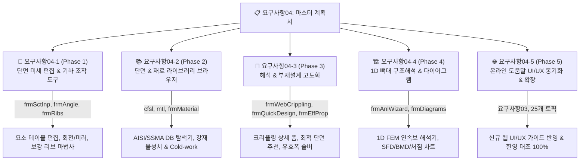

# [요구사항 04] CFS 레거시 기능 웹 완전 포팅 마스터 계획서 (Master Roadmap)

---

## 1. 개요 및 배경

* **문서 번호**: `요구사항04`
* **목적**: 기존 상용 프로그램(`CFS.exe`)의 43개 WinForms UI 화면 및 95개 도움말 기능 중 현재 웹 시스템에서 미구현/부분구현된 영역을 100% 웹으로 포팅하기 위한 **5대 Phase 마스터 계획 수립 및 하위 세부 명세서 연계**.
* **기준 문서**: 
  * [`docs/10_cfs_legacy_ui_vs_web_gap_analysis.md`](file:///f:/PyProject/CFDesigner/docs/10_cfs_legacy_ui_vs_web_gap_analysis.md)
  * [`docs/프로젝트_구조_및_파일_인벤토리_명세.md`](file:///f:/PyProject/CFDesigner/docs/프로젝트_구조_및_파일_인벤토리_명세.md)
* **포팅 원칙**:
  1. `decompiled_src/`의 C# 알고리즘을 Ground Truth로 삼아 0.1% 오차 무결성 유지.
  2. 데스크톱 윈도우 UI를 모던 AltDP 스타일의 웹 UI(모달, 툴바, 인터랙티브 캔버스, Chart.js)로 현대화.
  3. 방대한 작업 범위의 구현 누락을 방지하기 위해 **5개 독립 하위 Phase 문서로 분할 관리**.

---

## 2. 5대 단계별(Phase 1 ~ Phase 5) 하위 문서 구성 맵

---

## 3. Phase별 핵심 작업 요약 및 하위 문서 링크

| Phase | 세부 요구사항 문서 | 대상 레거시 C# 폼 / 문서 | 핵심 구현 내용 |
|---|---|---|---|
| **Phase 1** | [**`요구사항04-1.md`**](file:///f:/PyProject/CFDesigner/요구사항/요구사항04-1_Phase1_단면_미세_편집_및_기하_조작_도구.md) | `frmSctInp.cs` `frmAngle.cs` `frmRibs.cs` `frmLocation.cs` | • 단면 요소별 스프레드시트 그리드 편집기 (노드/각도/길이/두께) • 2D 캔버스 기하 변환 도구 (90° 회전, 상하/좌우 미러, 중심 정렬) • 플랜지/웨브 중간 보강재(Ribs) 자동 추가 마법사 |
| **Phase 2** | [**`요구사항04-2.md`**](file:///f:/PyProject/CFDesigner/요구사항/요구사항04-2_Phase2_단면_및_재료_라이브러리_브라우저.md) | `frmSctLib.cs` `frmOpenLibSct.cs` `frmMaterial.cs` `DataAnalysis.cs` | • `*.cfsl` 바이너리 단면 라이브러리(AISI, SSMA, LGSI) 웹 파서 • 모던 단면 라이브러리 탐색 & 선택 모달 UI • `*.mtl` 재료 DB 브라우저 및 가공경화(Cold-work) 효과 계산기 |
| **Phase 3** | [**`요구사항04-3.md`**](file:///f:/PyProject/CFDesigner/요구사항/요구사항04-3_Phase3_해석_및_부재설계_고도화.md) | `frmWebCrippling.cs` `frmQuickDesign.cs` `frmBuckleParam.cs` `frmEffProp.cs` | • 웨브 크리플링 4대 지지조건 & 지지폭($N$) 전용 설정 폼 • 설계 하중 기반 최적 단면 자동 추천/탐색(Quick Design) 모달 • FSM 해석 구간/스텝 세부 파라미터 모달 & 수치 그리드 • Winter 유효폭 반복 수치해석 및 2D 유효단면 형상 시각화 |
| **Phase 4** | [**`요구사항04-4.md`**](file:///f:/PyProject/CFDesigner/요구사항/요구사항04-4_Phase4_1D_뼈대_구조해석_엔진_및_다이어그램.md) | `frmAnlInp.cs` `frmAnlWizard.cs` `frmDiagrams.cs` `frmAnlPicMaster.cs` | • 1D 보/기둥 구조해석 마법사 (단순보, 연속보, 캔틸레버, 하중입력) • 1D FEM 뼈대 해석 솔버 엔진 (`src/solver/frame1d.py`) • SFD(전단력도), BMD(휨모멘트도), 처짐 인터랙티브 차트 뷰어 |
| **Phase 5** | [**`요구사항04-5.md`**](file:///f:/PyProject/CFDesigner/요구사항/요구사항04-5_Phase5_온라인_도움말_신규_웹_UI_UX_동기화_및_토픽_확장.md) | `CFS.chm` (95개 문서) [`요구사항03.md`](file:///f:/PyProject/CFDesigner/요구사항/요구사항03_온라인_도움말_영문_원문_병기_및_토글_UI_개선.md) | • 레거시 WinForms UI 설명을 신규 AltDP Web UI 가이드로 전면 개편 • 6대 카테고리 25개 토픽으로 확장 (신규 기능 가이드 완비) • 요구사항 03 규약에 따른 영문 원문 대조(Bilingual) 100% 매핑 |

---

## 4. 실행 및 검증 원칙

1. **단계별 독립 배포 및 테스트**:
   * 각 Phase는 하위 문서에 정의된 API 라우트 및 UI 컴포넌트를 구현하고, `pytest` 단위 테스트 및 브라우저 E2E 검증을 마친 후 다음 Phase로 진행합니다.
2. **0.1% 오차 교차 검증**:
   * 계산 로직은 `original_source/CFS.exe`의 결과치와 대조하여 0.1% 미만의 정밀도를 보장합니다.
3. **AltDP UI 일관성**:
   * 모든 신규 모달과 툴바는 기존 다크/라이트 테마 토큰 및 글래스모피즘 스타일을 100% 준수합니다.
