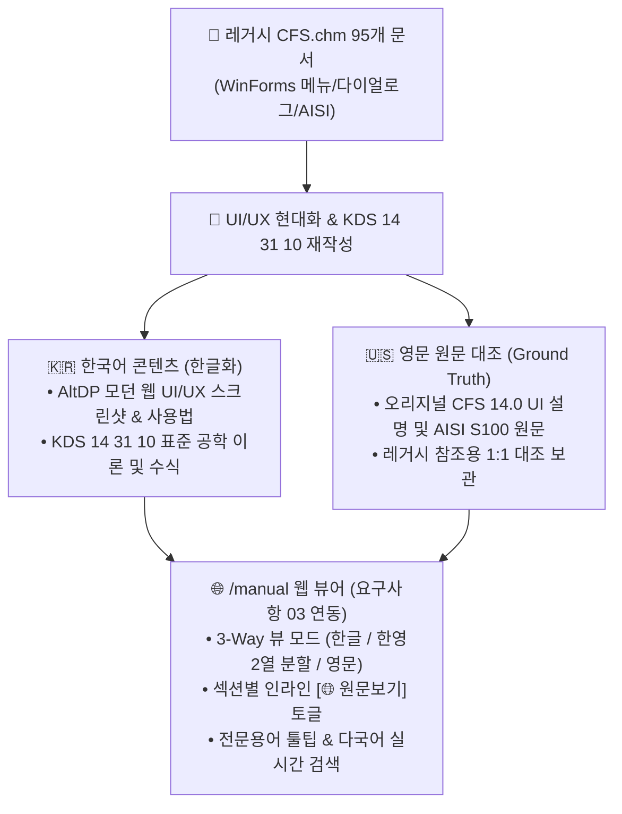

# [요구사항 04-5] Phase 5: 온라인 도움말 신규 웹 UI/UX 동기화 및 토픽 확장 사양서

---

## 1. 개요 및 배경

* **문서 번호**: `요구사항04-5` (Phase 5)
* **목적**: 기존 CFS 14.0의 95개 도움말 문서에 수록된 레거시 WinForms UI/UX 설명(메뉴바, 탭, 구식 다이얼로그)을 **CFDesigner의 모던 AltDP 웹 UI/UX(반응형 4분할 레이아웃, 2D/3D 인터랙티브 캔버스, Phase 1~4 신규 모달)에 맞춰 전면 업데이트**하고, [`요구사항03`](file:///f:/PyProject/CFDesigner/요구사항/요구사항03_온라인_도움말_영문_원문_병기_및_토글_UI_개선.md)의 **한·영 병기/대조(Bilingual Edition) 규약**에 따라 토픽을 확장 및 동기화.
* **기준 문서**: 
  * [`요구사항/요구사항03_온라인_도움말_영문_원문_병기_및_토글_UI_개선.md`](file:///f:/PyProject/CFDesigner/요구사항/요구사항03_온라인_도움말_영문_원문_병기_및_토글_UI_개선.md)
  * [`docs/08_online_help_manual_specification.md`](file:///f:/PyProject/CFDesigner/docs/08_online_help_manual_specification.md)
  * [`docs/cfs_help_manual/*.htm`](file:///f:/PyProject/CFDesigner/docs/cfs_help_manual/) (95개 레거시 원본)

---

## 2. 도움말 업데이트 및 토픽 확장 원칙

1. **UI/UX 설명의 웹 현대화**:
   * 구식 WinForms 조작법(예: *"Click File -> Open"*, *"Check Box in Tab"*)을 **웹 인터랙션(예: *"상단 툴바 [📚 단면 라이브러리] 버튼 클릭"*, *"드래그 & 드롭 DXF 영역"*, *"2D 캔버스 우측 상단 회전 아이콘"*)**으로 완벽 전환.
2. **요구사항 03 한·영 대조 규약 100% 준수**:
   * 모든 신규/수정 토픽은 `content_html`(한글/웹UI)과 `content_en_html`(영문/레거시 원문)을 동시에 보유.
   * 사용자가 언제든 인라인 `[🌐 원문보기]`를 통해 레거시 CFS의 원본 설명과 비교 가능하도록 구성.
3. **Phase 1~4 신규 기능 100% 반영**:
   * 새로 추가되는 기능(요소 테이블 편집기, 라이브러리 브라우저, 퀵 디자인, 1D 연속보 구조해석)에 대한 전용 설명 토픽 신설.

---

## 3. 카테고리별 세부 토픽 확장 및 업데이트 명세

### 📂 카테고리 1: 시작하기 & 웹 UI 가이드 (Getting Started & Web UI Guide)
* 기존 4개 토픽 $\rightarrow$ **6개 토픽으로 확장**

| 토픽 ID | 신규/개편 | 한글 제목 (Web UI) | 영문 제목 (Legacy Reference) | 대응 레거시 문서 | 핵심 업데이트 내용 |
|---|:---:|---|---|---|---|
| `intro` | 개편 | 시스템 소개 및 특징 | System Overview & Features | `introduction.htm`, `overview.htm` | CFS SaaS 웹 구조, 클라우드 수치해석, KDS 규준 안내 |
| `ui_layout` | 개편 | 웹 UI 4분할 레이아웃 가이드 | Web UI 4-Quadrant Layout Guide | `interface.htm`, `section-window.htm` | 좌측 제어패널, 중앙 2D/3D 캔버스, 하단 FSM 차트, 우측 D/C |
| `wizard` | 개편 | 단면 마법사 파라메트릭 생성 | Parametric Section Wizard | `section-wizard-1.htm`, `-2.htm` | 6대 기본 단면(C, Z, Hat, Deck, Tube, Angle) 웹 마법사 입력법 |
| `dxf_import` | 개편 | AutoCAD DXF 가져오기 & 메싱 | AutoCAD DXF Import & Auto-Meshing | `import-dxf.htm` | 2D Polyline 작도 규칙, 드래그&드롭 업로드, 중심선 자동 메싱 |
| **`element_grid`** | **신규 (P1)** | **단면 요소 테이블 직접 편집** | **Element Table Spreadsheet Editor** | `section-inputs-elements.htm`, `frmSctInp.cs` | 노드, 길이, 각도, 두께 스프레드시트 편집 모달 조작 가이드 |
| **`geom_transform`** | **신규 (P1)** | **단면 기하 변환 및 중간 리브** | **Geometric Transforms & Intermediate Ribs** | `rotate-mirror.htm`, `insert-ribs.htm`, `frmAngle.cs` | 90° 회전, 대칭 미러링, 원점 정렬, V형/U형 보강 리브 추가법 |

---

### 📂 카테고리 2: 단면 라이브러리 & 재료 물성치 (Library & Materials) — *[신설 카테고리]*
* **3개 신규 토픽 추가**

| 토픽 ID | 신규/개편 | 한글 제목 (Web UI) | 영문 제목 (Legacy Reference) | 대응 레거시 문서 | 핵심 업데이트 내용 |
|---|:---:|---|---|---|---|
| **`section_lib`** | **신규 (P2)** | **표준 단면 라이브러리 브라우저** | **Section Library Browser (AISI/SSMA)** | `open-library-section.htm`, `library-builder.htm` | AISI, SSMA, LGSI 표준 단면 검색, 필터링 및 원클릭 로드법 |
| **`material_db`** | **신규 (P2)** | **강재 재료 DB 및 물성치 설정** | **Material Properties & Custom Steel** | `options-material.htm`, `custom-material-*.htm` | KS(SSC275 등) 및 ASTM 강종 프리셋 선택, $F_y, F_u, E$ 입력 |
| **`cold_work`** | **신규 (P2)** | **코너 성형 가공경화 강도 증가** | **Cold-Work Forming Strength Calculation** | `options-material.htm`, AISI S100 Appendix 1 | 코너 성형에 따른 유효항복강도($F_{ya}$) 자동 산정 이론 및 적용법 |

---

### 📂 카테고리 3: 단면 성질 & 유효단면 이론 (Section Properties & Effective Stress)
* 기존 3개 토픽 $\rightarrow$ **4개 토픽으로 확장**

| 토픽 ID | 신규/개편 | 한글 제목 (Web UI) | 영문 제목 (Legacy Reference) | 대응 레거시 문서 | 핵심 업데이트 내용 |
|---|:---:|---|---|---|---|
| `gross_props` | 유지 | 총단면 기하학적 성질 (Gross) | Gross Section Properties | `RSG/CFS/Section.cs` | $A_g, I_x, I_y, r_x, r_y$, 도심($C_G$) 선적분 수식 |
| `torsion_props` | 유지 | 비틀림 및 뒴 성질 (Torsion) | Torsional & Warping Properties | `torsion-analysis.htm` | 생브낭 $J$, 뒴상수 $C_w$, 전단중심 $S_C$, 극단면반경 $r_0$ |
| `principal_axes` | 유지 | 주축 및 주단면 2차모멘트 | Principal Axes & Principal Moments | `RSG/CFS/Part.cs` | 주축 회전각($\theta_p$), 주단면 2차모멘트($I_1, I_2$) 수식 |
| **`effective_props`** | **신규 (P3)** | **Winter 식 기반 유효단면 해석** | **Effective Section Properties (Winter Method)** | `effective-properties.htm`, `frmEffProp.cs` | 압축/휨 하중 하의 유효폭 반복 계산 및 2D 유효단면 시각화 |

---

### 📂 카테고리 4: FSM 탄성 좌굴해석 이론 (Finite Strip Method Buckling)
* 기존 3개 토픽 $\rightarrow$ **4개 토픽으로 확장**

| 토픽 ID | 신규/개편 | 한글 제목 (Web UI) | 영문 제목 (Legacy Reference) | 대응 레거시 문서 | 핵심 업데이트 내용 |
|---|:---:|---|---|---|---|
| `fsm_theory` | 유지 | FSM 탄성 좌굴 해석 이론 | FSM Elastic Buckling Theory | `RSG/CFS/FiniteStrip.cs` | $[K_e], [K_g]$ 대판 강성행렬 유도 및 일반화 고유치 문제 |
| `buckling_modes` | 유지 | 좌굴 모드 판별 (국부/왜곡/전체) | Buckling Mode Classification | `buckle-shapes.png` | $P_{crl}, P_{crd}, P_{cre}$ 판독법 및 Three.js 3D 렌더링 |
| `signature_curve` | 유지 | 시그니처 커브 및 3D 시각화 | Signature Curve & 3D Visualization | `buckle-profile.png` | 반파장 $L$ 스펙트럼 차트 및 진폭/모드 제어법 |
| **`fsm_params`** | **신규 (P3)** | **FSM 해석 구간 및 하중조건 설정** | **Buckling Analysis Parameters & Results Grid** | `buckling-parameters.htm`, `buckling-results.htm` | 스윕 범위($L_{min} \sim L_{max}$), 스텝 수, 편심응력 FSM, CSV 내보내기 |

---

### 📂 카테고리 5: KDS 14 31 10 부재설계 & 계산서 (Member Design & Reports)
* 기존 5개 토픽 $\rightarrow$ **6개 토픽으로 확장**

| 토픽 ID | 신규/개편 | 한글 제목 (Web UI) | 영문 제목 (Legacy Reference) | 대응 레거시 문서 | 핵심 업데이트 내용 |
|---|:---:|---|---|---|---|
| `kds_dsm_comp` | 유지 | KDS 압축부재 설계 (DSM Pn) | KDS Compression Member Design (DSM Pn) | `member-check-report.htm` | $P_{ne}, P_{nl}, P_{nd}$ 및 공칭압축강도 $P_n$ 산정식 |
| `kds_dsm_flex` | 유지 | KDS 휨부재 설계 (DSM Mn) | KDS Flexural Member Design (DSM Mn) | `member-check-report.htm` | $M_{ne}, M_{nl}, M_{nd}$ 및 공칭휨강도 $M_n$ 산정식 |
| `kds_shear_crip`| 개편 | KDS 전단강도 & 웨브 크리플링 | KDS Shear & Web Crippling Strength | `web-crippling-parameters.htm` | $V_n$ 수식 및 4대 재하조건(EOF/IOF/ETF/ITF) $P_{nc}$ 산정법 |
| **`quick_design`** | **신규 (P3)** | **퀵 디자인 (최적 단면 자동 추천)** | **Quick Design Optimization Tool** | `quick-design.htm`, `frmQuickDesign.cs` | 설계 소요 하중($P_u, M_u$) 입력 및 최경량 단면 자동 탐색 가이드 |
| `kds_interaction`| 유지 | P-M 조합응력 & D/C 검토 | P-M Interaction & Biaxial Bending | `frmMemberCheck.cs` | 휨-압축 상관식, 모멘트 증대계수($B_1, B_2$), D/C 바 판정 |
| `report_guide` | 유지 | A4 구조계산서 출력 & 인쇄 | A4 Calculation Report Guide | `reports.htm`, `print.htm` | 인쇄 미리보기, 수식 근거표, 브라우저 PDF 저장법 |

---

### 📂 카테고리 6: 1D 뼈대 구조해석 (1D Frame Analysis) — *[신설 카테고리]*
* **2개 신규 토픽 추가**

| 토픽 ID | 신규/개편 | 한글 제목 (Web UI) | 영문 제목 (Legacy Reference) | 대응 레거시 문서 | 핵심 업데이트 내용 |
|---|:---:|---|---|---|---|
| **`analysis_wizard`**| **신규 (P4)**| **1D 구조해석 마법사 & 하중입력**| **1D Frame Analysis Wizard & Loadings** | `analysis-wizard-*.htm`, `analysis-inputs-*.htm` | 단순보, 연속보, 캔틸레버 경간/지점/하중(등분포/집중) 입력법 |
| **`diagrams_viewer`**| **신규 (P4)**| **SFD / BMD / 처짐 다이어그램** | **Shear, Moment & Deflection Diagrams** | `analysis-diagrams.htm`, `frmDiagrams.cs` | SFD/BMD/처짐 차트 인터랙션, 허용처짐 검토, 부재설계 원클릭 연동 |

---

## 4. 백엔드 및 프론트엔드 연동 명세

1. **데이터셋 확장 (`src/web/manual/topics.py`)**:
   * 카테고리 4개 $\rightarrow$ **6개 카테고리**로 확장.
   * 토픽 15개 $\rightarrow$ **25개 토픽**으로 증설.
   * 모든 25개 토픽에 대해 `content_html`(KDS/웹UI) 및 `content_en_html`(CFS 오리지널 영문 원문) 100% 매핑.
2. **다국어 검색 API 동기화 (`src/api/manual_routes.py`)**:
   * 신규 10개 토픽의 한글/영문 키워드(예: `quick design`, `web crippling`, `rib`, `continuous beam`, `SFD`, `BMD`) 인덱싱.
3. **UI/UX 스크린샷 및 다이어그램 보강**:
   * 신규 모달 및 캔버스 조작법을 설명하는 고해상도 SVG/CSS 그래픽 및 KaTeX 수식 완비.

---

## 5. 검증 기준 (Acceptance Criteria)

- [ ] **AC 5-1**: 총 6개 카테고리 25개 토픽이 목차 트리(Sidebar TOC)에 누락 없이 체계적으로 노출되는가?
- [ ] **AC 5-2**: 신규 추가된 10개 토픽 모두에서 `[🌐 원문 보기]` 토글 시 CFS 14.0 오리지널 영문 참조 카드가 정확히 표시되는가?
- [ ] **AC 5-3**: 검색창에 `SFD`, `Quick Design`, `보강 리브`, `연속보` 입력 시 해당 신규 토픽이 즉시 검색 결과 상단에 노출되는가?
- [ ] **AC 5-4**: `tests/test_manual_api.py`를 실행했을 때 25개 전체 토픽의 한/영 데이터 무결성 테스트가 100% 통과하는가?
