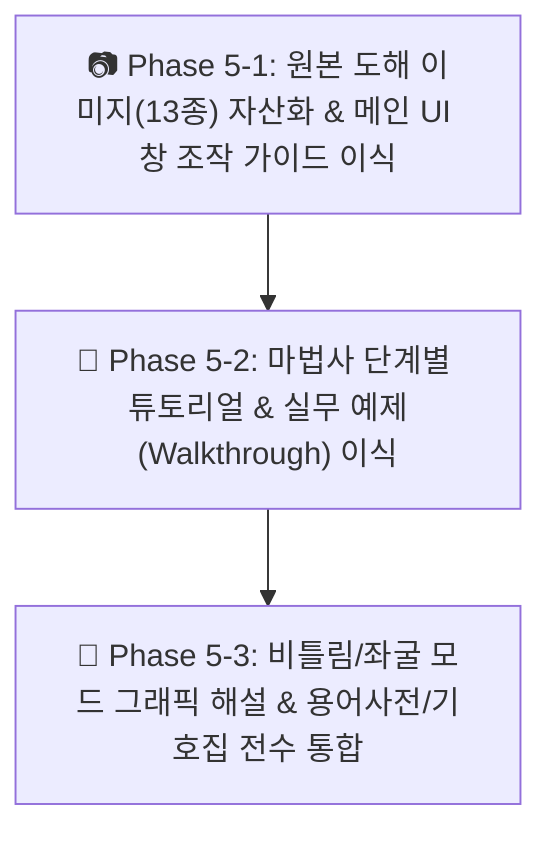

# [요구사항 05] CFS 14.0 원본 도움말 UI 도해(13종) 및 실무 튜토리얼·용어사전 전수 웹 이식

> **문서 상태**: 🚀 **활성 진행 과제**  
> **관련 기술 문서 (SSOT)**:
> - [`docs/08_online_help_manual_specification.md`](file:///f:/PyProject/CFDesigner/docs/08_online_help_manual_specification.md) (온라인 도움말 시스템 통합 명세서)
> - [`docs/09_cfs_legacy_help_manual_vs_web_gap_analysis.md`](file:///f:/PyProject/CFDesigner/docs/09_cfs_legacy_help_manual_vs_web_gap_analysis.md) (CFS 레거시 도움말 vs 웹 전수 Gap 분석서)
> - [`docs/10_cfs_legacy_ui_vs_web_gap_analysis.md`](file:///f:/PyProject/CFDesigner/docs/10_cfs_legacy_ui_vs_web_gap_analysis.md) (CFS 레거시 UI vs 웹 Gap 분석서)

---

## 1. 개요 및 목적

### 1.1 배경 및 Gap 분석 요약 ([`docs/09번 기술 문서`](file:///f:/PyProject/CFDesigner/docs/09_cfs_legacy_help_manual_vs_web_gap_analysis.md) 기반)
CFS 14.0 원본 도움말(`decompiled_src/cfs_help_manual/`, 79개 HTML + 13개 이미지)과 현재 웹 도움말(`src/web/manual/topics.py`, 25개 토픽)의 전수 대조 분석 결과 다음 3대 핵심 영역에서 누락(Gap)이 확인되었습니다:

1. **📷 고화질 UI 도해 및 다이어그램 이미지 (13종 전수 누락)**:
   - 메인 단면창(`section.png`), 1D 해석창(`analysis.png`), 퀵 디자인(`quick-design.png`)
   - FSM 좌굴 모드 4대 도해(`buckle-profile.png`, `buckle-shape.png`, `buckle-shapes.png`, `buckle-renders.png`)
   - 비틀림 해석 좌표계 및 모멘트 4대 도해(`torsion-section1.png`, `torsion-section2.png`, `torsion-direction.png`, `torsion-diagrams.png`)
   - 라이브러리 트리 아이콘 2종(`folder-open.jpg`, `folder-closed.jpg`)
2. **🧙 단계별 마법사 실무 튜토리얼 예제 (Step-by-Step Walkthroughs 누락)**:
   - 단면 마법사 2단계 실무 튜토리얼 (`section-wizard-1, 2.htm`)
   - 1D 뼈대해석 마법사 4단계 실무 튜토리얼 (`analysis-wizard-1 ~ 4.htm`: 경간 $\rightarrow$ 지점 $\rightarrow$ 하중 $\rightarrow$ 조합)
   - DXF Auto-Meshing 세그먼트 분할 및 두께 지정 가이드 (`import-dxf.htm`)
3. **📖 전문 용어사전(Glossary) 및 기호집(Symbols) 전문 누락**:
   - `glossary.htm` (18,663자의 방대한 냉간성형강 전문 용어사전 전문)
   - `symbols.htm` (6,673자 공학 기호 및 약어 정의집 전문)

### 1.2 요구 목적
* 원본 13종 이미지를 웹 정적 자산(`src/web/static/images/manual/`)으로 완벽히 구축하고,
* 25개 전수 토픽에 레거시 UI 도해 대조 설명, AltDP 모던 웹 인터페이스 대응 가이드, 단계별 마법사 실무 예제(Walkthrough), 비틀림/좌굴 그래픽 해설, 그리고 전문 용어사전(Glossary)을 전수 이식하여 **CFS.exe 원본 매뉴얼을 100% 능가하는 완결성 높은 웹 공학 매뉴얼을 완성**함.

---

## 2. 작업 범위 및 3단계 세분화 (Phase Partitioning)

대규모 데이터 및 UI 확장에 따른 구현 누락을 완벽히 방지하기 위해 3단계 Phase로 분할 진행합니다:

---

### 📷 Phase 5-1: 원본 도해 이미지(13종) 자산화 & [레거시 vs 모던 웹] UI 창 조작 가이드 이식

1. **정적 이미지 자산 배포 및 신규 모던 웹 UI 캡처 자산화**:
   - `decompiled_src/cfs_help_manual/` 내 원본 13종 이미지(`.png`, `.jpg`) 복사 배포.
   - **신규 모던 웹 UI 캡처 3종 추가 배포** (`web-section-ui.png`, `web-analysis-ui.png`, `web-quick-design.png`).
   - 모던 반응형 이미지 카드(`.manual-img-card`), [레거시 vs 모던 웹] 2열 대조 그리드(`.img-comparison-grid`) 및 캡션 스타일(`manual.css`) 적용.
   - 도해 클릭 시 고화질로 확대되는 라이트박스(Lightbox) 줌 인터랙션(`manual.js`, `manual.html`) 구현.
2. **[레거시 vs 모던 웹] 1:1 대조 UI 가이드 토픽 보강**:
   - `ui_layout` 토픽: 원본 `section.png`, `analysis.png` vs 모던 `web-section-ui.png`, `web-analysis-ui.png` 2열 대조 도해 수록.
   - `element_grid`, `geom_transform` 토픽: 원본 단면 요소 테이블 및 변환 조작법 상세 도해 설명 추가.
   - `quick_design` 토픽: 원본 `quick-design.png` vs 모던 `web-quick-design.png` 대조 도해 및 최적화 탐색 워크플로우 이식.

---

### 🧙 Phase 5-2: 마법사 단계별 튜토리얼 & 실무 예제(Walkthrough) 이식

1. **단면 마법사 실무 튜토리얼 (`wizard`)**:
   - 원본 `section-wizard-1.htm`, `section-wizard-2.htm`의 2단계 단면 생성 실무 예제 (C형강, Z형강 립 및 코너 반경 설정법) 전수 수록.
2. **1D 뼈대 구조해석 마법사 4단계 실무 튜토리얼 (`analysis_wizard`)**:
   - 원본 `analysis-wizard-1.htm` ~ `4.htm`의 4단계 마법사 실무 워크플로우 전수 이식:
     - **1단계 (경간)**: 단순보/연속보 경간(Span Length) 설정
     - **2단계 (지점 및 부재)**: 핀/롤러/고정 지점 조건 및 표준 단면 할당
     - **3단계 (하중)**: 등분포하중, 집중하중, 외력 모멘트 입력법
     - **4단계 (조합 및 해석)**: LRFD / ASD 하중조합 생성 및 해석 실행
3. **DXF Auto-Meshing 실무 가이드 (`dxf_import`)**:
   - 원본 `import-dxf.htm`의 폴리라인 레이어 규칙, 곡선 호(Arc) 세그먼트 분할 및 두께 지정 실무 팁 보강.

---

### 🔬 Phase 5-3: 비틀림/좌굴 모드 그래픽 해설 & 용어사전/기호집 전수 통합

1. **FSM 좌굴 모드 및 3D 형상 그래픽 해설 (`buckling_modes`, `signature_curve`)**:
   - 원본 `buckle-profile.png`, `buckle-shape.png`, `buckle-shapes.png`, `buckle-renders.png` 4종 도해 전수 수록.
   - 반파장($L$)에 따른 국부($P_{crl}$), 왜곡($P_{crd}$), 전체($P_{cre}$) 좌굴 모드의 단면 변형 형상 판별법 심화 해설.
2. **비틀림 및 뒤틀림 해석 그래픽 해설 (`torsion_props`)**:
   - 원본 `torsion-section1.png`, `torsion-section2.png`, `torsion-direction.png`, `torsion-diagrams.png` 4종 도해 수록.
   - 전단중심($x_0, y_0$), 뒴상수($C_w$), 생브낭 비틀림($J$) 및 비틀림 회전각 방향성 기준 해설.
3. **공학 기호/약어집 & 용어사전 통합 (`glossary`, `symbols`)**:
   - 원본 `glossary.htm`(18,663자) 전문을 한·영 대조 용어사전 데이터셋으로 구축하고 `/manual` 내 전용 뷰 및 다국어 검색 엔진에 통합.
   - 원본 `symbols.htm`(6,673자) 공학 기호 및 약어 정의집 수록.

---

## 3. 세부 파일별 변경 계획

| 레이어 / 대상 파일 | 변경 내용 및 역할 |
|---|---|
| **정적 자산** [`src/web/static/images/manual/*`](file:///f:/PyProject/CFDesigner/src/web/static/images/manual/) | 원본 도해 이미지 13종(`.png`, `.jpg`) 복사 및 웹 정적 서빙 |
| **HTML 뷰어** [`src/web/manual.html`](file:///f:/PyProject/CFDesigner/src/web/manual.html) | 라이트박스 줌 모달 컨테이너 및 용어사전(Glossary) TOC 탭 추가 |
| **스타일시트** [`src/web/static/css/manual.css`](file:///f:/PyProject/CFDesigner/src/web/static/css/manual.css) | 매뉴얼 도해 이미지 카드(`.manual-img-card`), 캡션, 라이트박스 팝업 스타일 추가 |
| **스크립트** [`src/web/static/js/manual.js`](file:///f:/PyProject/CFDesigner/src/web/static/js/manual.js) | 도해 이미지 클릭 라이트박스 인터랙션 및 용어사전 빠른 검색 바인딩 |
| **도움말 데이터셋** [`src/web/manual/topics.py`](file:///f:/PyProject/CFDesigner/src/web/manual/topics.py) | 25개 전수 토픽에 13종 이미지 HTML 태그, 마법사 튜토리얼 예제, 비틀림/좌굴 도해, 1.8만자 용어사전 데이터 전수 확충 |
| **단위 테스트** [`tests/test_manual_api.py`](file:///f:/PyProject/CFDesigner/tests/test_manual_api.py) | 13종 이미지 웹 서빙(200 OK) 및 각 토픽별 도해 태그/마법사 예제 포함 여부 검증 테스트 추가 |

---

## 4. Acceptance Criteria (종합 수용 기준)

- [x] **AC 5-1**: 원본 13종 이미지 + 모던 웹 UI 3종(`web-section-ui.png`, `web-analysis-ui.png`, `web-quick-design.png`) 자산화 및 라이트박스 팝업 뷰어 구현 완료.
- [x] **AC 5-2**: `ui_layout`, `quick_design` 토픽에 [레거시 vs 모던 웹] 2열 대조 카드 및 상세 조작 가이드 수록 완료.
- [x] **AC 5-3**: 단면 마법사 2단계 및 1D 해석 마법사 4단계 실무 튜토리얼 예제와 DXF 오차 제어 가이드 이식 완료.
- [x] **AC 5-4**: FSM 좌굴 4종 & 비틀림 4종 도해 수록 및 1.8만자 전문 용어사전/기호집 100% 통합 완료.
- [x] **AC 5-5**: `pytest tests/test_manual_api.py` 및 전체 60개 테스트 suite 100% PASS 입증.
