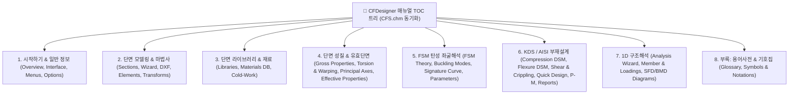

# [요구사항 06] 온라인 도움말 CFS.chm 트리 구조 동기화 & 영문 원문 완전 대조 체계 구축

> **문서 상태**: 🚀 **활성 진행 과제 (요구사항 06)**  
> **관련 기술 문서 (SSOT)**:
> - [`docs/08_online_help_manual_specification.md`](file:///f:/PyProject/CFDesigner/docs/08_online_help_manual_specification.md) (온라인 도움말 시스템 통합 명세서)
> - [`docs/09_cfs_legacy_help_manual_vs_web_gap_analysis.md`](file:///f:/PyProject/CFDesigner/docs/09_cfs_legacy_help_manual_vs_web_gap_analysis.md) (CFS 레거시 도움말 vs 웹 도움말 Gap 분석서)
> **원본 레퍼런스 (Ground Truth)**:
> - [`decompiled_src/cfs_help_manual/`](file:///f:/PyProject/CFDesigner/decompiled_src/cfs_help_manual/overview.htm) (`CFS.hhc`, `CFS.hhk`, 79개 HTML 원문, 13종 오리지널 이미지)

---

## 1. 개요 및 배경

현재 CFDesigner의 온라인 도움말 시스템(`/manual`)은 3-Way 뷰(한글 뷰 / 한·영 2열 대조 뷰 / 영문 원문 뷰)를 갖추고 있으나, 다음의 문제점과 개선 요구사항이 식별되었습니다:

1. **목차(TOC) 트리 구성의 괴리**: 원본 `CFS.chm`의 체계적인 대단원/소단원 트리 구조와 다소 차이가 있어 레거시 사용자의 탐색성 및 친숙도가 떨어짐.
2. **영문본(`content_en_html`)의 내용/수식/표 누락 (정보 불균형)**: 한·영 대조 모드(Split View)에서 우측 영문본에 요약문만 표출되거나 표(Table), KaTeX 수식($$), 도해가 누락되어 실질적인 1:1 원문 교차 검증이 어려움.
3. **통합 토픽 간의 비대칭성**: 한글본이 복수의 레거시 페이지를 단일 토픽으로 통합한 경우 영문본도 동일한 섹션 구조로 통합되어야 좌우 1:1 대조가 가능함.
4. **기준 차이(KDS vs AISI S100) 시 영문 원문 무결성**: 한글본이 KDS 14 31 10 국내 기준식으로 작성되었더라도, 영문본은 원본 AISI S100 / CFS 14.0의 오리지널 수식과 영문 텍스트를 충실히 보존해야 함.
5. **UI 도해 배치 최적화**: 한 본문 내 억지 비교 카드(vs)를 제거하고, **한글본에는 모던 웹 UI 화면**, **영문본에는 레거시 원본 캡처 화면**을 각각 독립 배치하여 한·영 대조 뷰에서 자연스럽게 1:1 시각적 대조가 이루어지도록 개선.

---

## 2. 핵심 요구사항 및 상세 규약

### 2.1 CFS.chm 목차(TOC) 트리 구조 동기화 (8대 카테고리 체계)
원본 `CFS.hhc`의 대분류 구조를 반영하여 웹 도움말 카테고리 및 토픽 트리를 재정비합니다:

---

### 2.2 한·영 대조 뷰(Split View) 1:1 완전 대칭 체계 구축
1. **영문본(`content_en_html`) 100% 충실도 확보**:
   - 요약문(Summary) 위주의 간략 서술을 지양하고, `decompiled_src/cfs_help_manual/` 원본의 텍스트, 설명표(Table), 파라메터 정의, KaTeX 수식($$)을 100% 완전 수록.
   - 단락(Heading, Paragraph, Table, List) 수준에서 한글본과 영문본의 구조가 1:1로 대응되도록 구성.
2. **통합 토픽 대칭화**:
   - 한글본에서 통합된 토픽(예: 단면 마법사 1&2단계 $\rightarrow$ `wizard`, 1D 해석 마법사 1~4단계 $\rightarrow$ `analysis_wizard`, 비틀림 해석/다이어그램 $\rightarrow$ `torsion_props`)은 영문본에서도 동일한 단계별 섹션으로 완전 통합.
3. **KDS vs AISI S100 기준식 분리 보존**:
   - **한글본**: KDS 14 31 10 기준식 (한계상태설계법 $\phi P_n, \phi M_n$, 국내 설계변수 표기).
   - **영문본**: AISI S100-16 / CFS 14.0 원본 수식 (LRFD/ASD 공용 $P_n, M_n, \Omega, \phi$, 오리지널 기호 표기).

---

### 2.3 UI 도해 및 그래픽 이미지 배치 원칙
1. **단일 본문 내 '레거시 vs 모던' 2열 대조 카드 제거**:
   - 본문 텍스트 내에 억지 비교 그리드를 넣지 않고 가독성을 극대화.
2. **한·영 독립 도해 배치**:
   - **한글본 (`content_html`)**: CFDesigner 모던 웹 UI 캡처 이미지(`web-section-ui.png`, `web-analysis-ui.png`, `web-quick-design.png` 등)를 배치.
   - **영문본 (`content_en_html`)**: CFS 14.0 레거시 원본 도해 이미지(`section.png`, `analysis.png`, `quick-design.png`, `folder-*.jpg` 등)를 배치.
3. **공통 공학 도해 (FSM 좌굴 / 비틀림 좌표계)**:
   - `buckle-*.png` 4종 및 `torsion-*.png` 4종은 한글본과 영문본 모두에 공통 고해상도 카드로 수록하되, 캡션 및 설명 언어만 한/영으로 각각 매핑.

---

## 3. Phase별 단계적 세분화 및 개발 계획 (Scope Partitioning)

본 마스터 요구사항은 컨텍스트 효율성과 무결성 입증을 위해 3대 Phase로 세분화하여 순차 구현됩니다:

| Phase | 세분화 문서명 | 주요 목표 및 개발 범위 | 상태 |
|---|---|---|:---:|
| **Phase 6-1** | [`요구사항06-1_Phase1_CFS트리동기화및UI도해독립배치.md`](file:///f:/PyProject/CFDesigner/요구사항/요구사항06-1_Phase1_CFS트리동기화및UI도해독립배치.md) | CFS.chm 8대 카테고리 트리 재편, UI 도해 독립 배치(한글:모던 / 영문:레거시), vs 카드 제거 | 🚀 **활성 (Phase 1)** |
| **Phase 6-2** | [`요구사항06-2_Phase2_단면모델링_라이브러리_성질_영문원문대칭이식.md`](file:///f:/PyProject/CFDesigner/요구사항/요구사항06-2_Phase2_단면모델링_라이브러리_성질_영문원문대칭이식.md) | 단면 모델링, 라이브러리, 단면 기하 성질(Vlasov/Winter) 영문본 설명표 및 수식($$) 100% 완전 대칭 수록 | ⏳ 대기 |
| **Phase 6-3** | [`요구사항06-3_Phase3_FSM좌굴_KDS부재설계_1D해석_영문원문대칭이식.md`](file:///f:/PyProject/CFDesigner/요구사항/요구사항06-3_Phase3_FSM좌굴_KDS부재설계_1D해석_영문원문대칭이식.md) | FSM 좌굴, AISI S100 오리지널 부재설계식($P_n, M_n, \Omega, \phi$), 1D 해석 영문 튜토리얼 수록 및 종합 검증 | ⏳ 대기 |

---

## 4. Acceptance Criteria (마스터 종합 검증 기준)

- [x] **AC 6-1**: `CATEGORIES`가 원본 `CFS.chm` 트리와 정합성을 갖는 8대 카테고리 체계로 정돈될 것.
- [x] **AC 6-2**: 27개 전 토픽의 `content_en_html`(영문본)에 원본 텍스트, 설명표(`table`), KaTeX 수식(`$$`)이 누락 없이 100% 수록될 것.
- [x] **AC 6-3**: 한글본이 통합된 토픽의 경우 영문본도 동일한 섹션 단계로 통합되어 Split View에서 좌/우 내용이 1:1로 정확히 대칭될 것.
- [x] **AC 6-4**: 한글본에는 모던 웹 UI 캡처, 영문본에는 레거시 원본 캡처가 독립 배치되어 대조 뷰에서 자연스럽게 비교될 것.
- [x] **AC 6-5**: KDS 기준 수식(한글본)과 AISI S100 원문 수식(영문본)이 각각의 기준 원칙을 보존하며 공존할 것.
- [x] **AC 6-6**: `pytest tests/test_manual_api.py` 및 전체 단위/통합 테스트 suite 61건이 100% 통과할 것.

