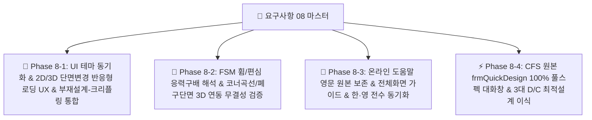

# [요구사항 08] UI 테마 연동 버그픽스, 그래픽 반응형 UX, FSM 응력구배(휨/편심) 해석 고도화, 온라인 도움말 한·영 전수 동기화 및 CFS 원본 퀵디자인(frmQuickDesign) 풀스펙 전수 이식

> **요구사항 번호**: `요구사항08`  
> **상태**: 🚀 `진행 중 (Active Master)`  
> **작성 일자**: 2026-09-01  
> **원본 레퍼런스 (Ground Truth)**:
> - [`decompiled_src/_Global/frmQuickDesign.cs`](file:///f:/PyProject/CFDesigner/decompiled_src/_Global/frmQuickDesign.cs) (2,268줄 퀵디자인 전체 파라메터)
> - [`decompiled_src/RSG/CFS/FiniteStrip.cs`](file:///f:/PyProject/CFDesigner/decompiled_src/RSG/CFS/FiniteStrip.cs) (FSM 응력구배 및 절점 결합 알고리즘)
> - [`decompiled_src/cfs_help_manual/`](file:///f:/PyProject/CFDesigner/decompiled_src/cfs_help_manual/overview.htm) (79개 HTML 원본 매뉴얼)
> **관련 모듈**:
> - 프론트엔드 UI: `src/web/static/js/` (`viewer_3d.js`, `canvas_2d.js`, `app.js`, `chart_fsm.js`), `src/web/static/css/style.css`, `src/web/index.html`
> - FSM 해석 엔진: `src/solver/` (`strip_assembler.py`, `signature_curve.py`, `eigen_solver.py`), `src/api/routes.py`
> - 온라인 도움말: `src/web/manual/topics.py`, `src/web/static/images/manual/`, `src/web/manual.html`
> - 퀵 디자인 엔진: `src/design/quick_design.py`, `src/geometry/library_parser.py`, `src/api/routes.py`
> **수용 기준 (Acceptance Criteria)**: 총 5대 항목 100% 무결성 검증 통과

---

## 1. 개요 및 마스터 목표

본 요구사항은 시스템의 실무 완성도 및 엔진 신뢰도를 극대화하기 위해 다음 **5대 핵심 개선 및 무결성 검증 과제**를 전수 구현하는 것을 목표로 합니다:

---

## 2. 5대 요구사항 상세 명세

### 2.1 [버그픽스 & UX 1] 중앙 그래픽 영역 테마 연동 & 단면 변경 시 반응형 로딩 UX
1. **테마(Light/Dark) 토글 버그 완전 해결**:
   - **3D 좌굴모드 뷰어 (`viewer_3d.js`)**: 테마 변경 시 Three.js 씬 배경색(`scene.background`)을 Light(`0xf8fafc`) / Dark(`0x0f172a`)로 즉시 동적 전환, 바닥 그리드 및 조명 자동 보정.
   - **2D 단면도 캔버스 (`canvas_2d.js`, `style.css`)**: 좌측 X-Y 원점 좌표계 원 내부 배경색 및 캔버스 툴바(Toolbar) 컨트롤 박스가 라이트 모드에서 검은색으로 남지 않고 테마 CSS 변수에 맞게 전환.
2. **도구상자(마법사/변환/라이브러리 등)에 의해 단면 형상이 변경될 때의 반응형 UX**:
   - **2D 캔버스**: 단면 형상 선부터 즉시 변경 $\rightarrow$ 이전 도심($C_G$) 및 전단중심($S_C$) 마커 즉시 삭제 $\rightarrow$ "⏳ 단면 성질 재계산 중..." 중앙 플로팅 메시지 표시 $\rightarrow$ 백엔드 계산 완료 후 신규 도심/SC 표시.
   - **3D 뷰어**: 현재 화면을 흐리게(블러/Dim 처리) 전환하고 "⏳ FSM 좌굴해석 재계산 중..." 중앙 플로팅 메시지 표시 $\rightarrow$ 완료 시 신규 3D 모드 형상 렌더링.
3. **상단 불필요한 시스템 메시지 제거**:
   - "중간에 계산을 취소하고..." (Debounce/요청 취소 안내) 등 불필요한 안내 메시지를 상단 배너에서 노출하지 않도록 정리.

### 2.2 [UI/UX 통합 2] 좌측 부재설계 영역 & 웨브 크리플링 통합
1. **문제점**: 현재 웨브 크리플링 검토가 부재력 검토(P-M 조합응력)와 분리되어 있어 설계 흐름이 단절됨.
2. **개선안**:
   - 좌측 부재설계 패널 내에 **[부재 내력 P-M 검토]**와 **[웨브 크리플링(Web Crippling) 검토]**를 탭/아코디언 일원화 구조로 통합.
   - 1D 구조해석 연동 시 축력($P$), 모멘트($M$), 전단력($V$)과 함께 지점 반력($R \rightarrow P_{wc}$)이 웨브 크리플링 입력으로 자동 연동.

### 2.3 [엔진 고도화 & 기하 3] FSM 좌굴곡선 응력구배(휨/편심) 해석 및 코너 곡선 / 폐구단면 거동 검증
1. **FSM 휨/편심 응력구배 고유치 해석 오류 수정**:
   - FSM 세부설정에서 응력분포를 순수 축압축(`compression`) 외 강축 휨(`bending_x`), 약축 휨(`bending_y`), 편심압축으로 변경 시 발생하는 오류 팝업 완전 해결.
   - `strip_assembler.py`의 휨 응력 구배 하 기하강성행렬 $[K_g]$ 조립 시 인장/압축 노드 부호 처리 보정 및 `eigen_solver.py`의 양의 실수 고유치 필터링 안정화.
   - 휨 모드일 때 탄성 좌굴 모멘트 $M_{crl}, M_{crd}, M_{cre}$ ($\text{kN}\cdot\text{m}$) 수치 산정 및 시그니처 커브/지표 UI 연동.
2. **단면 접힌 부분(코너 Fillet R) 곡선 표현**:
   - 2D/3D 캔버스에서 각 단면의 접힌 부분(코너 곡선)이 직선으로 꺾이지 않고 부드러운 호(Arc) 곡선으로 정확히 표현되도록 렌더러 보강.
3. **폐쇄형 단면 / 리브 추가 면 3D 유한요소 거동 무결성 검증**:
   - 사각파이프 등 폐구단면(Tube)이나 리브가 추가된 면이 3D 해석 시 절점을 공유하지 않고 독립 거동하는 것처럼 보이는 현상을 정밀 점검하고, `StripAssembler`의 절점 일치/공유(Node Coincidence) 및 Three.js 3D 메쉬 결합 로직을 원본 C#(`FiniteStrip.cs`)과 100% 동일하게 검증.

### 2.4 [문서 무결성 4] 온라인 도움말 영문 원본 보존, 전체화면 가이드 & 한·영 전수 동기화
1. **영문 원본 도움말 보존 원칙 준수**:
   - 한·영 대조 조건을 맞춘다고 원본 영문 도움말의 본문 텍스트나 공학 표현을 임의로 변경/변형하지 않고, **구성/배열/포맷팅만 일치**시킬 것.
2. **전체 화면 종합 설명 토픽 신설/보강**:
   - AltDP 모던 웹 전체 화면(4대 영역: 제어판, 2D/3D 뷰어, FSM 시그니처, D/C 게이지)의 레이아웃 및 작업 흐름에 대한 종합 가이드 수록.
3. **한영 대조 뷰(Split View) 내용 누락 11개 토픽 전수 교정**:
   - `1-1` (intro), `2-2` (dxf_import), `2-4` (geom_transform), `3-2` (material_db), `4-3` (principal_axes), `5-1` (fsm_theory), `6-1` (kds_dsm_comp), `6-2` (kds_dsm_flex), `6-3` (kds_shear_crip), `6-5` (kds_interaction), `7-1` (analysis_wizard) 등 좌우 높이 및 스크롤 완벽 일치.
4. **1-2 그림 캡처 교정**:
   - `web-analysis-ui.png`에 SFD/BMD/처짐 차트가 선명하게 포함된 정밀 UI 캡처로 갱신.
5. **도해 배열 4-2 (`effective_props`)**:
   - 2x2 그리드 배열 $\rightarrow$ 1행 1도해 수직 단일 컬럼화.
6. **표(Table) 및 수식($$) 1:1 대칭 완비**:
   - `3-3` (`cold_work`), `5-4` (`fsm_params`) 표 작성 및 `2-3` (`element_grid`) KaTeX 수식($$) 전수 수록.
7. **예제 분리**:
   - `2-2` 등 본문 중간에 들어간 예제를 본문 하위의 `[📝 실무 적용 튜토리얼 예제]` 독립 서브 섹션으로 분리.
8. **KDS vs AISI 상호 전수 수록**:
   - KDS 14 31 10과 AISI S100 간 차이점을 양쪽 언어에 누락 없이 100% 대조 수록.

### 2.5 [기능 풀스펙 이식 5] CFS 원본 퀵 디자인(`frmQuickDesign.cs`) 100% 전수 이식
1. **문제점**: 현재 퀵디자인 모달의 입력 파라메터가 CFS 원본 대비 축소되어 있음.
2. **원본 `frmQuickDesign.cs` 전수 파라메터**:
   - **단면 필터**: 계열(Depth: 3.5"~14" / 90~350mm), 타입(S-Stud, T-Track), 플랜지(1.25"~3.5"), 판두께(18~118 mil / 0.8~3.0mm), 펀칭 홀(Punched Web), 형상배치(Single, Back-to-Back, Face-to-Face), 성형가공경화(Cold-Work), 비탄성예비(Inelastic Reserve), 강종 항복강도($F_y = 33 / 50\text{ ksi}$ or $235 / 355\text{ MPa}$).
   - **설계 하중 및 경간**: 경간(Span), 배치간격(Spacing), 고정하중(Dead), 활하중(Live), 풍하중(Wind), 고정축력(Dead Axial), 활축력(Live Axial), 횡지지간격(Bracing), 처짐제한(Live Limit, Total Limit: $L/360, L/240$), 지압길이(Bearing Length $N$).
   - **출력 결과**: 강도(Strength D/C), 처짐(Deflection D/C), 웨브 크리플링(Web Crippling D/C) 3대 통합 판정 및 중량순 추천 랭킹 리스트.
3. **엔진 수정 시 원본(Ground Truth) 동일성 검증**:
   - 퀵디자인의 강도, 처짐, 웨브 크리플링 계산식은 CFS 원본(`frmQuickDesign.cs`) 계산 루틴과 동일한 결과를 내도록 철저히 교차 검증.

---

## 3. 단계별 하위 실행 계획 (Sub-Phase Breakdown)

* **[`요구사항08-1_Phase1_UI테마연동버그픽스_및_부재설계웨브크리플링통합.md`](file:///f:/PyProject/CFDesigner/요구사항/요구사항08-1_Phase1_UI테마연동버그픽스_및_부재설계웨브크리플링통합.md)**: 3D/2D 테마 동기화, 단면 변경 시 2D/3D 플로팅 로딩 UX, 상단 취소 메시지 제거, 부재설계-크리플링 UI 일원화.
* **[`요구사항08-2_Phase2_FSM응력구배_강축약축휨_편심압축_해석엔진고도화.md`](file:///f:/PyProject/CFDesigner/요구사항/요구사항08-2_Phase2_FSM응력구배_강축약축휨_편심압축_해석엔진고도화.md)**: FSM 휨/편심 응력구배 해석 수정, 코너 Fillet R 곡선 표현, 3D 폐구단면/리브 절점 공유 거동 무결성 검증.
* **[`요구사항08-3_Phase3_온라인도움말_한영대조_수식_표_도해배열_전수동기화.md`](file:///f:/PyProject/CFDesigner/요구사항/요구사항08-3_Phase3_온라인도움말_한영대조_수식_표_도해배열_전수동기화.md)**: 영문 원본 보존 원칙, 전체 화면 가이드 추가, 11개 토픽 한영 대조 완벽 동기화, 수식/표 대칭, 1행 1도해, 예제 분리.
* **[`요구사항08-4_Phase4_CFS원본대화창_frmQuickDesign_풀스펙_100퍼센트_전수이식.md`](file:///f:/PyProject/CFDesigner/요구사항/요구사항08-4_Phase4_CFS원본대화창_frmQuickDesign_풀스펙_100퍼센트_전수이식.md)**: `frmQuickDesign.cs` 100% 전수 파라메터 및 강도/처짐/크리플링 3대 D/C 최적설계 엔진 완성.

---

## 4. 무결성 검증 계획

1. **테마 & 2D/3D UX 검증**: 라이트 모드 전환 시 3D 배경/2D 툴바 즉시 전환, 단면 변경 시 2D 이전 도심 즉시 삭제 및 "재계산 중" 플로팅, 3D 화면 블러 처리 확인.
2. **FSM 응력구배 & 절점 공유 검증**: 강축 휨/약축 휨/편심압축 선택 시 오류 없이 $M_{cr}$ 도출, 사각파이프 3D 좌굴 시 일체 거동 확인 (`pytest tests/engine/`).
3. **온라인 매뉴얼 검증**: 영문 원문 보존 상태에서 27개 전 토픽 Split View 및 11개 토픽 수식/표 누락 0건 전수 검증 (`pytest tests/manual/`).
4. **퀵 디자인 검증**: 원본 `frmQuickDesign.cs` 전수 입력 필드 연동 및 1,000+ 단면 자동 스캔 검증 (`pytest tests/ui/`).
