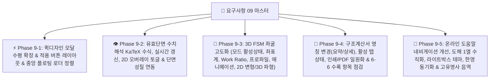

# [요구사항 09] 퀵디자인 UI 개선, 유효단면 실시간 2D/3D 오버레이 및 단면성질 연동, 3D FSM 좌굴해석 고도화(좌표계/프로파일/애니메이션/파형), 구조계산서 버튼 일원화 및 온라인 도움말 전수 동기화

> **요구사항 번호**: `요구사항09`  
> **상태**: ✅ `100% 무결성 구현 및 전수 검증 완료 (Completed & Verified)`  
> **작성 일자**: 2026-09-01  
> **검증 보고서**: [`docs/13_요구사항09_전수검증_및_대조비교표_보고서.md`](file:///f:/PyProject/CFDesigner/docs/13_요구사항09_전수검증_및_대조비교표_보고서.md)  
> **원본 레퍼런스 (Ground Truth)**:
> - [`decompiled_src/RSG/CFS/EffectiveProperties.cs`](file:///f:/PyProject/CFDesigner/decompiled_src/RSG/CFS/EffectiveProperties.cs) (유효폭 수치해석 및 오버레이 알고리즘)
> - [`decompiled_src/RSG/CFS/FiniteStrip.cs`](file:///f:/PyProject/CFDesigner/decompiled_src/RSG/CFS/FiniteStrip.cs) (3D FSM 좌굴 형상, Work Ratio, 길이방향 사인파)
> - [`decompiled_src/_Global/frmBuckleProfile.cs`](file:///f:/PyProject/CFDesigner/decompiled_src/_Global/frmBuckleProfile.cs) (좌굴 뷰어 컨트롤, 애니메이션, 인쇄, 2D 변형모드)
> - [`decompiled_src/cfs_help_manual/`](file:///f:/PyProject/CFDesigner/decompiled_src/cfs_help_manual/) (온라인 매뉴얼 원본 도해 5-2, 6-6 등)
> **관련 모듈**:
> - 프론트엔드 UI: `src/web/index.html`, `src/web/static/css/style.css`, `src/web/static/js/` (`app.js`, `canvas_2d.js`, `viewer_3d.js`, `chart_fsm.js`)
> - 유효단면 및 FSM 엔진: `src/geometry/effective_width.py`, `src/solver/strip_assembler.py`, `src/solver/eigen_solver.py`, `src/api/routes.py`
> - 구조계산서 모듈: `src/report/html_report.py`, `src/report/svg_diagrams.py`, `src/web/static/js/app.js`
> - 온라인 매뉴얼 시스템: `src/web/manual/topics.py`, `src/web/manual.html`, `src/web/static/js/manual.js`, `src/web/static/css/manual.css`
> **수용 기준 (Acceptance Criteria)**: 총 5대 카테고리 22개 세부 수용 기준 100% 무결성 검증 통과

---

## 1. 개요 및 마스터 목표

본 요구사항은 사용자 실무 사용성(UX), 시각적 완성도, 유효단면(Winter Effective Properties)과 3D FSM 좌굴해석의 정밀 연동, 구조계산서 일원화 및 온라인 도움말 시스템의 엄밀성을 강화하기 위해 다음 **5대 핵심 영역에 대한 전수 개선 및 고도화**를 수행합니다:

---

## 2. 5대 도메인별 상세 명세 및 수용 기준

### 2.1 [퀵디자인 & 중앙 로더 1] 퀵디자인 모달 크기 확장, 적용 버튼 UX 및 중앙 로더 정렬
1. **퀵디자인 모달 수평 크기 확장 (Horizontal Expansion)**:
   - 모달 너비를 `max-width: 1440px; width: 98vw;`로 확장하고 3열 그리드 컬럼 비율을 최적화(`320px 340px 1fr`)하여, 테이블 내 가로 스크롤 없이 모든 3대 D/C 지표(강도, 처짐, 크리플링, 최대 D/C, 절감률)가 한눈에 펼쳐지도록 개선.
2. **테이블 [적용] 버튼 레이아웃 버그 수정**:
   - `<td>` 폭을 충분히 확보(`min-width: 70px`)하고, 버튼 내부 텍스트 `white-space: nowrap;` 및 패딩/폰트 크기(`padding: 4px 8px; font-size: 11.5px; font-weight: 600;`)를 정돈하여 버튼 글자 짤림/개행 현상 완전 제거.
3. **중앙 그래픽 영역 로딩 메시지 정중앙 배치**:
   - "⏳ 단면 성질 재계산 중..." (2D) 및 "⏳ FSM 좌굴해석 재계산 중..." (3D) 플로팅 로더가 캔버스/뷰포트 영역의 정가운데(`top: 50%; left: 50%; transform: translate(-50%, -50%);`)에 완벽하게 정렬되도록 CSS/JS 배치 보정.

---

### 2.2 [유효단면 & 2D 연동 2] 유효단면 KaTeX 수식, 수치해석창 내부 실시간 계산 완결, 2D 오버레이 기능 분리 & 단면성질 연동
1. **KaTeX 수식 렌더링 누락 수정**:
   - 유효단면 모달(`effectiveModal`) 내 $A_e$, $A_e / A_g$, $I_{xe}$, $\Delta y$, $f$ 등의 기호가 `$$` 텍스트로 보이지 않고 KaTeX 라이브러리를 통해 정식 수식 기호로 깔끔하게 렌더링되도록 처리.
2. **수치해석 계산 및 결과 표시의 모달 내부 완결 (실시간 연산)**:
   - 유효단면 수치해석창(`effectiveModal`)에서 적용 응력 $f$ 및 재하 모드(축) 변경 시 디바운스(150ms) 기반으로 백엔드 `/api/geometry/effective-width`를 호출하여 **유효단면 수치해석창 내부의 결과란($A_e, A_e/A_g, I_{xe}, \Delta y$)에 즉각 실시간 계산되어 표시**.
   - 창을 열고 수치를 변경하는 단계에서는 메인 화면(단면 기하학적 성질란 등)에 바로 적용되지 않고 오직 **해당 수치해석창 내부에서만 독립적으로 실시간 계산/표현**.
3. **계산과 2D 오버레이 기능 명확 분리 및 2D 캔버스 오버레이 버튼 동작**:
   - 기존의 단일 버튼에 묶여있던 계산/오버레이 기능을 명확히 분리: 수치 계산은 창 내부에서 실시간으로 완결되고, 버튼은 **[⚡ 유효단면 2D 캔버스 오버레이]** 전용 버튼으로 동작.
   - **모달 [⚡ 유효단면 2D 캔버스 오버레이] 클릭 시**: 모달이 닫히며 2D 캔버스에 유효단면 점선(Dashed stroke)이 오버레이되고 $\rightarrow$ 상단 2D 툴바의 **[👁️ 유효단면]** 버튼이 활성화(Pressed/Active `.active`) 상태로 전환되며 $\rightarrow$ 우측 단면 기하학적 성질란 하단에 비로소 **[유효단면 성질 ($f=...$ MPa)]** 정보 블록($A_e, A_e/A_g, I_{xe}, \Delta y$)이 함께 표기.
   - **툴바 버튼 재클릭 시**: 이미 오버레이된 유효단면 점선이 2D 화면에서 깔끔하게 제거되고 툴바 버튼 눌림 해제 및 우측 단면성질란 유효단면 표기 해제.
   - **단면 변경 시 자동 리셋**: 2D 화면에서 마법사, DXF 로드, 툴바 변환(회전, 대칭 등)에 의해 단면 기하가 변경되면 유효단면 오버레이를 자동 해제하고 툴바 버튼 비활성화 및 우측 유효단면 정보 표기 자동 제거.

---

### 2.3 [3D FSM 버클링 해석 고도화 3] 버클링 모드 활성 버튼, 좌표계, Work Ratio, 프로파일, 애니메이션, 2D 변형 및 3D 파형 렌더링
1. **3D 뷰어 버클링 모드 버튼 Active 상태 유지**:
   - 현재 렌더링 중인 버클링 모드(로컬 버클링 `local`, 디스토셔널 버클링 `distortional`, 글로벌 버클링 `global`)에 부합하는 상단 버튼이 눌러진 상태(Active 강조 배경)로 유지.
2. **도움말 5-2 도해2 기준 3D 탄성 버클링 해석 UI 기능 전수 추가**:
   - **X, Y, Z 3차원 좌표계 축 기호**: 3D 씬 좌측 하단에 축 방향 Triad 기호(X: 빨강, Y: 초록, Z: 파랑) 렌더링.
   - **Work Ratio & Direct Strength 지표 표기**: 3D 뷰어 상단 정보 오버레이에 현재 반파장($L$), 버클링계수($\beta$), Work Ratio(내부 변형에너지 비율), 다이렉트 스트렝스 공칭강도($P_{nl}, P_{nd}, P_{ne}$ 또는 $M_{nl}, M_{nd}, M_{ne}$) 표기.
   - **스트레스 프로파일(Stress Profile) 표시**: 단면 둘레를 따라 가해진 압축/인장 초기 응력 분포 다이어그램 표시 토글.
   - **진동 애니메이션 시작/중지(Play/Pause) 버튼**: 버클링 변형 애니메이션을 일시 정지하거나 다시 재생할 수 있는 컨트롤 버튼 추가.
   - **인쇄(Print) 및 화면 저장(Export Image) 버튼**: 현재 3D 버클링 변형 화면을 고해상도 PNG 이미지로 즉시 다운로드하거나 인쇄 미리보기로 전송하는 기능.
3. **도움말 5-2 도해3 기준 2D 단면 변형 모드형상 (Cross-section Mode) 출력**:
   - 2D 캔버스에 선택된 반파장에서의 2D 평면 버클링 변형 단면(횡변위 및 회전이 반영된 모드 형상) 렌더링 뷰 모드 추가.
4. **도움말 5-2 도해4 기준 3D 길이방향 사인파(Longitudinal Sine Wave) 파형 렌더링**:
   - 3D 부재 축방향($Z$)을 따라 $\sin(\pi z / L)$ 파형으로 진폭이 변화하는 3D 입체 버클링 파형 메시 렌더링 효과 구현.
5. **단면 코너 반경(Corner Radius) 원본 소스 및 2D 캔버스 표현 점검**:
   - 원본 C# (`RSG/CFS/Part.cs`, `Section.cs`)의 요소별 코너 반경(`Element.Rad`) 처리 알고리즘을 대조하고, 2D 캔버스 및 3D 뷰어에서 필렛 곡선이 완벽하게 일치되도록 점검 및 반영.

---

### 2.4 [구조계산서 일원화 4] 명칭 표준화, 활성 버튼 상태, 인쇄/PDF 버튼 단일화 & 6-6 수록 항목 전수 점검
1. **보고서 명칭 변경**:
   - 기존 "간략 요약 보고서" $\rightarrow$ **"요약 보고서 (Summary Report)"**
   - 기존 "정식 상세 계산서" $\rightarrow$ **"상세 보고서 (Detailed Calculation Report)"**
2. **현재 보고서 탭 Active 상태 유지**:
   - 현재 렌더링되어 화면에 표시 중인 보고서 모드(요약 / 상세)에 맞춰 해당 토글 버튼이 눌러진 채(Active)로 시각적 표현.
3. **인쇄 / PDF 저장 버튼 일원화**:
   - 계산서 본문 내 중복된 인쇄/다운로드 버튼을 제거하고, 모달 제목 표시줄(Header)의 **[🖨️ 인쇄 / PDF 저장]** 단일 버튼으로 통합.
4. **온라인 매뉴얼 6-6 (`report_guide`) 대비 수록 항목 전수 점검 및 보강**:
   - CFS 14종 원본 리포트 항목(단면도, Gross 특성, Mohr 주축, Torsion 상수, FSM 탄성 버클링 곡선, KDS DSM 압축/휨/전단/웨브크리플링 설계강도, P-M 상호작용비)이 요약/상세 보고서에 빠짐없이 완벽히 포함되었는지 1:1 전수 검증.

---

### 2.5 [온라인 도움말 전수 동기화 5] 네비게이션 개선, 도해 1열화, 라이트박스 테마, 한영 4개 토픽 대조 & 버클링 음역 통일
1. **도움말 네비게이션 헤더 정돈**:
   - 상단 헤더의 불필요한 **[대시보드]** 버튼 제거.
   - **[🌓 테마]** 토글 버튼을 헤더 맨 앞(좌측 브랜드 로고 바로 옆)으로 재배치하여 즉각적인 시각 접근성 확보.
2. **도해 1행 1그림(Single-column) 수직 배열 적용**:
   - `4-2` (`effective_props`), `5-2` (`buckling_modes`) 등 다중 이미지가 포함된 토픽에서 수평 그리드 겹침을 방지하고 **1행 1그림 수직 단일 열** 배치로 완전 통일.
3. **이미지 라이트박스(클릭 확대) 테마 연동**:
   - 라이트 모드에서 이미지를 클릭하여 확대할 때 라이트박스 배경이 검은색으로 고정되지 않고, 현재 테마에 부합하는 반투명 글래스 배경(`rgba(248, 250, 252, 0.92)` / `rgba(15, 23, 42, 0.92)`)으로 자동 전환.
4. **한·영 서술 차이, 수식 누락, 기호 설명 누락 4대 토픽 전수 교정**:
   - **`4-4` (`torsion_props`)**: 비틀림 상수 $J$, 와핑 상수 $C_w$, 전단중심 $(x_o, y_o)$ 수식 및 기호 설명 한·영 1:1 일치.
   - **`5-1` (`fsm_theory`)**: 박판 유한대판법 강성방정식 $[K_e - \beta K_g]\Delta = 0$ 및 Sturm 고유치 수식 한·영 대칭.
   - **`5-3` (`signature_curve`)**: 반파장 $L$, 로컬/디스토셔널/글로벌 극솟점 판별식 및 기호 대조.
   - **`6-3` (`kds_shear_crip`)**: 전단좌굴 강도 $V_n$ 및 웨브 크리플링 지압강도 $P_{nc}$ 4대 재하조건 파라미터($C, C_R, C_N, C_h$) 표 및 수식 1:1 완비.
5. **Buckling $\rightarrow$ 버클링 음역 전역 표준화**:
   - "전체 좌굴, 국부 좌굴, 왜곡 좌굴, 글로벌 좌굴, 로컬 좌굴, 디스토셔널 좌굴" 등의 혼용 번역/음역을 배제하고, 고유명사로서 **글로벌 버클링 (Global Buckling)**, **로컬 버클링 (Local Buckling)**, **디스토셔널 버클링 (Distortional Buckling)**으로 전면 통일 (UI 대시보드, 툴팁, 3D 뷰어, 온라인 매뉴얼 전역 공통 적용).
6. **`6-4` (`quick_design`) UI 캡처 갱신**:
   - 퀵디자인 토픽의 캡처 이미지를 Phase 8-8에서 완성된 최신 3열 풀스펙 모달 UI 화면으로 전면 교체.

---

## 3. 단계별 하위 실행 계획 (Sub-Phase Breakdown)

* **[`요구사항09-1_Phase1_퀵디자인_모달확장_적용버튼_및_중앙로더정렬.md`](file:///f:/PyProject/CFDesigner/요구사항/요구사항09-1_Phase1_퀵디자인_모달확장_적용버튼_및_중앙로더정렬.md)**: 퀵디자인 모달 1440px 수평 확장, 적용 버튼 너비/텍스트 정렬, 2D/3D 플로팅 로더 화면 정가운데 배치.
* **[`요구사항09-2_Phase2_유효단면_수치해석_KaTeX_실시간갱신_2D오버레이토글_및_단면성질연동.md`](file:///f:/PyProject/CFDesigner/요구사항/요구사항09-2_Phase2_유효단면_수치해석_KaTeX_실시간갱신_2D오버레이토글_및_단면성질연동.md)**: KaTeX 수식 렌더링, 모달 내부 실시간 계산 완결, 2D 오버레이 전용 버튼 동작, 툴바 버튼 Active 동기화, 우측 Gross 단면성질 하단 유효단면 연동 및 단면변경 시 자동 해제.
* **[`요구사항09-3_Phase3_3D_FSM좌굴_모드버튼_좌표계_WorkRatio_애니메이션_2D변형_3D파형_구현.md`](file:///f:/PyProject/CFDesigner/요구사항/요구사항09-3_Phase3_3D_FSM좌굴_모드버튼_좌표계_WorkRatio_애니메이션_2D변형_3D파형_구현.md)**: 버클링 모드 활성 버튼 상태, XYZ 좌표축, Work Ratio/응력 프로파일 표시, 애니메이션 Play/Pause, 이미지 저장, 2D 변형모드 및 3D 사인파 파형 렌더링.
* **[`요구사항09-4_Phase4_구조계산서_명칭변경_활성버튼_인쇄PDF단일화_및_6-6수록항목전수점검.md`](file:///f:/PyProject/CFDesigner/요구사항/요구사항09-4_Phase4_구조계산서_명칭변경_활성버튼_인쇄PDF단일화_및_6-6수록항목전수점검.md)**: "요약 보고서" / "상세 보고서" 명칭 변경, Active 탭 표현, 헤더 인쇄/PDF 단일화, 6-6 대비 14종 리포트 수록 항목 전수 무결성 검증.
* **[`요구사항09-5_Phase5_온라인도움말_네비게이션_도해1열화_라이트박스테마_한영동기화_버클링음역통일.md`](file:///f:/PyProject/CFDesigner/요구사항/요구사항09-5_Phase5_온라인도움말_네비게이션_도해1열화_라이트박스테마_한영동기화_버클링음역통일.md)**: 대시보드 버튼 삭제, 테마 버튼 맨 앞 이동, 1행 1그림(4-2, 5-2), 라이트박스 테마 연동, 4대 토픽(4-4, 5-1, 5-3, 6-3) 한영 대조 완비, 글로벌/로컬/디스토셔널 버클링 음역 통일 및 6-4 퀵디자인 최신 이미지 교체.

---

## 4. 무결성 검증 계획

1. **UI 및 인터랙션 검증 (`pytest tests/ui/`)**:
   - 퀵디자인 모달 1440px 렌더링, 적용 버튼 줄바꿈 없음, 2D/3D 플로팅 로더 중앙 정렬 확인.
   - 유효단면 모달 내부 KaTeX 렌더링 및 실시간 수치 갱신, 2D 오버레이 툴바 토글, 우측 단면성질 연동 및 단면변경 시 자동 해제 테스트.
   - 계산서 요약/상세 보고서 명칭, 활성 탭 상태, 인쇄/PDF 단일화 확인.
2. **3D FSM 버클링 렌더러 검증 (`pytest tests/engine/`)**:
   - XYZ 축, Work Ratio, 응력 프로파일, 애니메이션 시작/중지, 2D 변형모드 및 3D 사인파 파형 렌더링 무결성 검증.
3. **온라인 도움말 전수 검증 (`pytest tests/manual/`)**:
   - 27개 토픽 한·영 대칭성, 4개 토픽(4-4, 5-1, 5-3, 6-3) 수식/기호 누락 0건, 글로벌/로컬/디스토셔널 버클링 음역 전역 적용 확인.
