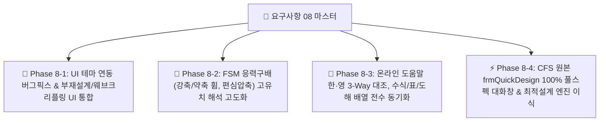

# [요구사항 08] UI 테마 연동 버그픽스, FSM 응력구배(휨/편심) 해석 고도화, 온라인 도움말 한·영 전수 동기화 및 CFS 원본 퀵디자인(frmQuickDesign) 풀스펙 전수 이식

> **요구사항 번호**: `요구사항08`  
> **상태**: 🚀 `진행 중 (Active Master)`  
> **작성 일자**: 2026-09-01  
> **관련 모듈**:
> - 프론트엔드 UI: `src/web/static/js/` (`viewer_3d.js`, `canvas_2d.js`, `app.js`, `chart_fsm.js`), `src/web/static/css/style.css`, `src/web/index.html`
> - FSM 해석 엔진: `src/solver/` (`strip_assembler.py`, `signature_curve.py`, `eigen_solver.py`), `src/api/routes.py`
> - 온라인 도움말: `src/web/manual/topics.py`, `src/web/static/images/manual/`, `src/web/manual.html`
> - 퀵 디자인 엔진: `src/design/quick_design.py`, `src/geometry/library_parser.py`, `src/api/routes.py`, `decompiled_src/_Global/frmQuickDesign.cs`
> **수용 기준 (Acceptance Criteria)**: 총 5대 항목 100% 무결성 검증 통과

---

## 1. 개요 및 마스터 목표

본 요구사항은 시스템의 실무 완성도를 극대화하기 위해 다음 **5대 핵심 개선 및 버그 픽스 과제**를 전수 구현하는 것을 목표로 합니다:

---

## 2. 5대 요구사항 상세 명세

### 2.1 [버그픽스 1] 중앙 그래픽 영역 테마(Light/Dark) 연동 버그 픽스
1. **3D 좌굴모드 뷰어 (`viewer_3d.js`)**:
   - 테마 토글 시 Three.js 씬 배경색(`scene.background`)이 다크 고정에서 라이트 모드(`0xf8fafc`)로 실시간 전환 연동.
   - 그리드 바닥판(`GridHelper`) 및 조명 강도 자동 보정.
2. **2D 단면도 캔버스 (`canvas_2d.js`)**:
   - 좌측 X-Y 원점 좌표계 원 내부 배경색이 테마에 맞추어 라이트/다크 동적 전환.
   - 캔버스 툴바(확대/축소/원점/그리드) 컨트롤 박스 배경색 및 아이콘 테마 동기화.

### 2.2 [UI/UX 통합 2] 좌측 부재설계 영역 & 웨브 크리플링 통합
1. **문제점**: 현재 웨브 크리플링 검토가 부재력 검토(P-M 조합응력)와 분리되어 있어 설계 흐름이 단절됨.
2. **개선안**:
   - 좌측 부재설계 패널 내에 **[부재력 P-M 검토]**와 **[웨브 크리플링(Web Crippling) 검토]**를 탭/아코디언 일원화 구조로 통합.
   - 1D 구조해석 연동 시 축력($P$), 모멘트($M$), 전단력($V$)과 함께 지점 반력($R \rightarrow P_{wc}$)이 웨브 크리플링 입력으로 자동 연동.

### 2.3 [엔진 고도화 3] FSM 좌굴곡선 응력구배(Stress Distribution) 해석 오류 수정
1. **문제점**: FSM 세부설정에서 응력분포를 순수 축압축(`compression`) 외 강축휨(`bending_x`), 약축휨(`bending_y`), 편심압축으로 변경 시 오류 팝업 발생.
2. **원인 및 조치**:
   - `strip_assembler.py`의 휨 응력 구배 하에서 기하강성행렬 $[K_g]$ 조립 시 인장/압축 노드 부호 처리 보정.
   - `eigen_solver.py`의 일반 고유치 해석에서 휨 좌굴 모멘트 $M_{cr} = LF \times S_{xc} F_y$ 산정식 및 양의 실수 고유치 필터링 로직 완비.
   - 프론트엔드(`app.js`, `chart_fsm.js`)에서 휨 응력 모드일 때 $M_{crl}, M_{crd}, M_{cre}$ ($\text{kN}\cdot\text{m}$) 지표를 정확히 렌더링하도록 UI 연동.

### 2.4 [문서 무결성 4] 온라인 도움말 한·영 전수 동기화 및 UI 도해/예제 재배치
1. **한영 대조 뷰(Split View) 내용 누락 페이지 전수 교정**:
   - `1-1` (intro), `2-2` (dxf_import), `2-4` (geom_transform), `3-2` (material_db), `4-3` (principal_axes), `5-1` (fsm_theory), `6-1` (kds_dsm_comp), `6-2` (kds_dsm_flex), `6-3` (kds_shear_crip), `6-5` (kds_interaction), `7-1` (analysis_wizard) 등 11개 토픽 좌우 높이 및 스크롤 완벽 일치.
2. **1-2 그림 캡처 교정**:
   - `web-analysis-ui.png`에 전단력도(SFD), 휨모멘트도(BMD), 처짐곡선이 선명하게 나타나는 정밀 UI 캡처로 갱신.
3. **도해 배열 4-2 (`effective_props`)**:
   - 2x2 그리드 배열을 단일 컬럼(1행 1도해) 세로 스택 구조로 정돈하여 가독성 개선.
4. **표(Table) 및 수식($$) 1:1 대칭 완비**:
   - `3-3` (`cold_work`), `5-4` (`fsm_params`) 영문 표 $\rightarrow$ 한글 도움말에도 동일 규격 표 작성.
   - `2-3` (`element_grid`) 등 수식이 등장하는 모든 영문 토픽의 수식을 한글 토픽에 빠짐없이 수록.
5. **예제 분리**:
   - `2-2` 등 본문 중간에 들어간 예제를 본문 하위의 `[📝 실무 적용 튜토리얼 예제]` 독립 섹션으로 깔끔하게 분리.
6. **KDS vs AISI 상호 전수 수록**:
   - KDS 14 31 10과 AISI S100 간 차이점(안전율 $\Omega$, 저항계수 $\phi$, 세장비 한계 등)을 한글/영문 양쪽에 생략 없이 100% 대조 수록.

### 2.5 [기능 풀스펙 이식 5] CFS 원본 퀵 디자인(`frmQuickDesign.cs`) 100% 전수 이식
1. **문제점**: 현재 퀵디자인 모달의 입력 파라메터가 CFS 원본 대비 축소되어 있음.
2. **원본 `frmQuickDesign.cs` 전수 파라메터**:
   - **단면 필터**: 계열(Depth: 3.5"~14" / 90~350mm), 타입(S-Stud, T-Track), 플랜지(1.25"~3.5"), 판두께(18~118 mil / 0.8~3.0mm), 펀칭 홀(Punched Web), 형상배치(Single, Back-to-Back, Face-to-Face), 성형가공경화(Cold-Work), 비탄성예비(Inelastic Reserve), 강종 항복강도($F_y = 33 / 50\text{ ksi}$ or $235 / 355\text{ MPa}$).
   - **설계 하중 및 경간**: 경간(Span), 배치간격(Spacing), 고정하중(Dead), 활하중(Live), 풍하중(Wind), 고정축력(Dead Axial), 활축력(Live Axial), 횡지지간격(Bracing), 처짐제한(Live Limit, Total Limit: $L/360, L/240$), 지압길이(Bearing Length $N$).
   - **출력 결과**: 강도(Strength D/C), 처짐(Deflection D/C), 웨브 크리플링(Web Crippling D/C) 3대 통합 판정 및 중량순 추천 랭킹 리스트.
3. **구현 계획**: 원본 C# 계산 루틴을 100% 이식하여 `QuickDesignModal`을 정식 풀스펙으로 전면 고도화.

---

## 3. 단계별 하위 실행 계획 (Sub-Phase Breakdown)

* **[`요구사항08-1_Phase1_UI테마연동버그픽스_및_부재설계웨브크리플링통합.md`](file:///f:/PyProject/CFDesigner/요구사항/요구사항08-1_Phase1_UI테마연동버그픽스_및_부재설계웨브크리플링통합.md)**: 3D/2D 테마 동기화 버그픽스 및 부재설계-웨브크리플링 UI 일원화.
* **[`요구사항08-2_Phase2_FSM응력구배_강축약축휨_편심압축_해석엔진고도화.md`](file:///f:/PyProject/CFDesigner/요구사항/요구사항08-2_Phase2_FSM응력구배_강축약축휨_편심압축_해석엔진고도화.md)**: FSM 강축/약축 휨 및 편심압축 고유치 해석 알고리즘 무결성 구현.
* **[`요구사항08-3_Phase3_온라인도움말_한영대조_수식_표_도해배열_전수동기화.md`](file:///f:/PyProject/CFDesigner/요구사항/요구사항08-3_Phase3_온라인도움말_한영대조_수식_표_도해배열_전수동기화.md)**: 11개 토픽 한영 대조 완벽 동기화, 수식/표 대칭, 1행 1도해, 예제 분리.
* **[`요구사항08-4_Phase4_CFS원본대화창_frmQuickDesign_풀스펙_100퍼센트_전수이식.md`](file:///f:/PyProject/CFDesigner/요구사항/요구사항08-4_Phase4_CFS원본대화창_frmQuickDesign_풀스펙_100퍼센트_전수이식.md)**: `frmQuickDesign.cs` 100% 전수 파라메터 및 다중 D/C 최적설계 엔진 완성.

---

## 4. 무결성 검증 계획

1. **테마 검증**: 라이트 모드 전환 시 3D 배경, 2D 원점 원, 툴바가 즉시 정상 렌더링되는지 확인.
2. **FSM 응력구배 검증**: 강축 휨(`bending_x`), 약축 휨(`bending_y`) 선택 후 [재해석] 시 오류 없이 시그니처 커브 및 $M_{crl}, M_{crd}, M_{cre}$ 정상 도출 확인 (`pytest tests/engine/`).
3. **온라인 매뉴얼 검증**: 27개 전 토픽 Split View 및 11개 토픽 수식/표 누락 0건 전수 검증 (`pytest tests/manual/`).
4. **퀵 디자인 검증**: 원본 `frmQuickDesign.cs` 전수 입력 필드 연동 및 1,000+ 단면 자동 스캔 검증 (`pytest tests/ui/`).
