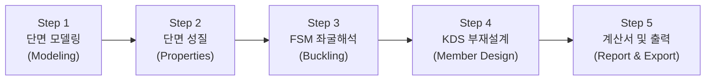
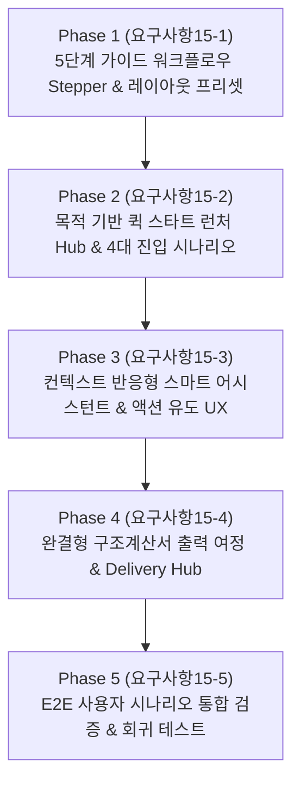

# [요구사항 15] 엔지니어링 워크플로우 가이드 UI 및 목적 기반 UX 파이프라인 구축

> **문서 상태**: 🚀 작업 대기 (Ready for Implementation)  
> **문서 버전**: v1.0  
> **작성일자**: 2026-09-02  
> **기반 문서**: [기술 문서 15: CFS 원본 UI/메뉴/창 구성 및 입출력 상세 명세서](file:///f:/PyProject/CFDesigner/docs/15_cfs_legacy_ui_menu_and_dialog_specification.md) & [기술 문서 07: 웹 UI/UX 명세서](file:///f:/PyProject/CFDesigner/docs/07_web_application_ui_ux_specification.md)

---

## 1. 배경 및 문제 정의 (Background & Problem Statement)

### 1.1. 배경 및 철학적 고찰
* 소프트웨어의 UI/UX와 결과물 출력물의 구성은 **"개발자가 엔지니어(사용자)를 바라보는 철학"**을 반영합니다.
* 상용 CFS 프로그램은 **[1. 단면 정의 $\rightarrow$ 2. 성질 산정 $\rightarrow$ 3. 좌굴 분석 $\rightarrow$ 4. 부재 설계 $\rightarrow$ 5. 리포트 출력]**이라는 냉간성형강 구조공학의 완결형 파이프라인 철학을 바탕으로 메뉴와 MDI 창 체계를 유기적으로 구축하였습니다.

### 1.2. 현재 CFDesigner 웹 앱의 UX 한계점
1. **작업 순서의 가이드 부재 (Where to start?)**:
   * 첫 화면 진입 시 좌측 패널(파라메트릭/재료/웨브크리플링), 중앙(2D/3D 캔버스), 하단(FSM 차트), 우측(D/C 게이지 및 단면성질)이 한꺼번에 노출되어, 사용자가 "지금 무엇을 먼저 해야 하는지" 작업 흐름을 직관적으로 인지하기 어렵습니다.
2. **산발적으로 흩어진 기능 진입부 (Scattered Entry Points)**:
   * 마법사, DXF 임포트, 퀵 디자인, 1D 뼈대해석, 유효단면 해석, FSM 파라미터 등의 핵심 기능들이 상단 툴바, 좌측 탭, 우측 버튼, 단축키 등에 흩어져 있어 진입 경로가 불분명합니다.
3. **상태 연계형 액션 제안 부재 (No Contextual Guidance)**:
   * 단면을 수정했을 때 "FSM 좌굴해석을 갱신해야 하는지", 좌굴 극솟점을 찾은 후 "부재설계로 어떻게 넘어가는지" 등의 다음 단계 제안(Next Step Guidance)이 부족합니다.
4. **완결형 출력 여정의 단절**:
   * 단면 해석과 부재설계 후 최종 성과물(구조계산서 및 도면)을 산출하고 검토 완료에 이르는 마무리 경험이 명확하지 않습니다.

---

## 2. 핵심 개선 목표 (Key Objectives)

1. **5단계 순차 워크플로우 파이프라인 (Step Pipeline Navigation)** 구축:
   * 상단에 엔지니어링 표준 작업 순서를 안내하는 시각적 스텝퍼(Stepper) 배치.
   * 단계 전환에 따른 **작업공간 레이아웃 자동 프리셋 전환 (Dynamic Workspace Presets)** 제공.
2. **목적 기반 퀵 스타트 진입 허브 (Quick Start Launcher Hub)** 신설:
   * 사용자의 당면 목적(표준단면 설계 / 비정형 CAD 해석 / 목표하중 역설계 / 1D 보 해석)에 따른 4대 원클릭 스타트 시나리오 제공.
3. **컨텍스트 반응형 스마트 어시스턴트 (Contextual Action Assistant)**:
   * 현재 상태를 실시간 진단하여 하단 또는 플로팅 바에 "다음 권장 작업([FSM 해석 실행], [설계 검토로 이동], [단면 보강])"을 스마트 액션 버튼으로 유도.
4. **원클릭 완결형 성과물 내보내기 (Export & Delivery Hub)**:
   * 계산서 출력, DXF 도면 내보내기, 해석 결과 JSON/CSV 다운로드를 단계의 최종 피날레로 배치하여 완결감 있는 사용자 경험 제공.

---

## 3. 세부 요구사항 명세 (Detailed Requirements)

### 3.1. [UI-01] 상단 워크플로우 가이드 스텝퍼 (Workflow Pipeline Stepper)
* **위치**: 상단 글로벌 헤더 바로 아래에 전용 워크플로우 네비게이션 바 배치.
* **5대 단계 구성**:
  1. `Step 1. 단면 모델링 (Section Modeling)`: 단면 마법사, DXF 업로드, 요소 편집, 재료 선택
  2. `Step 2. 단면 성질 (Properties & Effective)`: Gross 단면성질, 주축, Mohr 원, Winter 유효단면 오버레이
  3. `Step 3. 좌굴 거동 해석 (FSM Elastic Buckling)`: 시그니처 커브 플롯, 극솟점($P_{crl}, P_{crd}, P_{cre}$) 자동 캡처, 3D 변형 모드
  4. `Step 4. KDS/AISI 부재설계 (Member Design & Check)`: 지지조건/비지지길이, 설계하중, DSM 강도($P_n, M_n, V_n$), 웨브크리플링, P-M 상호작용
  5. `Step 5. 구조계산서 및 출력 (Report & Delivery)`: KDS 상세계산서, 수식 Trace, 인쇄/PDF, CAD DXF 내보내기
* **인터랙션 기능**:
  * 각 스텝 클릭 시 해당 작업에 최적화된 **화면 레이아웃 프리셋(Layout Preset)**으로 부드럽게 전환.
  * 단계별 상태 배지: `[준비완료 (Check)]`, `[해석필요 (Warning)]`, `[검토합격 (OK)]`, `[강도초과 (NG)]` 실시간 표시.
  * 우측 상단에 `[다음 단계 (Next Step) →]` 액션 버튼 상시 배치.

---

### 3.2. [UI-02] 작업공간 단계별 다이내믹 프리셋 (Dynamic Workspace Presets)

| 단계 (Step) | 주 강조 영역 (Focus Area) | 보조 패널 (Secondary) | 숨김/축소 영역 (Minimized) |
|---|---|---|---|
| **Step 1: 모델링** | 중앙 2D CAD 캔버스 (전체화면급) | 좌측 단면 마법사 & 요소 편집기 | 하단 FSM 차트 접힘, 우측 D/C 접힘 |
| **Step 2: 단면성질** | 2D 캔버스 (유효단면 점선 표시) | 우측 Gross/Effective 단면성질 카드 | 좌측 마법사 접힘, 하단 FSM 접힘 |
| **Step 3: 좌굴해석** | 중앙 3D 좌굴 파형 뷰어 + 하단 FSM 시그니처 커브 (5:5 분할) | FSM 파라미터 및 극솟점 테이블 | 좌측 치수 패널 접힘, 우측 D/C 접힘 |
| **Step 4: 부재설계** | 우측 D/C 게이지 & P-M 상호작용 곡선 + 좌측 부재설계/웨브크리플링 패널 | 중앙 2D 응력 상태 캔버스 | 하단 FSM 차트 최소화 |
| **Step 5: 성과물출력** | 중앙 구조계산서 리포트 뷰어 (Full A4 미리보기) | 좌측 계산서 목차 네비게이터 | 2D/3D 캔버스 최소화 |

---

### 3.3. [UI-03] 목적 기반 퀵 스타트 런처 (Quick Start Launcher Modal / Hero)
* **발동 조건**: 웹 앱 최초 진입 시 또는 상단 메뉴의 `[새 프로젝트 (New Project)]` 클릭 시 모달로 표출.
* **4대 목적별 진입 카드**:
  1. **🎯 표준 단면 설계 (Standard Section Design)**:
     * C, Z, Hat, ㄷ형강 등 표준 형상 선택 $\rightarrow$ 치수 파라메트릭 빌더로 직행.
  2. **📐 비정형 CAD 단면 해석 (Custom DXF Import)**:
     * "DXF 파일을 이곳에 드래그하세요" 대형 드롭존 $\rightarrow$ 자동 메싱 후 단면성질로 직행.
  3. **⚡ 목표 하중 역설계 (Quick Design & Optimization)**:
     * 하중($P, w$), 경간($L$), 처짐 기준($L/360$) 입력 $\rightarrow$ 3열 최적 단면 추천 모달로 직행.
  4. **🌉 1D 보/연속보 구조해석 (1D Frame Analysis)**:
     * 단순보/연속보/캔틸레버 마법사 $\rightarrow$ SFD/BMD 다이어그램으로 직행.

---

### 3.4. [UI-04] 컨텍스트 반응형 스마트 어시스턴트 (Contextual Action Assistant)
* **화면 하단 플로팅 알림 바 (Smart Action Bar)** 형태로 배치:
  * **상황 1 (단면 변경 감지)**: `"단면 치수가 수정되었습니다. 단면성질 및 FSM 좌굴해석을 갱신하시겠습니까? [원클릭 일괄 해석]"`
  * **상황 2 (FSM 해석 완료)**: `"국부좌굴($P_{crl}=45.2\,kN$), 왜곡좌굴($P_{crd}=68.1\,kN$) 극솟점을 확인했습니다. [KDS 부재설계 검토로 이동 →]"`
  * **상황 3 (설계 강도 초과, NG 발생)**: `"압축-휨 조합응력 D/C가 1.18로 허용치를 초과했습니다. [퀵 디자인으로 단면 최적화] 또는 [판 두께 증가]"`
  * **상황 4 (모든 검토 완료, OK)**: `"모든 부재설계 검토를 통과했습니다 (최대 D/C = 0.82). [구조계산서 출력 및 PDF 저장 →]"`

---

### 3.5. [UI-05] 구조계산서 및 성과물 내보내기 허브 (Step 5 Delivery Hub)
* 리포트 화면 상단에 원클릭 성과물 패키지 툴바 제공:
  * `[📄 정식 A4 계산서 인쇄/PDF]`: 인쇄 전용 CSS 및 페이지 분할 최적화
  * `[📐 CAD DXF 도면 내보내기]`: 해석된 유효단면 및 단면 형상 2D DXF 다운로드
  * `[📊 데이터 내보내기]`: Gross 성질, FSM 시그니처 커브, 부재력 CSV/JSON 다운로드
  * `[📋 요약표 클립보드 복사]`: 엑셀 붙여넣기용 단면성질 및 강도 테이블 클립보드 복사

---

## 4. 하위 Phase 분할 계획 (Partitioned Phase Implementation Plan)

작업 범위가 전체 UI 레이아웃 및 UX 파이프라인 전환을 포괄하므로, 누락 없는 무결한 개발을 위해 아래와 같이 5대 하위 Phase로 세분화하여 진행합니다.

* **Phase 1 ([`요구사항15-1.md`](file:///f:/PyProject/CFDesigner/요구사항/요구사항15-1_Phase1_5단계_가이드_스텝퍼_및_작업공간_다이내믹_프리셋_구현.md))**: 5단계 가이드 워크플로우 파이프라인(Stepper) 헤더 및 단계별 작업공간 프리셋(Layout Preset 1~5) 전환 시스템 구현
* **Phase 2 ([`요구사항15-2.md`](file:///f:/PyProject/CFDesigner/요구사항/요구사항15-2_Phase2_목적기반_퀵스타트_런처_허브_및_4대_진입시나리오_구축.md))**: 목적 기반 퀵 스타트 런처 모달(Quick Start Hub) 및 4대 시나리오(표준설계, DXF해석, 역설계, 1D보) 다이렉트 라우팅
* **Phase 3 ([`요구사항15-3.md`](file:///f:/PyProject/CFDesigner/요구사항/요구사항15-3_Phase3_컨텍스트_스마트_어시스턴트_및_상태기반_다음단계_제안UX.md))**: 실시간 상태 진단형 스마트 어시스턴트 플로팅 바 및 상태 전이 기반 다음 단계 액션 추천 UX 구축
* **Phase 4 ([`요구사항15-4.md`](file:///f:/PyProject/CFDesigner/요구사항/요구사항15-4_Phase4_완결형_성과물_출력_딜리버리_허브_및_Step5_통합.md))**: Step 5 성과물 딜리버리 허브(PDF, DXF, CSV, 클립보드 복사) 및 최종 검토 승인 워크플로우 완성
* **Phase 5 ([`요구사항15-5.md`](file:///f:/PyProject/CFDesigner/요구사항/요구사항15-5_Phase5_4대_시나리오_E2E_통합검증_및_회귀테스트.md))**: 4대 작업 시나리오 기반 프론트엔드/엔진 E2E 통합 테스트 및 사용자 경험 무결성 검증

---

## 5. 수용 기준 및 1:1 검증 체크리스트 (Acceptance Criteria)

- [x] **가이드 Stepper**: 상단에 5단계 워크플로우 바가 표시되며 현재 단계와 상태(Check, Warning, OK, NG)가 정확히 시각화되는가?
- [x] **다이내믹 프리셋**: 스텝 전환 시 필요한 도구와 뷰어가 강조되고 불필요한 패널이 지능적으로 축소/접힘 처리되는가?
- [x] **퀵 스타트 런처**: 신규 작업 시 4대 진입 목적에 따라 정확한 도구(마법사/DXF/퀵디자인/1D해석)로 즉시 안내되는가?
- [x] **스마트 어시스턴트**: 단면 변경, FSM 완료, 강도 초과 등 공학적 상태 변화에 따라 적절한 다음 단계 액션 버튼이 제시되는가?
- [x] **성과물 허브**: 최종 5단계에서 계산서 인쇄, DXF 다운로드, CSV 추출이 원클릭으로 완결감 있게 동작하는가?
- [x] **기존 엔진 무결성**: UI 개편 후에도 `pytest` 전체 테스트(118개: 엔진/UI/도움말)가 100% 통과하는가?
